## 21. [WaveEar: Exploring a mmWave-based Noise-resistant Speech Sensing for Voice-User Interface](https://cse.buffalo.edu/~wenyaoxu/papers/conference/xu-mobisys2019b.pdf)
- **阅读时间：** 2022-2-16
- **修改日期：** 2022-9-28
- **出处：** Mobisys2019
- **关键词：** 毫米波感知人声, 24GHz mmwave
- **摘要：** 通过从根本上发展用户和设备之间的信息共享，语音用户界面 (VUI) 已成为现代个人设备（e.g，智能手机、语音助手）中不可或缺的组成部分。 VUI 的声学传感旨在感知所有声学对象；然而，现有的 VUI 机制只能提供低质量的语音感知。这是由于复杂环境噪声的可听和不可听干扰通过导致用户请求的拒绝服务 (DoS) 来限制 VUI 的性能。因此，在 VUI 中启用抗噪声语音传感以在稳健的环境中以卓越的效率和精度执行关键任务至关重要。为此，我们研究了使用射频信号（例如毫米波 (mmWave)）来感知个人抗噪声语音的可行性。我们首先对声音生成的基本原理和由此产生的声音振动进行深入研究。根据获得的见解，我们提出了WaveEar，一种端到端的抗噪声语音传感系统。WaveEar 包含一个低成本的毫米波探头，用于在多人中定位说话者的位置，并将毫米波信号引导到喉咙附近区域用于感知他/她的声音振动的扬声器。接收到的包含语音信息的信号被馈送到我们新颖的深度神经网络，以通过详尽的提取来恢复语音。我们在 21 名参与者的真实场景下进行的实验评估表明，WaveEar 能够准确推断抗噪语音并在现代电子设备中实现普遍的 VUI。 


    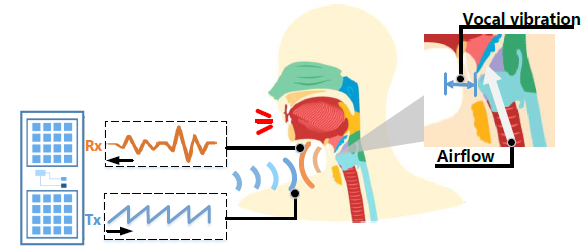

    
    
    

- **应用场景：**
<div style="text-align:center">
    <p align="center">
        
    </p>
</div>
<div style="text-align:center">
    <p align="center">
        
    </p>
</div>


- **贡献：**
    - 我们开发了 WaveEar，这是一种抗噪声的声音传感系统，它利用由近喉咙皮肤振动引起的毫米波信号的干扰来恢复人声。

    - 我们设计了一种基于调频连续波(FMCW) 的毫米波探头，该探头能够在多人之间定位说话者并感应细微的近喉声音振动。 提出了一种新颖的深度神经网络，即 Wave-voice Net，用于从探测信号中重建抗噪声的人声。

    - 我们评估WaveEar 在不同环境噪声和其他因素（如感应距离、运动伪影和用户情绪状态）的干扰下的鲁棒性。 我们的结果表明，该系统实现了卓越的性能，并为在现代电子设备中实现普遍的 VUI 奠定了基础。


- **整体框架：**
<div style="text-align:center">
    <p align="center">
        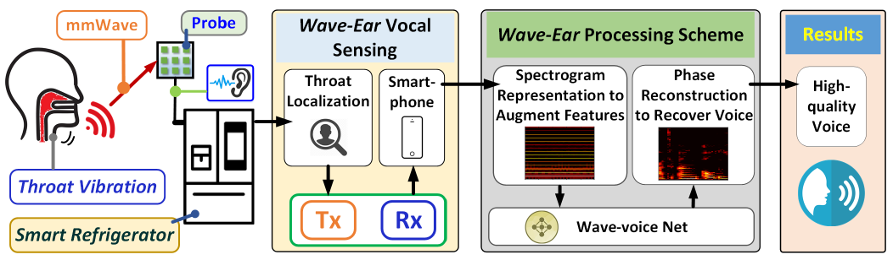
    </p>
</div>

- **思维导图**


- **实验环境：**
<div style="text-align:center">
    <p align="center">
        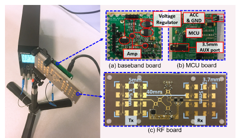
    </p>
</div>

- **思考：** 感知声带振动显著性与功率有关？ 论文发射功率是多少？总功耗为1.23W


## 20. [BioFace-3D: Continuous 3D Facial Reconstruction Through Lightweight Single-ear Biosensors](https://https://dl.acm.org/doi/10.1145/3447993.3483252)
- **阅读时间：** 2022-3-13
- **修改日期：** 2022-9-28
- **出处：** Mobicom2021
- **关键词：** 生物传感器，基于面部跟踪的人脸3D重建
- **摘要：** 在过去的十年中，面部地标跟踪和 3D 重建由于其在人机交互、面部表情分析和情感识别等众多应用中受到了广泛关注。传统方法要求用户被限制在特定的位置和面部 在受限的记录条件下（例如，没有遮挡且在良好的照明条件下）的摄像机。 这种高度受限的设置使它们无法部署在许多涉及人体运动的应用场景中。 在本文中，我们提出了第一个单耳机轻量级生物传感系统 BioFace-3D，它可以不显眼、连续、可靠地感知整个面部运动，跟踪 2D 面部标志，并进一步渲染 3D 面部动画。我们的单耳机生物传感系统利用跨模式迁移学习模型将包含在高级视觉面部标志检测模型中的知识迁移到低级生物信号域。经过训练，我们的 BioFace-3D 可以直接从生物信号中执行连续的 3D 面部重建，而无需任何视觉输入。这种从视觉传感到生物传感的范式转变不需要将摄像头放置在用户面前，这将为许多新兴的移动和物联网应用带来新的机遇。涉及不同设置的 16 名参与者的大量实验表明，BioFace-3D 可以准确跟踪 53 个主要面部标志，平均误差仅为 1.85 毫米，归一化平均误差为 3.38%，与大多数最先进的基于相机的解决方案相当。渲染出来的 3D 面部动画与真实的人类面部动作一致，也验证了系统在连续 3D 面部重建方面的能力。

- **整体框架：** </br>
<div style="text-align:center">
    <p align="center">
        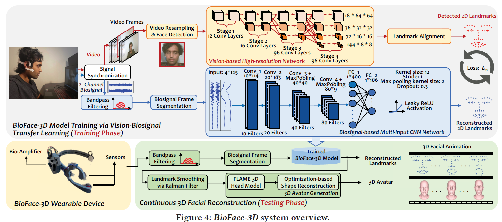
    </p>
</div>


## 19. [Unpaired Image-to-Image Translation using Cycle-Consistent Adversarial Networks](https://arxiv.org/pdf/1703.10593.pdf)
- [Project](https://junyanz.github.io/CycleGAN/)
- **阅读时间：** 2022-4-2
- **修改时间：** 2022-9-28
- **出处：** ICCV 2017
- **关键词：** 风格迁移，GAN图片生成图片， Cycle-GAN
- **摘要：** 图像到图像转换是一类视觉和图形问题，其目标是使用一组对齐的图像对来学习输入图像和输出图像之间的映射。但是，对于许多任务，配对训练数据将不可用。我们提出了一种在没有配对示例的情况下学习将图像从源域 X 转换到目标域 Y 的方法。我们的目标是学习一个映射 G : X → Y，使得来自 G(X) 的图像分布与使用对抗性损失的分布 Y 无法区分。因为这个映射是高度欠约束的，我们将它与逆映射 F : Y → X 结合起来，并引入循环一致性损失来推动 F(G(X)) ≈ X（反之亦然）。在不存在配对训练数据的几个任务上给出了定性结果，包括集合风格迁移、对象变形、季节迁移、照片增强等。与几种先前方法的定量比较证明了我们方法的优越性。

- **应用场景：** 给定任意两个无序图像集合 X 和 Y，我们的算法学习自动将图像从一个图像“翻译”到另一个图像，反之亦然：（左）来自 Flickr 的莫奈画作和风景照片； （中）来自 ImageNet 的斑马和马； （右）来自 Flickr 的夏季和冬季优胜美地照片。 示例应用（下）：使用著名艺术家的画作集合，我们的方法学习将自然照片渲染成各自的风格。
<div style="text-align:center">
    <p align="center">
        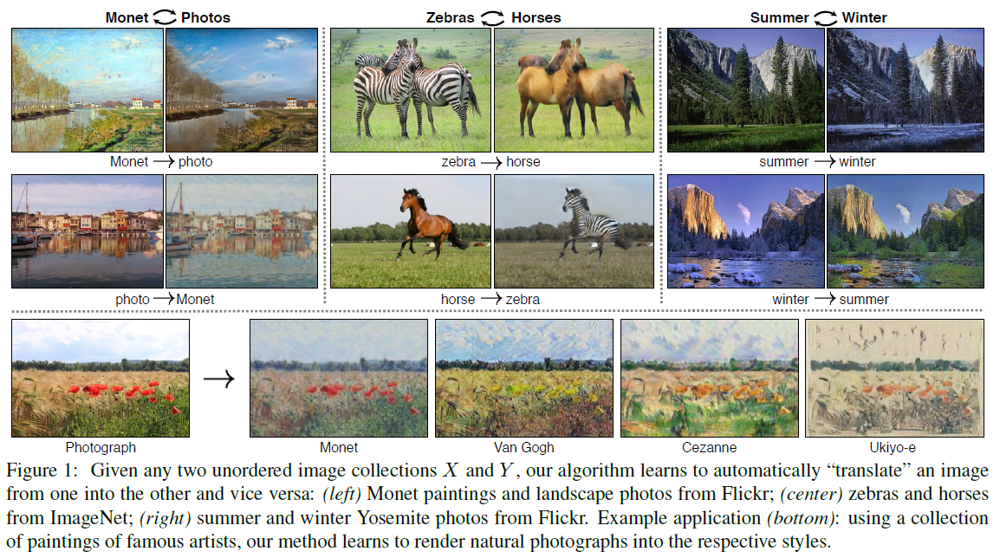
    </p>
</div>

- **算法原理：** 采用两个生成器$G$，$F$和两个判别器$D_x$和$D_y$
<div style="text-align:center">
    <p align="center">
        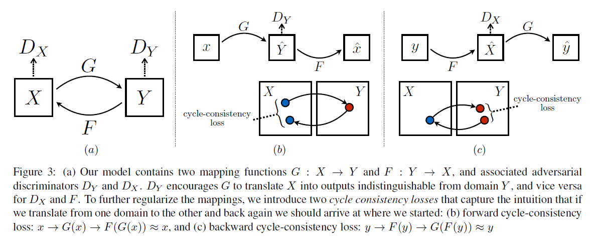
    </p>
</div>

## 18. [UltraSE: Single-Channel Speech Enhancement Using Ultrasound](http://xyzhang.ucsd.edu/papers/Ke.Sun_MobiCom21_UltraSE.pdf)
- **阅读时间：** 2022-2-9
- **修改日期：** 2022-9-28
- **出处:** MobiCom2021
- **关键词：** 超声波增强语音信号, 超声波加麦克风语音融合识别
- **摘要：** 鲁棒语音增强被认为是音频处理的圣杯，也是人机交互的关键要求。使用单通道、纯音频方法解决此任务仍然是一个开放的挑战，特别是对于涉及竞争扬声器和背景噪声混合的实际场景。在本文中，我们提出了 UltraSE，它使用超声波传感作为一种补充模式，将所需说话者的声音从干扰和噪声中分离出来。 UltraSE 使用商品移动设备（例如智能手机）发射超声波并捕捉说话者发音手势的反射。它引入了一种多模态、多领域的深度学习框架来融合超声多普勒特征和可听语音频谱图。此外，它采用基于跨模态相似性测量网络的对抗性训练鉴别器来学习两种异构特征模态之间的相关性。我们的实验验证了 UltraSE 同时提高了语音清晰度和质量，并且大大优于最先进的解决方案。

- **整体框架：** UltraSE 针对用户手持智能手机在嘈杂环境中录制语音的场景。 UltraSE 使用超声波感应作为一种补充模式，将所需说话者的声音与干扰分开。
    <div style="text-align:center">
        <p align="center">
            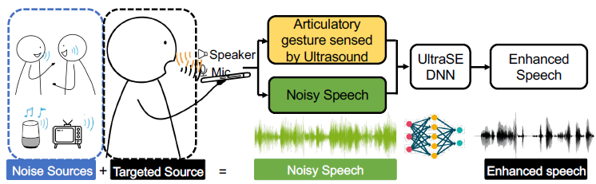
        </p>
    </div>

- **动机：** 利用超声波信号来增强语音信息
    
- **整体方案：**
    <div style="text-align:center">
        <p align="center">
            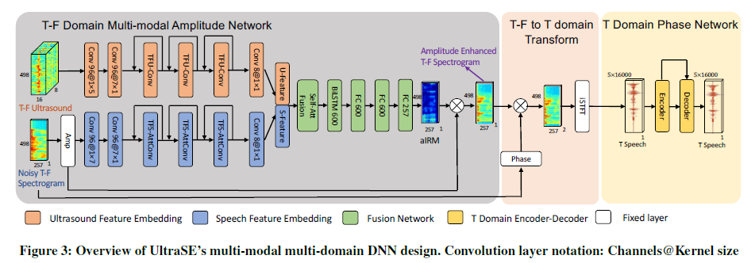
        </p>
    </div>

    - 1. 获取语音信息，高通滤波分离出超声波信号，超声波获取多普勒频移，语音获取语谱图
    - 2. 利用语谱图和超声波时频图训练GAN网络


- ## 17. [3D Point Cloud Generation with Millimeter-Wave Radar](http://xyzhang.ucsd.edu/papers/KQian_UbiComp21_RadarPointCloud.pdf)
- **阅读时间：** 2022-2-16
- **修改日期：** 2022-9-28
- **出处：** IMWUT/UbiComp'2021
- **关键词：** 设计了一块硬件系统，可以做到6Tx，8Rx，毫米波雷达3D点云
- **摘要：** 新兴的自动驾驶系统需要可靠地感知 3D 环境。不幸的是，当前的主流感知方式，即相机和激光雷达，在具有挑战性的光照和天气条件下很脆弱。另一方面，尽管它们全天候运行，但今天的车载雷达仅限于位置和速度检测。在本文中，我们介绍了 MilliPoint，这是一个实用的系统，可提高雷达传感能力以生成 3D 点云。 MilliPoint 的关键设计原则在于能够在低成本商用车雷达上实现合成孔径雷达 (SAR) 成像。为此，MilliPoint 对信号变化与雷达运动的关系进行建模，实现雷达在波长尺度精度的自跟踪，从而实现相干空间采样。此外，MilliPoint 通过后期成像处理正确聚焦目标，解决了镜面反射的独特问题。它还利用雷达的内置天线阵列来估计反射点的高度，并最终生成 3D 点云。我们已经在商用车辆雷达上实施了 MilliPoint。我们的评估结果表明，与现有的车载雷达解决方案相比，MilliPoint 有效地对抗运动误差和镜面反射，并且可以构建具有更高密度和分辨率的 3D 点云。

- 实验效果：
    <div style="text-align:center">
        <p align="center">
            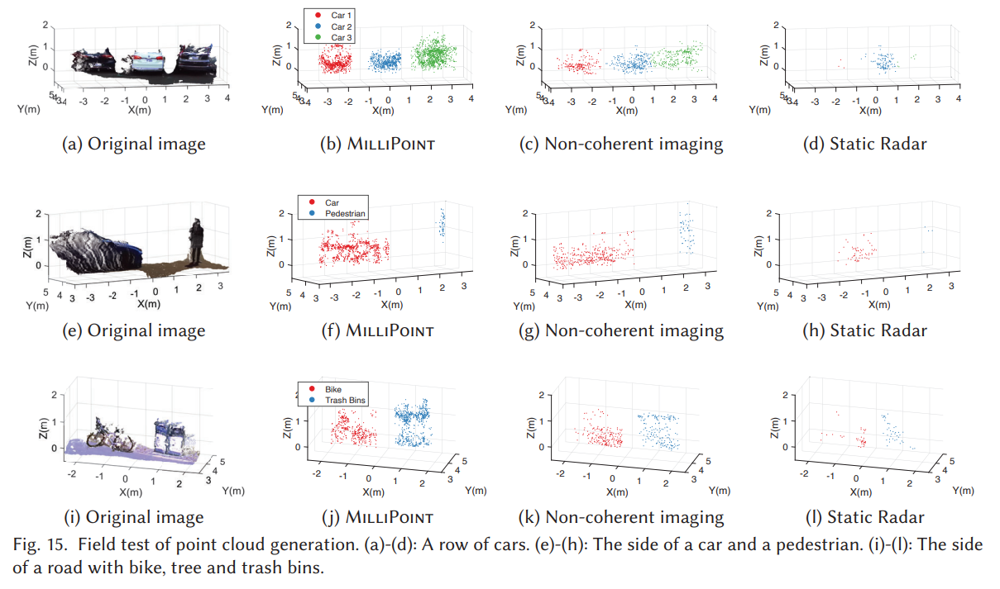
        </p>
    </div>
- 实验平台：
    <div style="text-align:center">
        <p align="center">
            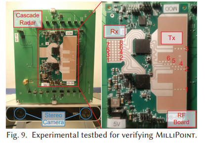
        </p>
    </div>


## 16. [mm-Wave Radar Based Gesture Recognition: Development and Evaluation of a Low-Power, Low-Complexity System](https://dl.acm.org/doi/10.1145/3264492.3264501)
- **阅读时间：**2022.2.16
- **修改日期：** 2022-9-28
- **出处：** mobicom2018
- **关键词：** 毫米波雷达，手势识别，机器学习
- **摘要：** 手势识别作为开发无处不在的、上下文感知的物联网应用程序的一项有吸引力的功能而受到关注。将雷达用作主要或次要系统很诱人，因为它们可以在黑暗、高光强度环境中运行，并且比许多竞争对手的系统距离更远。从这一观察出发，我们提出了一种通用的、低成本的、基于毫米波雷达的手势识别系统。毫米波雷达的潜在优势包括由于波长小而产生的高空间分辨率、在小区域内可以使用多个天线以及由于毫米波辐射的自然衰减而产生的低干扰。我们考虑八种不同的手势并使用两种低复杂度分类算法对我们的 COTS 解决方案进行实验性评估：无监督自组织图 (SOM) 和监督学习向量量化 (LVQ)。为了测试鲁棒性，我们考虑了人手和人体在短距离和长距离上执行的手势。根据我们的初步评估，我们观察到 LVQ 和 SOM 分别从未处理的原始数据中正确检测到所有手势的 75% 和 60%。对于选定的手势组，检测率明显更高（>90%）。我们认为，由于 AoA 估计不准确，性能会受到影响。因此，我们使用双雷达设置评估我们的系统，将估计精度提高 8-9%。

- **介绍：**
    1. 手势识别应用场景，常用的实现机理（硬件数据获取+分类算法）
    2. 基于RF，wifi等无线设备手势识别存在的缺点->深度传感器，camera均存在缺点，成本，大范围部署等
    3. 提出基于mmwave的低成本手势识别系统，以及采用的算法结构

- **相关工作：**
    1. 多普勒频移
    2. CSI
    3. RSS
    4. IQ域
    5. Camera

- **提出的方法：**
    1. 特征提取，FMCW波，range+AOA
    2. 手势分类和检测
        - 自组织映射（SOM）是一种基于人工神经网络的数据分析方法，可以区分大量不同的输入数据，并自动将它们分类成有序的聚类
        - 学习矢量化（LVQ）是一种监督学习方法，原理类似SOM

    <div style="text-align:center">
        <p align="center">
            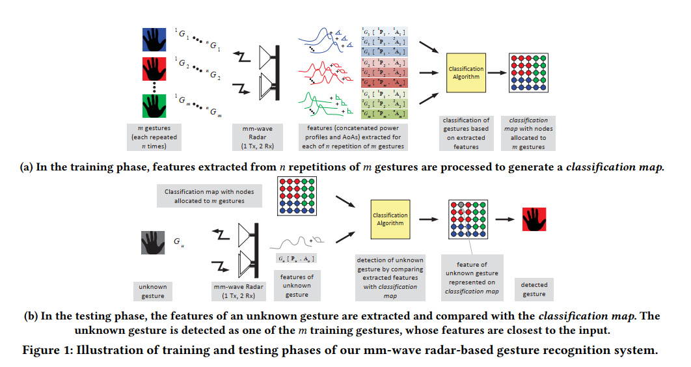
        </p>
    </div>  

- **评估内容：**
    1. 手势和评估场景，8种不同手势，4种场景，两个radar获取AOA数据
    2. 雷达硬件和输入数据，OmniRadar RIC60a 一发两收
    3. 分类算法参数

- **性能分析：**
- **结论：**
在本文中，展示了基于毫米波雷达的手势识别系统的初步结果，该系统使用低复杂度 SOM 和 LVQ 算法。 提出的解决方案不受干扰等外部环境影响，易于部署。 使用八种手势对系统进行了实验性评估，这些手势由人的手和身体在长距离和短距离内执行。


## 15. [Thru-the-wall Eavesdropping on Loudspeakers via RFID by Capturing Sub-mm Level Vibration](https://dl.acm.org/doi/10.1145/3494975)
- **阅读时间：** 2022.2.15
- **修改日期：** 2022-9-28
- **出处：** UmbiCom'2021-V4
- **关键词：** RFID声音窃听，CGAN  
- **摘要：**语音识别方法的空前成功刺激了智能音频系统的广泛使用，这为通过窃听扬声器窃取用户隐私提供了新的攻击机会。有效的窃听方法采用高速摄像机，依靠 LOS 测量物体振动，或利用 WiFi MIMO 天线阵列，需要在安静的环境中窃听。在本文中，我们探讨了基于 COTS RFID 标签窃听扬声器的可能性，该标签普遍部署在我们日常生活的许多角落。我们提出了 Tag-Bug，它专注于具有复杂频带的人声，并通过捕获亚毫米级振动对扬声器进行穿墙窃听。 Tag-Bug 通过两种方式提取声音特征： (1) 振动效应，标签直接由声音引起的振动； (2) 反射效应，标签不振动，而是感知附近振动物体的反射信号。为了放大振动信号的影响，我们设计了一种新的信号特征，称为调制信号差 (MSD)，以从射频信号中重建声音。为了提高用于人声识别的重建声音的质量，我们应用条件生成对抗网络（CGAN）从重建声音的部分频带恢复全频带。在 USRP 平台上的大量实验表明，Tag-Bug 能够成功捕捉响度大于 60dB 的单调声音。 Tag-Bug 可以在自由空间窃听、穿墙窃听和穿绝缘玻璃窃听中分别以 95.3%、85.3% 和 87.5% 的精度有效识别人声数量。 Tag-Bug 在自由空间窃听中也能以 87% 的准确率准确识别字母。

- 本文主要研究的是由数字或字母组成的私人信息，如社会保险号、密码、信用卡号等。
    <div style="text-align:center">
        <p align="center">
            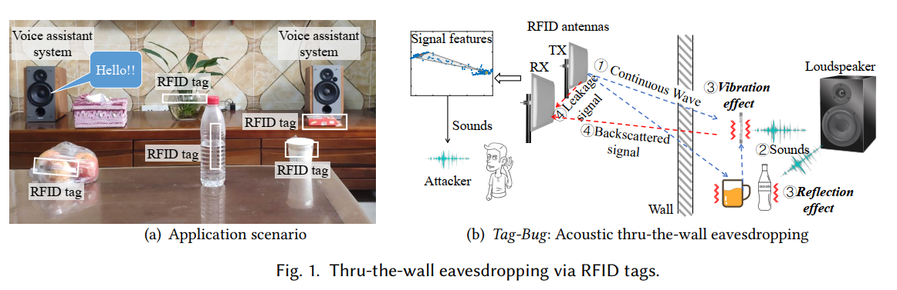
        </p>
    </div>

### 论文详情
1. 介绍：研究内容，相关研究情况，本文研究内容，3个挑战，3个贡献
2. 问题公式化：
3. 可行性研究：
    - 观察 1：采样率较高的 USRP 阅读器比 COTS RFID 阅读器更适合窃听。
    - 观察2:标签运动导致时域的波动变化，IQ平面上信号矢量的旋转。
    - 观察3:背散射信号捕捉到的标签振动远大于CW信号捕捉到的扬声器振膜振动。
4. 系统设计：
    - 信号发送模型
    - 振动信号中提取声音
    - 反射信号中提取声音
    - 标签的响应机制
5. 系统实现：5部分组成
    - 抽样随机化
    - 振幅放大
    - 振动特征提取，从接收信号中提取振动特征
    - 信号滤波
    - 基于CGAN的声音Refinement
    <div style="text-align:center">
        <p align="center">
            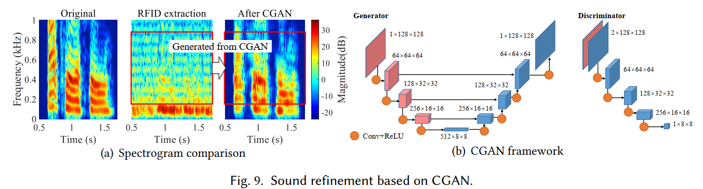
        </p>
    </div>

6. 单音性能评估
    - 实验配置，发送环境，声音特征，硬件，分析SNR，贴RFID的材料
    - 传播环境的影响
    - 声音特征的影响
    - 硬件影响
    - 连续声音的影响

7. 人声音性能评价
    - 阅读器和扬声器之间绝缘的影响
    - 音量的影响
    - 字母识别准确率


## 14. [VocalPrint: A mmWave-based Unmediated Vocal Sensing System for Secure Authentication](https://dl.acm.org/doi/10.1145/3384419.3430779)
- **阅读时间** 2022-1-3
- **修改日期：** 2022-9-28
- **出处：** Sensys'2020
- **关键词：** 毫米波身份验证
- **摘要:** 随着语音控制设备的不断增长，语音指标已被广泛用于用户识别。然而，语音生物识别技术容易受到重放攻击和环境噪声的影响。我们发现语音生物识别技术的根本漏洞在于其间接传感模式（例如麦克风）。在本文中，我们介绍了 VocalPrint，这是一种弹性毫米波询问系统，可直接捕获和分析用于用户身份验证的声音振动。具体来说，VocalPrint 利用了用户喉咙附近区域周围皮肤反射射频 (RF) 信号的独特干扰，这是由通信期间的声音振动引起的。使用新颖的弹性感知杂波抑制方法将复杂的环境噪声与 RF 信号隔离，以保留细粒度的声音生物特征。之后，我们提取与文本无关的声道和声源特征，并将它们输入到集成分类器中进行用户身份验证。 VocalPrint 非常实用，因为它利用低成本、便携和节能的硬件，可以轻松过渡到智能手机，同时由于其非接触性质，具有作为典型语音认证系统的足够可用性。我们对 41 名具有不同询问距离、方向和身体动作的参与者的实验结果表明，即使在不利条件下，VocalPrint 也可以达到 96% 以上的身份验证准确率。我们展示了我们的系统对各种威胁级别的复杂噪声干扰和欺骗攻击的弹性。

- **系统应用场景：（声带认证）**
    <div style="text-align:center">
        <p align="center">
            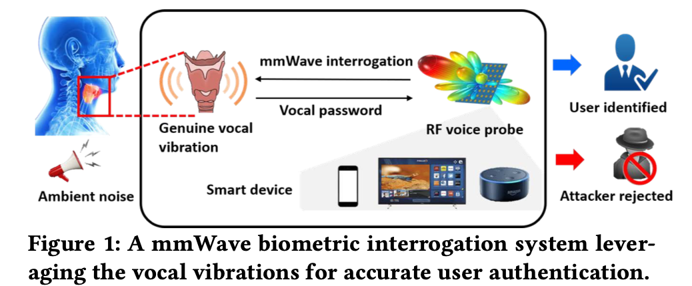
        </p>
    </div>

- **挑战：**
    - 如何抑制由环境中的静态和动态对象以及运动伪影引起的复杂噪声杂波，以在接收到的毫米波响应中保留细粒度的语音生物特征？
    - 如何提取和识别能够完美捕捉声道和声源信息的内在特征，以最大化系统性能？
    - 如何验证系统对欺骗攻击的弹性？
- **贡献：**
    - 连续声带振动模型公式推理
    - 人体运动补偿，当人体运动范围 > Range Resolution(c/2B)时，选取的range bin存在误差

- **整体框架：** VocalPrint 的概述主要包括用于感知声音振动的毫米波询问模块、用于消除复杂噪声的弹性感知杂波抑制模块以及用于识别合法用户以对抗冒名顶替者的身份验证模块。
    <div style="text-align:center">
        <p align="center">
            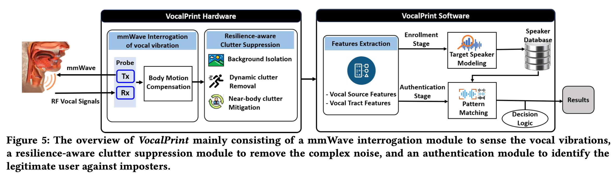
        </p>
    </div>


## 13. [mmASL: Environment-Independent ASL Gesture Recognition Using 60 GHz Millimeter-wave Signals](https://dl.acm.org/doi/pdf/10.1145/3381010)
- **阅读日期：** 2021.12.28
- **修改日期：** 2022-9-28
- **出处：** UmbiCom'2020
- **关键词：** 毫米波实现美语手语识别, NI+SiBeam系统，multi-FPGA，12Tx+12Rx天线
- **摘要：** 亚马逊 Echo 和 Google Home 等家庭助理设备在过去几年变得非常流行。然而，由于其语音控制功能，聋人和听力障碍 (DHH) 人士无法使用这些设备。鉴于美国有超过 50 万人使用美国手语 (ASL) 进行交流，因此需要一个可以识别 ASL 的家庭助理系统。这项工作的目标是为 DHH 用户设计一个家庭助理系统（简称 mmASL），可以使用 60 GHz 毫米波无线信号进行 ASL 识别。 mmASL 有两个重要组成部分。首先，它可以使用空间频谱图执行可靠的唤醒词检测。其次，使用可扩展的多任务深度学习模型，mmASL 可以学习 ASL 符号的语音特性，并使用它们来准确识别 ASL 符号。我们在具有相控阵的 60 GHz 软件无线电平台上实施 mmASL，并使用来自 15 个签名者、50 个 ASL 标志和超过 12K 标志实例的大规模数据收集对其进行评估。我们表明 mmASL 可以容忍其他干扰用户及其活动、环境变化和不同用户位置的存在。我们将 mmASL 与经过充分研究的基于 Kinect 和 RGB 相机的 ASL 识别系统进行比较，发现它可以实现可比的性能（标志识别的平均准确率为 87%），验证了使用 60 GHz 毫米波系统进行 ASL 标志识别的可行性。
        
- **系统框架：**    
    <div style="text-align:center">
        <p align="center">
            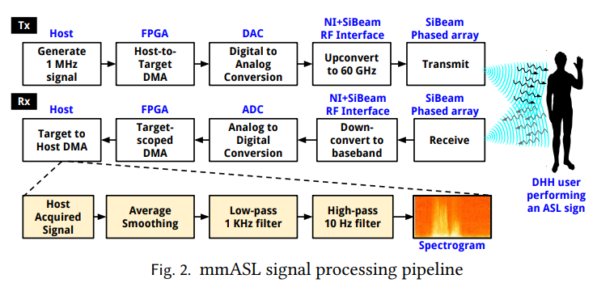
        </p>
    </div>

- **特点：**
    1. 它利用 60 GHz 室内信道的方向性和信道稀疏性，使 ASL 识别能够容忍房间内其他人（移动或静止）的存在。
    2. mmASL 能够创建独立于环境的运动特征，允许在不同的室内环境中进行训练和测试。
    3. 它不限制用户在执行手势时处于房间内的任何特定位置。
    4. mmASL 旨在提取和学习特征表示，以便它可以针对大量 ASL 符号以及用户签名的多样性进行扩展。
- **Challenges & Solutions：**
    - 任何位置可靠的检测出唤醒词，并且可以容忍他人存在的活动；mmASL利用beam scanning
    - 可扩展和可解释的美国手语识别，利用机器学习对大量的手语信号分类；mmASL利用观察到的多普勒传播来创建ASL符号的谱图，提供了不同符号之间足够的可区分性，设计了一个可解释的多任务深度学习模型来进行符号识别，而不是盲目地将机器学习应用于光谱图
    - mmASL在现实的，不受控制的设置，美国手语的符号识别是一项挑战，因为不同甚至相同的使用者所使用的符号之间可能存在显著差异。考虑到其他干扰者的存在和环境的变化等情况，这就更加复杂了，应对这些挑战需要在现实的、不受控制的环境中进行大规模的数据收集、分析、模型设计和评估。


## 12. [EchoPrint: Two-factor Authentication using Acoustics and Vision on Smartphones](https://dl.acm.org/doi/10.1145/3241539.3241575)（MobiCom’2018）
- **阅读日期：** 2021.12.28
- **修改日期：** 2022-9-28
- **出处：** Mobicom'2018
- **关键词：** 超声波人脸认证, FMCW，Machine Learning， CNN提取特征，SVM分类并且可以部署在手机
- **摘要**：智能手机上的用户身份验证必须同时满足安全性和便利性，这是一种固有困难的平衡艺术。 Apple 的 FaceID 可以说是此类努力中的最新成果，其代价是增加了额外的硬件（例如点投影仪、泛光照明器和红外摄像头）。我们提出了一种新颖的用户身份验证系统 EchoPrint，它利用声学和视觉来实现安全便捷的用户身份验证，而无需任何特殊硬件。 EchoPrint 主动从听筒扬声器发出几乎听不见的声学信号，以“照亮”用户的面部，并通过从 3D 面部轮廓反弹的回声中提取的独特特征来验证用户的身份。为了应对手机握持姿势的变化，从而产生回声，训练卷积神经网络 (CNN) 以提取可靠的声学特征，这些特征进一步与视觉面部标志位置相结合，以馈送二元支持向量机 (SVM) 分类器以进行最终身份验证。由于回声特征取决于 3D 面部几何形状，因此 EchoPrint 不易被图像或视频（如 2D 视觉人脸识别系统）欺骗。它只需要商用硬件，从而避免了 FaceID 等解决方案中特殊传感器的额外成本。对 62 名志愿者和图像、照片、雕塑等非人类物体进行的实验表明，EchoPrint 实现了 93.75% 的平衡精度和 93.50% 的 F-score，而平均精度为 98.05%，并且没有观察到基于图像/视频的攻击成功欺骗。

- **整体框架：** EchoPrint 从听筒扬声器发出几乎听不见的声音信号，以“照亮”用户的面部。 从回声中提取的声学特征与来自正面摄像头的视觉面部标志相结合，以验证用户身份。
    <div style="text-align:center">
        <p align="center">
            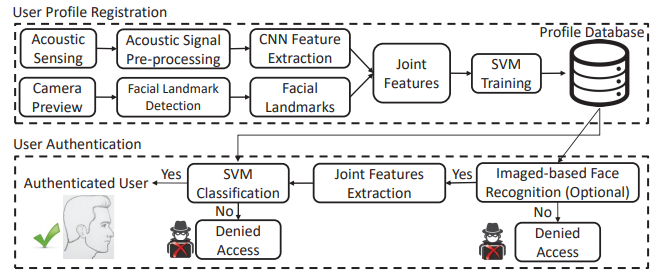
        </p>
    </div>

- **挑战：**
    - i. 回声信号对用户面部和设备之间的相对位置(如，姿势)非常敏感，这使得提取可靠的姿势不敏感特征用于鲁棒认证变得非常困难
    - ii. 智能手机有多个扬声器和麦克风——哪个最合适，什么是合适的声音信号，对认证性能至关重要
    - iii. 复杂的信号处理，特征提取，以及机器学习技术需要快速用户注册和实时认证
- **贡献：**
    - 设计的声发射信号适用于硬件限制、传感分辨率和人类可听度等考虑因素。 我们还创建了声学信号处理技术，以可靠地分割来自面部的回声
    - 我们提出了一个端到端的混合机器学习框架，它使用卷积神经网络提取有代表性的声学特征，并将视觉和声学特征融合到 SVM 以进行最终认证。


## 11. [Learning from the Master: Distilling Cross-modal Advanced Knowledge for Lip Reading](https://ieeexplore.ieee.org/document/9578681/)
- **阅读时间：** 2021.12.25
- **修改日期：** 2022-9-28
- **出处：** CVPR2021
- **关键词：** 无声视频中预测口语，跨模态学习，视觉和音频
- 摘要：唇读旨在从无声唇视频中预测口语。由于此类视觉任务的性能通常比其对应的语音识别差，因此一种潜在的方案是从经过音频信号预训练的教师那里提炼知识。然而，**跨模态数据之间的潜在域差距可能导致学习上的歧义，从而限制了唇读的表现**。在本文中，我们提出了一种新颖的唇读协作框架，并考虑了两个方面的问题：1）教师应该理解双模态知识以可能弥合固有的跨模态差距； 2）教师应根据学生的发展情况，适应性地调整教学内容。为此，我们引入了一个可训练的“主”网络，它可以同时摄取音频信号和无声唇部视频，而不是预训练的教师。 master从三种特征模态生成logits：音频模态、视频模态及其组合。为了进一步提供一种交互式策略来有机地融合这些知识，我们通过学生的特定任务反馈来规范master，其中隐含了学生的要求。同时，我们将几个“导师”网络纳入我们的系统，作为灵活强调卓有成效的知识的指导。此外，我们纳入了课程学习设计，以确保更好的融合。大量实验表明，所提出的网络在多个基准测试中优于最先进的方法，包括在单词级和句子级场景中。 

- **整体框架：**
    <div style="text-align:center">
        <p align="center">
            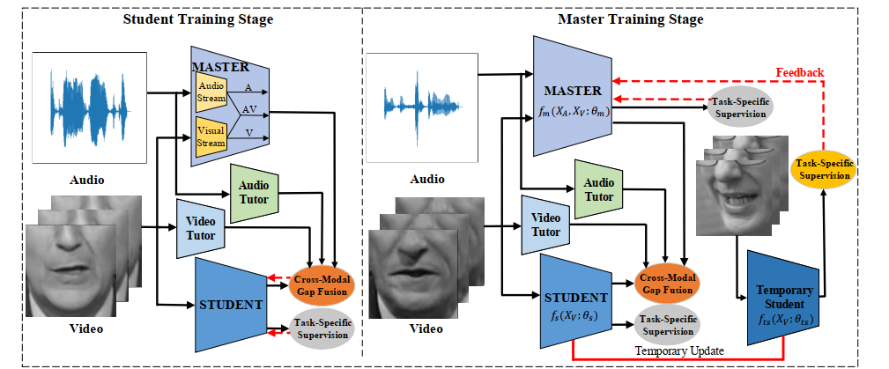
        </p>
    </div>

- **背景介绍：**
    - 唇读，也被称为视觉语音识别，旨在预测从无声的唇视频中说出的单词或句子。这个视觉任务可以在不依赖听觉的情况下将语音转换为文本，因此，它可以应用于许多实际场景，如无声电影配音、**为失语症患者创造声音（creating a voice for aphonia patients）**、为安全系统服务。一种可能的解决方案是通过知识蒸馏(KD)将音频数据中的知识转移到视频数据中，

- **动机：**
    - 不同的字母“p”和“b”的唇形相似，所以在视频中很难区分。

- **贡献：**
    - 提出了一个基于协作学习的唇读框架。与大多数现有方法不同的是，本文将一个先进的可培训的主网络嵌入到我们的系统中，master可以根据学生的反馈进行调整，从而动态地提供双峰式的知识，让学生更好地学习。
    - 在系统中加入了几个导师网络，分别用音频和视频数据进行预训练。为了得到master、tutors和student的配合，特别定制了一种动态融合缺失来引导student学习视听概率，从而缓解了跨域差距带来的歧义。


## 10. [We Can Hear You with Wi-Fi!](https://ieeexplore.ieee.org/document/7384744)
- **阅读时间：** 2021.12.20
- **修改日期：** 2022-9-28
- **出处：** MobiCom2014
- **关键词：** 利用Wi-Fi做唇语识别，通过检测和分析来自嘴巴运动的细粒度反射信号，利用部分多径效应和小波变换引入**口腔运动轮廓**的问题。
- **摘要**：最近的文献推动 Wi-Fi 信号“看到”人们的动作和位置。本文提出以下问题：Wi-Fi 能“听到”我们的谈话吗？我们展示了 WiHear，它使 Wi-Fi 信号能够“听到”我们的谈话，而无需部署任何设备。为了实现这一点，WiHear 需要检测和分析来自嘴巴运动的细粒度无线电反射。 WiHear 通过引入利用部分多径效应和小波包变换的口腔运动配置文件解决了这个微运动检测问题。由于 Wi-Fi 信号不需要视线，WiHear 可以在无线电范围内“听到”人们的谈话。此外，WiHear 可以利用 MIMO 技术同时“听到”多人的谈话。我们在 USRP N210 平台和商业 Wi-Fi 基础设施上实施 WiHear。结果表明，在我们预先定义的词汇中，WiHear 对单个人说话不超过 6 个单词的平均检测准确率为 91%，对不超过 3 个人同时说话的检测准确率高达 74%。此外，通过从不同角度部署多个接收器，可以进一步提高检测精度。

- **整体框架：**
    <table><tr>
        <td>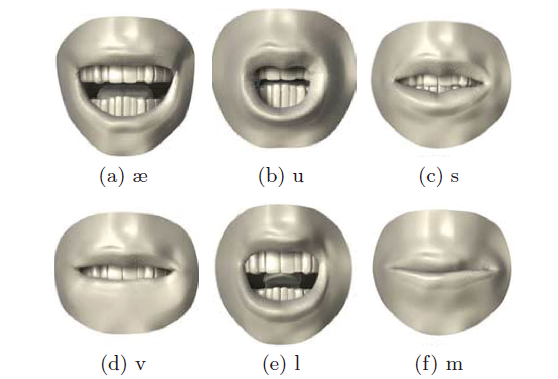</td>
        <td>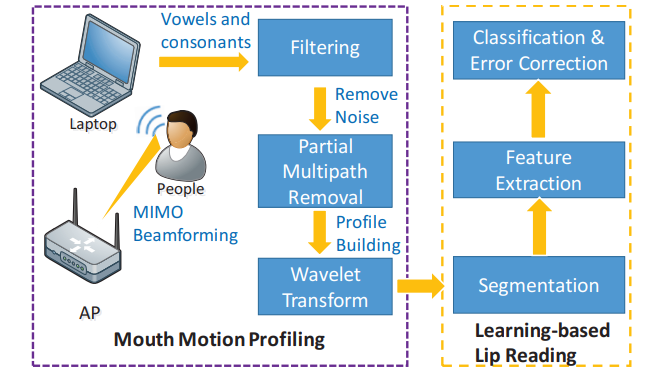</td>
    </tr></table>

- **动机：** Wi-Fi感知唇语

- **整体方案：**
    - 1. WiHear是一种无线系统，它可以让商用WiFi设备使用正交频分复用(OFDM)听到人们的谈话频分复用)Wi-Fi设备, 发送和接收组成单用户唇读。
    - 2. 发射机可在当前移动设备上配置两个(或更多)全向天线，或在当前ap(接入点)上配置一个定向天线(易于更改)。
    - 3. 接收器只需要一个天线就可以捕捉无线电反射信号。WiHear可以扩展到多个ap或移动设备，支持多个用户同时使用
    - 4. WiHear发射器通过**波束形成**向用户口中发送Wi-Fi信号。WiHear接收器提取并分析嘴巴运动的反射，具体：（1）基于小波的口腔运动轮廓分析。WiHear通过过滤带外干扰和部分消除多径来净化接收信号。然后通过离散小波包分解构造口腔运动轮廓。（2）基于唇读的学习。一旦WiHear提取出嘴巴的运动特征，它就会应用机器学习来识别发音，并通过分类和基于上下文的纠错来翻译它们。目前，WiHear只能在用户说话过程中不做其他动作的情况下检测和识别人类对话

- **细节：**
    - 1. 定位嘴唇
        - a. 利用beamforming定位嘴唇位置：设定预定姿态，wifi发射器扫描检测
        - b. 设置时间戳然后确定方向
    - 2. 过滤干扰
        - a. 唇部运动频率2-5Hz，IIR巴特沃斯滤波器
        - b. 眨眼的频率 < 1Hz 
    - 3. 部分多径信息去除
    - 4. 口部运动的剖面构造
    - 5. 离散小波分解，对口型进行离散小波分解，分析嘴巴不同部位的运动
    - 6. 语音分割，每个词被分割成多个语音事件，单词之间检测沉默时间（eg 300ms）来分割
    - 7. 特征提取
    - 8. 分类，利用广义最小相似性比较
    - 9. 利用嘴部运动分类部分单词


## 9. [Micro-Doppler Effect in Radar: Phenomenon, Model, and Simulation Study](https://ieeexplore.ieee.org/document/1603402)
- **阅读日期：** 2021.12.19
- **修改日期：** 2022-9-28
- **关键词：** Micro-doppler详细的物理公式理论推导, 基础理论推导
- **摘要：** 当除了由雷达目标的整体运动引起的恒定多普勒频移外，目标或目标上的任何结构都经历微运动动力学，例如机械振动或旋转时，微运动动力学会引起多普勒调制 返回的信号，称为微多普勒效应。 我们介绍了雷达中的微多普勒现象，建立了多普勒调制模型，推导了目标振动、旋转、翻滚和圆锥运动引起的微多普勒公式，并通过仿真研究对其进行了验证，分析了时变微多普勒 使用高分辨率时频变换的特征，并演示在真实雷达数据中观察到的微多普勒效应。

- **Micro-Doppler模型：** 目标振动和旋转
<div style="text-align:center">
    <p align="center">
        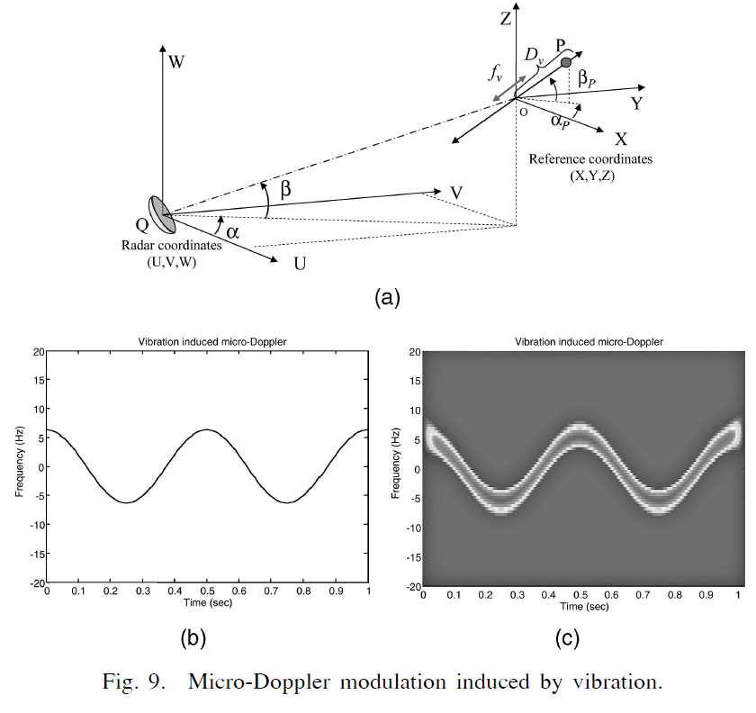
    </p>
</div>

<div style="text-align:center">
    <p align="center">
        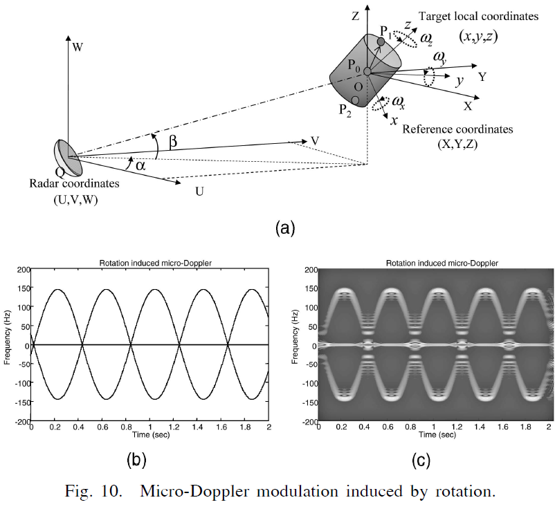
    </p>
</div>

## 8. [Analysis of micro-Doppler signatures](https://cs.gmu.edu/~fli/papers/ANALYSIS%20OF%20MICRO-DOPPLER%20SIGNATURES.pdf)
- **阅读日期：** 2021.12.19
- **修改日期：** 2022-9-28
- **关键词：** 主要介绍基本的micro-doppler数学模型，包括振动、旋转
- **摘要：** 目标或目标结构的机械振动或旋转可能会对返回的雷达信号产生额外的频率调制，这会产生关于目标多普勒频率的边带，称为微多普勒效应。 微多普勒特征能够确定目标的某些特性。 本文介绍了雷达中的微多普勒效应，并发展了微多普勒特征的数学计算。 计算机模拟进行并利用联合时频域中的微多普勒特征。

<div style="text-align:center">
    <p align="center">
        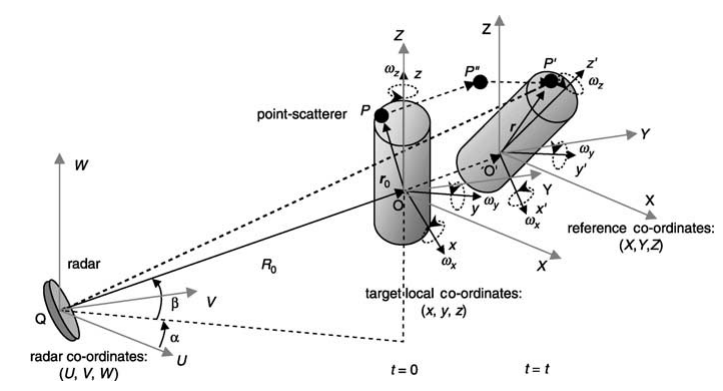
    </p>
</div>


## 7. [ThermoWave: a new paradigm of wireless passive temperature monitoring via mmWave sensing](https://dl.acm.org/doi/10.1145/3372224.3419184)
- **阅读日期：** 2021.11
- **修改日期：** 2022-9-28
- **出处：** Mobicom2021
- **关键词：** mmWave 测温度，毫米波与材料相关的
- **Abstract:** Temperature sensor is one of the most widespread technologies in the IoT era. Wireless temperature monitoring systems are convenient to deploy and can drive mass applications in the fields of smart home, transportation and logistics. Currently, wireless temperature monitoring products are based on microelectronic and semiconductor components, which are not cost-effective (e.g., a few dollars) and more importantly, generate electronic wastes. In this work, we present ThermoWave, a new paradigm of wireless temperature monitoring that is ecological, battery-less, and ultra-low cost. Specifically, ThermoWave is on the basis of the thermal scattering effect on millimeter-wave (mmWave) signals. Specifically, cholesteryl materials align their molecular patterns at different environmental temperatures, and this temperature-induced pattern change will be modulated and sensed by the scattered mmWave signals. There are three functional modules in the ThermoWave system. The ThermoTag is a cholesteryl material inked film or paper tag that can be conveniently attached to the object of interest to monitor temperature changes. Each ThermoTag costs less than 0.01 dollars. The temperature modulated mmWave scattering will be received by a mmWave-radar based ThermoScanner and demodulated by a software-based temperature decoder ThermoSense, which includes a model-based method (i.e., ThermoDot) for point temperature estimation and a data-driven method (i.e., ThermoNet) for thermal imaging. We prototype and evaluate the ThermoWave system performance in both controlled and real-world setups. Experimental results show that the ThermoWave achieves the precision of ±1.0°F in the range of 30°F to 120°F in a controlled setup. We also investigate the performance in real-world applications, and the ThermoWave can reach the ±3.0°F precision in the temperature estimation. We also test and discuss sustainability, durability, robustness, and cost-effectiveness of the ThermoWave in both design and experiments.


- **摘要：** 温度传感器是物联网时代应用最广泛的技术之一。无线温度监控系统部署方便，可推动智能家居、交通、物流等领域的大规模应用。目前，无线温度监测产品基于微电子和半导体元件，成本效益不高（例如几美元），更重要的是会产生电子废物。在这项工作中，我们展示了 ThermoWave，这是一种生态、无电池和超低成本的无线温度监测新方法。具体来说，ThermoWave 是基于对毫米波（mmWave）信号的热散射效应。具体来说，胆固醇材料在不同的环境温度下排列它们的分子模式，这种温度引起的模式变化将被散射的毫米波信号调制和感知。 ThermoWave 系统中有三个功能模块。 ThermoTag 是一种胆固醇材料的油墨薄膜或纸质标签，可以方便地贴在感兴趣的物体上以监测温度变化。每个 ThermoTag 的成本不到 0.01 美元。温度调制的毫米波散射将由基于毫米波雷达的 ThermoScanner 接收，并由基于软件的温度解码器 ThermoSense 解调，该解码器包括用于点温度估计的基于模型的方法（即 ThermoDot）和数据驱动的方法（即, ThermoNet) 用于热成像。我们在受控和实际设置中对 ThermoWave 系统性能进行原型设计和评估。实验结果表明，ThermoWave 在受控设置中在 30°F 至 120°F 的范围内实现了 ±1.0°F 的精度。我们还研究了实际应用中的性能，并且 ThermoWave 在温度估计中可以达到 ±3.0°F 的精度。我们还在设计和实验中测试和讨论 ThermoWave 的可持续性、耐用性、稳健性和成本效益。

- **整体框架：** 介绍了 ThermoWave 范例及其三个核心模块（即 ThermoTag、ThermoScanner 和 ThermoSense）。 ThermoTag 可以放在手腕上测量皮肤温度，放置在床上测量环境温度，以及放置在床单上进行身体热成像。 ThermoScanner 不断询问 ThermoTag 以捕获温度外壳热散射响应，然后将响应信号发送到 ThermoDot 模型和 ThermoNet 模型，分别获得逐点温度读数和热成像。
<div style="text-align:center">
    <p align="center">
        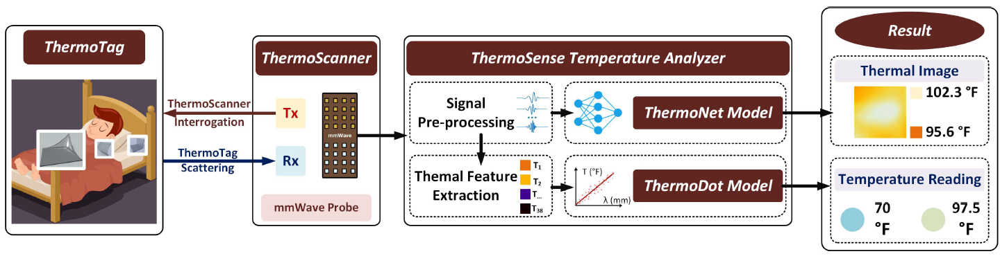
    </p>
</div>

- **特征提取：** </br>
    1. 从[小波变换](https://zhuanlan.zhihu.com/p/22450818)中实现特征提取，可以准确有效地描述频移信号，而无需担心噪声信号影响传感精度。
    2. 为了理解热散射响应，我们将特征分为两种类型，即光谱特征和时间特征。 值得注意的是，我们采用光谱分析，将信号过滤，然后分析信号强度的分布。
    3. 梅尔频率倒谱系数 (MFCC) 和功率归一化倒谱系数 (PNCC) 是出色的功率频率分布分析仪，可提供对频移的详细理解，并能够减少后期预测中的噪声影响。
    4. 功率函数非线性化[ref:Speech Recognition System](https://www.mdpi.com/2076-3417/9/10/2166/htm)
    5. 功率函数非线性然后通过离散余弦变换（DCT）
    6. 将得到的矩阵转换为一维数组以减少特征数量以提高效率，即分别从 20 个 Gammatone 通道生成 20 个系数。 考虑到特征系数用于回归分析，PNCC 工作的起源包括均值归一化的操作。 请注意，均值归一化已被取消，因为此操作不会在热分析中提供进一步的好处。 到目前为止，已有效收集标量系数以进行回归。

- **ThermoNet网络结构：** ThermoNet 利用热散射响应的光谱图像及其对应的地面实况热图像来训练图像到图像的神经网络模型，得到的模型能够从光谱图像生成热图像。 ThermoNet Constructor 不断根据频谱图图像生成样本输出，而 ThermoNet Proctor 决定样本输出是否足够接近真实情况。 当 ThermoNet Proctor 拒绝样本输出时，将比较结果并将其发送到 Loss Optimization for ThermoNet Constructor 以在未来生成更好（即更准确）的输出。
    - 1. 从每段 RF 信号中提取 38 个标量值的特征数组，将带有一个温度标签（即真实值）的特征数组输入到回归模型中，以解决算法 1 所示的预测建模问题。

    - 2. 使用bootstrap聚合（装袋）方法有两大优势
    1）集成学习允许多个回归器生成独立的预测结果，并以更好的置信度将它们聚合成最终决策。由每个独立回归器的准确度赋予权重，以提高最终决策的准确度，从而实现更高的准确度。

    - 3. Bagging 允许低方差值，使输出在温度预测中更加稳定，从而防止过拟合。一系列特征数组被输入到bagging模型中，该模型利用算法1中的ThermoDot模型进行回归预测并返回对应于特征数组的温度估计。在将特征向量列表作为输入和温度值列表作为基本事实馈送装袋回归器后，回归器求解​​离散参数以拟合训练数据。然后，生成的 ThermoDot 模型将采用热散射响应并返回单值温度输出，如图 7 所示。

    <div style="text-align:center">
        <p align="center">
            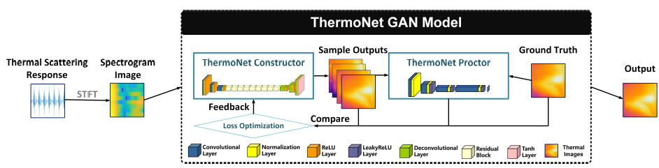
        </p>
    </div>

- **ThermoNet 模型构建** </br>
    - 1. 为了解决光谱图像到热成像的映射问题，光谱图像中的像素必须映射到热图像中的像素。 这种映射不仅要捕捉一般的颜色与颜色的关系，还要捕捉图像结构，它封装了热图像上的温度分布
    - 2. 设计[Generative Adversarial Network](https://arxiv.org/abs/1406.2661)（GAN）model specifically designed for image-to-image transformation tasks.
    - 3. Constructor is a network of "encoder-decoder" structure.
    - 4. Proctor is a network of "encoder" structure that contains four
    layers of convolution.

- **光谱图变换的热散射响应**  </br>
    - 1. 利用STFT将二维数据变成三维
    - 2. 结果是一个三维数据，我们将其中一个维度映射到颜色空间以生成温度图像
    - 3. 问题简化为将光谱图像映射到正确的热图像


- **实验结果对比：** ThermoNet 生成的热图像与地面实况之间的比较。 ThermoNet 能够捕获热图像的细节并在预测中重新生成它们，从而使使用边缘检测的目标检测成为可能。 凭借大量的训练样本，ThermoNet 满足了在未经训练的（测试集）场景中生成热图像的期望，这些场景在图像结构和图像细节方面也非常接近真实情况。
    <div style="text-align:center">
        <p align="center">
            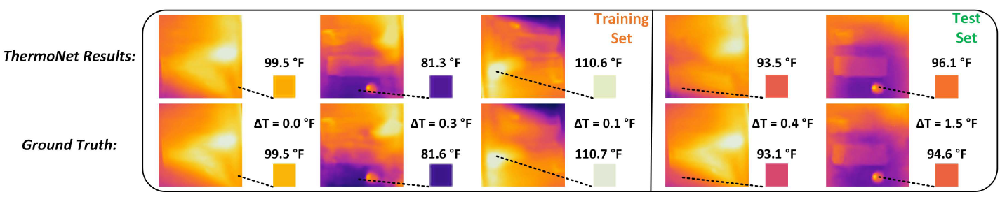
        </p>
    </div>


## 6. [CardiacWave: A mmWave-based Scheme of Non-Contact and High-Definition Heart Activity Computing](https://dl.acm.org/doi/10.1145/3478127)（UbiComp'2021)
- **阅读日期：** 2021-10
- **修改日期：** 2022-9-28
- **出处：** Ubicomp2021
- **关键词：** 毫米波感知生命特征，心跳信号

- **Abstract:** Using wireless signals to monitor human vital signs, especially heartbeat information, has been intensively studied in the past decade. This non-contact sensing modality can drive various applications from cardiac health, sleep, and emotion management. Under the circumstance of the COVID-19 pandemic, non-contact heart monitoring receives increasingly market demands. However, existing wireless heart monitoring schemes can only detect limited heart activities, such as heart rate, fiducial points, and Seismocardiography (SCG)-like information. In this paper, we present CardiacWave to enable a non-contact high-definition heart monitoring. CardiacWave can provide a full spectrum of Electrocardiogram (ECG)-like heart activities, including the details of P-wave, T-wave, and QRS complex. Specifically, CardiacWave is built upon the Cardiac-mmWave scattering effect (CaSE), which is a variable frequency response of the cardiac electromagnetic field under the mmWave interrogation. The CardiacWave design consists of a noise-resistant sensing scheme to interrogate CaSE and a cardiac activity profiling module for extracting cardiac electrical activities from the interrogation response. Our experiments show that the CardiacWave-induced ECG measures have a high positive correlation with the heart activity ground truth (i.e., measurements from a medical-grade instrument). The timing difference of P-waves, T-waves, and QRS complex is 0.67\%, 0.71\%, and 0.49\%, respectively, and a mean cardiac event difference is within a delay of 5.3 milliseconds. These results indicate that CaridacWave offers high-fidelity and integral heart clinical characteristics. Furthermore, we evaluate the CardiacWave system with participants under various conditions, including heart and breath rates, ages, and heart habits (e.g., tobacco use).

- **摘要：** 使用无线信号监测人体生命体征，尤其是心跳信息，在过去十年中得到了深入研究。这种非接触式传感模式可以推动心脏健康、睡眠和情绪管理等各种应用。在 COVID-19 大流行的情况下，非接触式心脏监测受到越来越多的市场需求。然而，现有的无线心脏监测方案只能检测有限的心脏活动，例如心率、基准点和类似心电图 (SCG) 的信息。在本文中，我们介绍 CardiacWave 以实现非接触式高清心脏监测。 CardiacWave 可以提供全方位的类似心电图 (ECG) 的心脏活动，包括 P 波、T 波和 QRS 复合波的详细信息。具体而言，CardiacWave 建立在 Cardiac-mmWave 散射效应 (CaSE) 之上，这是在毫米波询问下心脏电磁场的可变频率响应。 CardiacWave 设计包括用于询问 CaSE 的抗噪声传感方案和用于从询问响应中提取心脏电活动的心脏活动分析模块。我们的实验表明，由 CardiacWave 引起的 ECG 测量与心脏活动基本事实（即来自医疗级仪器的测量）具有高度的正相关性。 P波、T波和QRS波群的时间差分别为0.67%、0.71%和0.49%，平均心脏事件差在5.3毫秒的延迟内。这些结果表明 CaridacWave 具有高保真度和完整的心脏临床特征。此外，我们在各种条件下与参与者一起评估 CardiacWave 系统，包括心率和呼吸频率、年龄和心脏习惯（例如，吸烟）。

- **应用场景：** CardiacWave 是一种非接触式传感解决方案，通过胸部的毫米波散射来监测高清心脏活动。
<div style="text-align:center">
    <p align="center">
        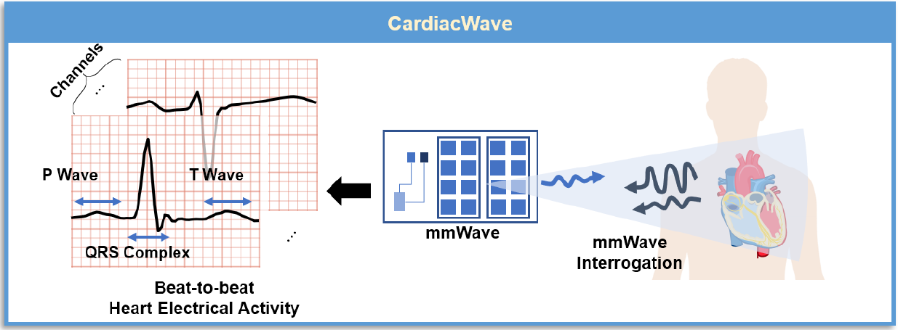
    </p>
</div>

- **整体框架：** CardiacWave 利用毫米波来询问心脏 EM 场。 散射的毫米波响应被馈送到特征提取和心脏活动分析模块以重建多通道心电图信号。
<div style="text-align:center">
    <p align="center">
        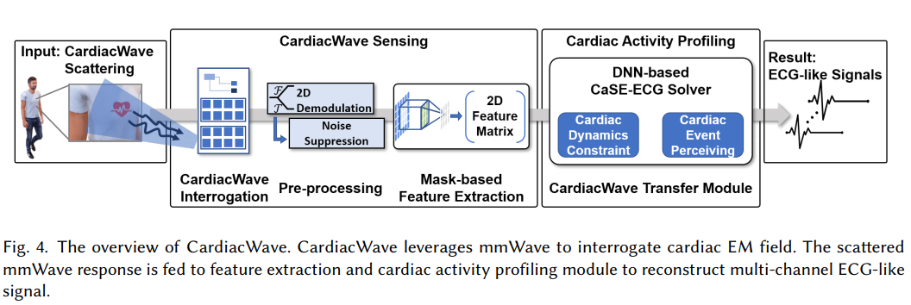
    </p>
</div>

- **实验配置：**
<div style="text-align:center">
    <p align="center">
        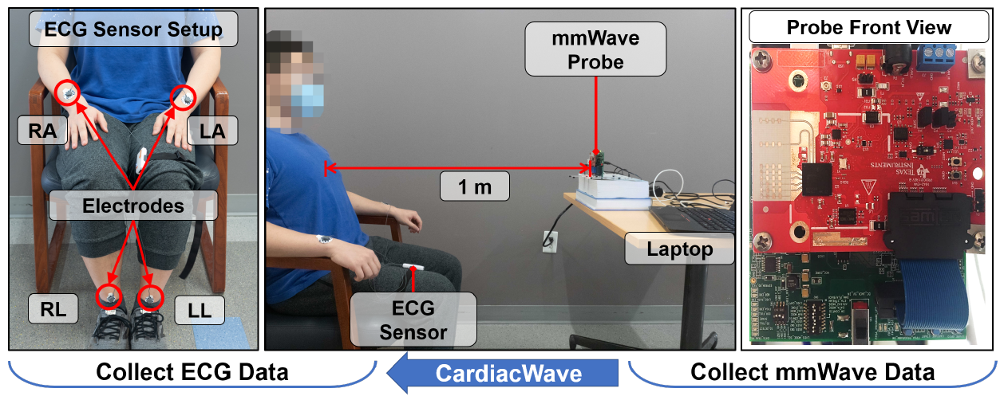
    </p>
</div>

- **Cite:**
```
@article{10.1145/3478127,
author = {Xu, Chenhan and Li, Huining and Li, Zhengxiong and Zhang, Hanbin and Rathore, Aditya Singh and Chen, Xingyu and Wang, Kun and Huang, Ming-chun and Xu, Wenyao},
title = {CardiacWave: A MmWave-Based Scheme of Non-Contact and High-Definition Heart Activity Computing},
year = {2021},
issue_date = {Sept 2021},
publisher = {Association for Computing Machinery},
address = {New York, NY, USA},
volume = {5},
number = {3},
url = {https://doi.org/10.1145/3478127},
doi = {10.1145/3478127},
abstract = {Using wireless signals to monitor human vital signs, especially heartbeat information, has been intensively studied in the past decade. This non-contact sensing modality can drive various applications from cardiac health, sleep, and emotion management. Under the circumstance of the COVID-19 pandemic, non-contact heart monitoring receives increasingly market demands. However, existing wireless heart monitoring schemes can only detect limited heart activities, such as heart rate, fiducial points, and Seismocardiography (SCG)-like information. In this paper, we present CardiacWave to enable a non-contact high-definition heart monitoring. CardiacWave can provide a full spectrum of Electrocardiogram (ECG)-like heart activities, including the details of P-wave, T-wave, and QRS complex. Specifically, CardiacWave is built upon the Cardiac-mmWave scattering effect (CaSE), which is a variable frequency response of the cardiac electromagnetic field under the mmWave interrogation. The CardiacWave design consists of a noise-resistant sensing scheme to interrogate CaSE and a cardiac activity profiling module for extracting cardiac electrical activities from the interrogation response. Our experiments show that the CardiacWave-induced ECG measures have a high positive correlation with the heart activity ground truth (i.e., measurements from a medical-grade instrument). The timing difference of P-waves, T-waves, and QRS complex is 0.67\%, 0.71\%, and 0.49\%, respectively, and a mean cardiac event difference is within a delay of 5.3 milliseconds. These results indicate that CaridacWave offers high-fidelity and integral heart clinical characteristics. Furthermore, we evaluate the CardiacWave system with participants under various conditions, including heart and breath rates, ages, and heart habits (e.g., tobacco use).},
journal = {Proc. ACM Interact. Mob. Wearable Ubiquitous Technol.},
month = {sep},
articleno = {135},
numpages = {26},
keywords = {Millimeter Wave Sensing}
}
```

## 5. [Wavoice: A Noise-resistant Multi-modal Speech Recognition System Fusing mmWave and Audio Signals](https://dl.acm.org/doi/abs/10.1145/3485730.3485945)（SenSys'2021）
- **阅读日期：** 2021.10
- **修改日期：** 2022-9-28
- **出处：** Sensys2021
- **关键词：** 毫米波与麦克风融合增强语音信号
- **摘要：** 随着自动语音识别的进步，语音用户界面最近越来越流行。自 COVID-19 大流行以来，VUI 因其非接触性而在在线交流中越来越受欢迎。此外，由于需要高信噪比的纯音频语音识别方法，各种环境噪声阻碍了语音用户界面的公共应用。在本文中，我们介绍了 Wavoice，这是第一个抗噪多模态语音识别系统，它融合了两种不同的语音传感模态，即毫米波 (mmWave) 信号和来自麦克风的音频信号。一项关键贡献是我们对毫米波和音频信号之间的内在相关性进行建模。基于它，Wavoice 促进了来自多个扬声器的实时抗噪语音活动检测和用户定位。此外，我们将两个新模块详细阐述到用于多模态信号融合的神经注意力机制中，并导致准确的语音识别。大量实验验证了 Wavoice 在各种条件下的有效性，7 米范围内的字符识别错误率低于 1%。 Wavoice 以更低的字符错误率和单词错误率优于现有的纯音频语音识别方法。复杂场景下的评测验证了Wavoice的鲁棒性

- **整体框架：** Wavoice，一种多模式语音识别系统，利用毫米波雷达和低成本麦克风来提高复杂环境中的抗噪声和运动干扰能力。
<div style="text-align:center">
    <p align="center">
        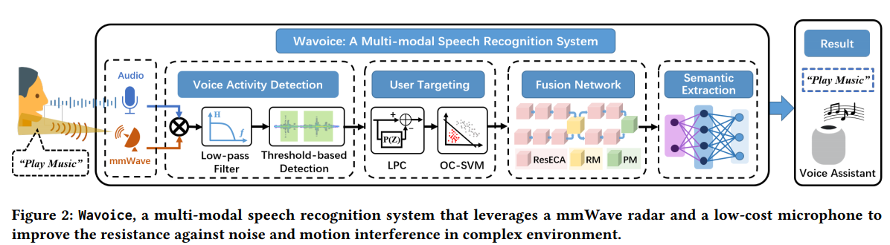
    </p>
</div>


## 4. [Tesla-Rapture: A Lightweight Gesture Recognition System from mmWave Radar Point Clouds](https://arxiv.org/abs/2109.06448)  
- **阅读日期：** 2021-10
- **修改日期：** 2022-9-28
- **关键词：** 毫米波雷达（IWR1443）点云数据实现轻量级手势识别
- **摘要：** 我们展示了 Tesla-Rapture，这是一种用于毫米波雷达生成的点云的手势识别界面。最先进的手势识别模型要么过于消耗资源，要么不够准确，无法使用可穿戴设备或受限设备（例如 IoT 设备（例如 Raspberry PI）、XR 硬件（例如 HoloLens）或智能手机）集成到现实生活场景中。为了解决这个问题，我们开发了 Tesla，这是一种用于毫米波雷达点云的消息传递神经网络 (MPNN) 图卷积方法。该模型在准确性方面优于两个数据集的最新技术，同时降低了计算复杂性，从而减少了执行时间。特别是，该方法能够比最准确的竞争对手预测手势快近 8 倍。我们在不同场景（环境、角度、距离）下的性能评估表明，Tesla 具有良好的泛化能力，在具有挑战性的场景（例如穿墙设置和极端角度感应）中，准确率提高了 20%。利用 Tesla，我们开发了 Tesla-Rapture，这是一种在 Raspberry PI 4 上使用毫米波雷达的实时实现，并评估其准确性和时间复杂度。我们还发布了源代码、经过训练的模型以及嵌入式设备模型的实现。 

- **整体框架：** Tesla-Rapture 的概述结构。 雷达通过雷达处理管道将 IQ 样本转换为点云，然后将其馈送到 Raspberry Pi 4 进行进一步处理和推断手势。
<div style="text-align:center">
    <p align="center">
        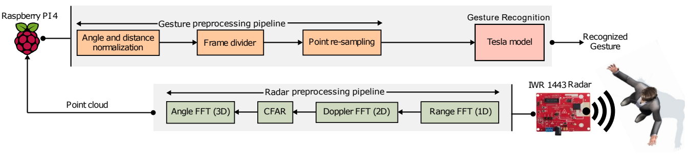
    </p>
</div>


## 3. [Osprey: A mmWave Approach to Tire Wear Sensing](https://dl.acm.org/doi/pdf/10.1145/3386901.3389031)
- **阅读日期：** 2021.9
- **修改日期：** 2022-9-28
- **出处：** MobiSys'2020
- [**Demo**](https://dl.acm.org/doi/10.1145/3386901.3396601)
- **摘要：** 轮胎磨损是全球汽车事故的主要原因。除了安全之外，轮胎磨损还会影响性能，是决定轮胎更换的重要指标，轮胎更换是全球卡车运输行业最大的维护费用之一。我们相信测量和监控所有汽车的轮胎磨损非常重要。当前测量轮胎磨损的方法是手动的并且极其繁琐。鉴于轮胎不适宜的温度、压力和动态，在轮胎中嵌入传感器电子设备以测量轮胎磨损具有挑战性。此外，放置在井中的非轮胎传感器（例如激光测距仪）容易受到可能沉淀在轮胎凹槽中的道路碎屑的影响。


- 本文介绍了 Osprey，这是第一个车载毫米波传感系统，可以连续测量准确的轮胎磨损，并且对道路碎屑具有鲁棒性。 Osprey 的关键创新是利用现有的大容量汽车毫米波雷达，将其放置在汽车的轮胎井中，并观察来自轮胎表面和凹槽的雷达信号的反射，以测量轮胎磨损，即使存在碎片也是如此。我们通过超分辨率逆合成孔径雷达算法实现了这一点，该算法利用轮胎的自然旋转并将距离分辨率提高到亚毫米。我们展示了我们的系统如何通过在凹槽中附加特殊的金属结构来消除碎屑，这些金属结构在与轮胎旋转相结合时充当空间代码并提供独特的特征。除了轮胎磨损感应外，我​​们还展示了检测和定位不安全的金属异物（例如卡在轮胎中的钉子）的能力。

- 我们在安装在机械、轮胎旋转装置和乘用车上的商用轮胎上评估 Osprey。我们在不同类型的碎片、不同程度的碎片、不同的地形和不同程度的汽车振动的情况下，以不同的速度测试鱼鹰。在我们所有的实验中，我们实现了 0.68 毫米的中值绝对轮胎磨损误差。 Osprey 还能以 1.7 厘米的误差定位卡在轮胎中的异物，并以 92% 的准确度检测金属异物。

- **应用场景：** 毫米波实现车辆轮胎检测
<div style="text-align:center">
    <p align="center">
        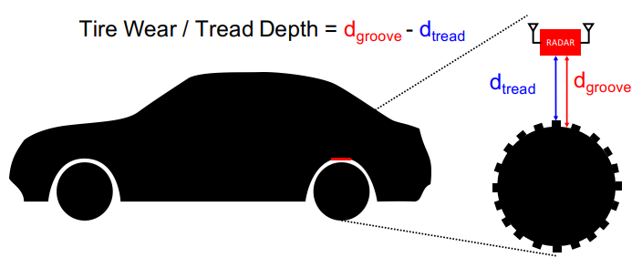
    </p>
</div>

- **整体框架：**  Osprey 的架构：（1）生成超分辨率 ISAR 轮胎图像（2）使用编码过滤掉碎片以获得胎面深度（3）检测和定位异物。
<div style="text-align:center">
    <p align="center">
        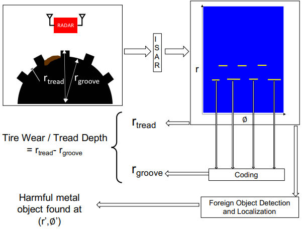
    </p>
</div>

## 2. [See Through Smoke: Robust Indoor Mapping with Low-cost mmWave Radar](https://dl.acm.org/doi/10.1145/3386901.3388945)
- **阅读日期：** 2021-9
- **修改日期：** 2022-9-28
- **出处：**  Mobisys2020
- **关键词：** 毫米波雷达，室内地图
- **摘要：** 本文介绍了miliMap的设计、实现和评估，这是一种基于单芯片毫米波(mmWave)雷达的室内测绘系统，针对低能见度环境以协助应急响应。 millMap的一个独特之处在于它仅利用低成本、现成的毫米波雷达，但可以重建与激光雷达相当的精度的密集网格地图，并提供地图上对象的语义注释。milliMap做出了两个关键的技术贡献。首先，它通过结合训练期间来自同位激光雷达的跨模态监督和室内空间的强几何先验，自主克服了毫米波信号的稀疏性和多径噪声。其次，它将毫米波反射的光谱响应作为特征来稳健地识别不同类型的物体，例如。门、墙壁等。在不同室内环境中的大量实验表明，milliMap可以实现小于0.2m的地图重建误差，并以约90%的准确度对关键语义进行分类，同时在浓烟中运行。

- **应用场景：**
<div style="text-align:center">
    <p align="center">
        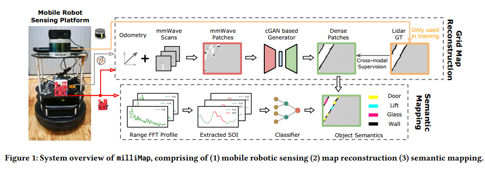
    </p>
</div>

- **贡献：**
    - 基于移动机器人的映射系统，使用单芯片毫米波雷达在低能见度室内环境中进行占用网格映射和语义映射。
    - 一种生成式学习方法，将来自同一位置的激光雷达的跨模式监督与室内空间的几何先验相结合。 我们的方法克服了毫米波信号的稀疏性和噪声问题，并且能够生成误差小于 0.2m 的密集地图。
    - 一种语义映射方法，通过利用毫米波反射的多路径效应来稳健地识别对象，提供 ∼ 90% 的分类准确度。
    - 具有广泛真实世界评估的实时原型实施，包括在烟雾弥漫的条件下进行测试。


## 1. [mmVib: Micrometer-Level Vibration Measurement with mmWave Radar](http://tns.thss.tsinghua.edu.cn/sun/publications/mmVib_MobiCom2020.pdf)
- **阅读日期：** 2021-9
- **修改日期：** 2022-9-28
- **出处：** Mobicom'2020
- **关键词：** 毫米波雷达，微米级的电机振动感知，模型解释
- **摘要：** 振动测量是工业系统中的一项关键任务，其中振动特性反映了物体的健康状况并指示了物体的异常情况。 以前的方法要么以侵入性方式工作，要么无法捕获微米级振动。 在这项工作中，我们提出了 mmVib，这是一种使用毫米波雷达测量微米级振动的实用方法。 通过引入多信号合并 (MSC) 模型来描述反射信号的特性，我们利用这些信号之间的内在一致性来准确恢复振动特性。 我们实现了一个 mmVib 原型，实验表明，该设计实现了 8.2% 的相对幅度误差和 0.5% 的中值相对频率误差。 通常，对于 100𝑢𝑚 振幅振动，中值振幅误差为 3.4𝑢𝑚。 与现有的两种方法相比，mmVib将80𝑡ℎ-percentile 幅度误差分别降低了62.9%和68.9%。

- **整体框架：**    
<div style="text-align:center">
    <p align="center">
        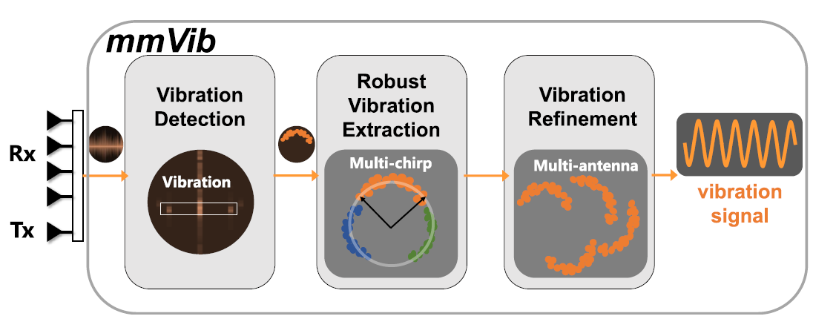
    </p>
</div>

- **MSC模型思想：**
<div style="text-align:center">
    <p align="center">
        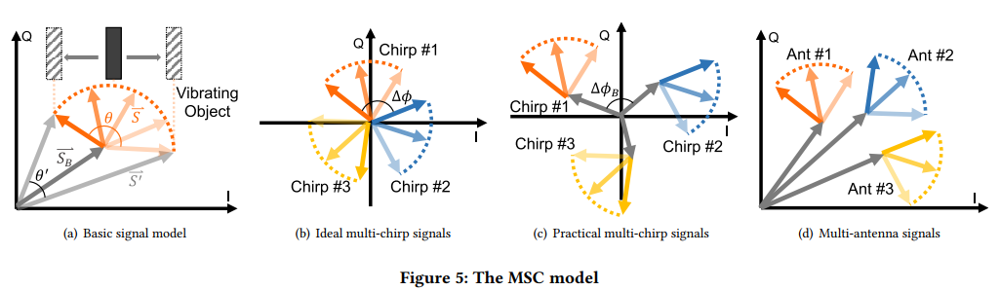
    </p>
</div>