## 26.[Mask Does Not Matter: Anti-Spoofing Face Authentication using mmWave without On-site Registration](https://han-jinsong.github.io/hanjinsong.github.com/mmFace_success_final.pdf)

- **阅读时间：** 2022-12-15
- **出处：** Mobicom2022
- **关键词：** 毫米波3D人脸认证

- **Xu et al. \cite{mmFace} exploit the penetrability, material sensitivity, and fine-grained sensing capability of mmWave to build an anti-spoofing mmFace system,  which allows mmFace to achieve reliable liveness detection and face authentication.**

- **Abstract：** Face authentication (FA) schemes are universally adopted. However, current FA systems are mainly camera-based and hence susceptible to face occlusion (e.g., facial masks) and vulnerable to spoofing attacks (e.g., 3D-printed masks). This paper exploits the penetrability, material sensitivity, and fine-grained sensing capability of millimeter wave (mmWave) to build an anti-spoofing FA system, named mmFace. It scans the human face by moving a commodity off-the-shelf (COTS) mmWave radar along a specific trajectory. The mmWave signals bounced off the human face carry the facial biometric features and structure features, which allows mmFace to achieve reliable liveness detection and FA. Due to the penetrability of mmWave, mmFace can still work well even if users wear masks. We explore a distance-resistant facial structure feature to suppress the impact of unstable face-to-device distance. To avoid inconvenient on-site registration, we also propose a novel virtual registration approach based on the core idea of cross-modal transformation from photos to mmWave signals. We implement mmFace with various antenna configurations and prototype two typical modes of mmFace. Extensive experiments show that mmFace can realize accurate FA as well as reliable liveness detection.


- **摘要：** 人脸认证(Face authentication, FA)方案被广泛采用。然而，目前的FA系统主要是基于摄像头的，因此容易受到面部遮挡(如口罩)和欺骗攻击(如3d打印口罩)的影响。本文利用毫米波的穿透性、材料敏感性和细粒度传感能力，构建了一个抗欺骗FA系统，命名为mmFace。它通过沿特定轨迹移动商品现货(COTS)毫米波雷达来扫描人脸。从人脸反射回来的毫米波信号携带了人脸的生物特征和结构特征，这使得毫米波人脸能够实现可靠的活性检测和FA。由于毫米波的穿透性，即使用户戴着口罩，mmFace仍然可以很好地工作。我们探索了一种抗距离的面部结构特征来抑制不稳定的与设备距离的影响。为了避免现场配准的不便，我们还提出了一种基于照片到毫米波信号跨模态转换的虚拟配准方法。采用多种天线配置实现了mmFace，并对mmFace的两种典型模式进行了原型设计。大量的实验表明，mmFace可以实现准确的FA和可靠的活性检测。

- **应用场景：** </br>
    <div style="text-align:center">
        <p>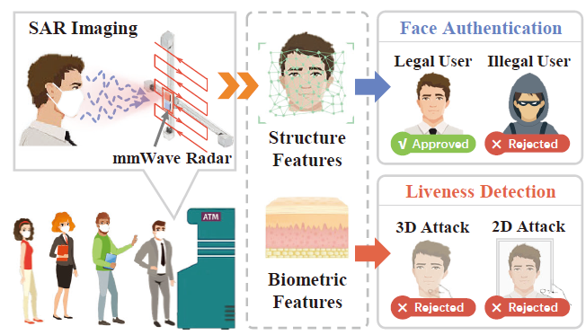</p>
    </div>
    
- **动机：** 我们探索一种**新的人脸认证技术**。该技术可适用于各种复杂的关照条件，有效的**识别戴口罩的用户的身份**，同时可**抵御伪造攻击**。
    <div style="text-align:center">
        <p>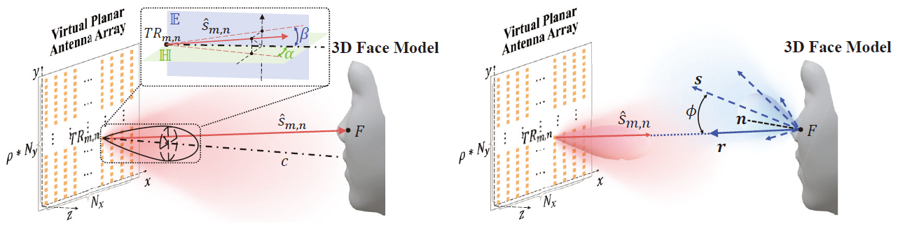</p>
    </div>

- **挑战：**
    - <b>1. 减少注册开销：</b> 现有的基于射频的方法通常需要在特定地点使用指定的射频设备进行现场注册。通过构建毫米波信号的传播模型，提出从照片到毫米波信号的跨模态转换的虚拟注册方法，从而避免繁琐的实地注册。
    - <b>2. 从非语义的信号中提取人脸结果特征：</b>毫米波的非语义性使我们很难直接从中获取面部结构信息，我们提出基于SAR成像技术从毫米波信号中重构出3D人脸图像，这些图像中包含人脸面部曲率分布信息。
    - <b>3. 距离鲁棒的人脸结构特征提取：</b>对于毫米波对距离敏感，3D人脸图像会受到人脸与雷达之间距离的影响，因此直接使用3D人脸图像无法实现距离鲁棒性的人脸识别。我们发现，在不同距离下重构的3D人脸图像的“亮区”轮廓是稳定的，“亮区”轮廓只由人脸面部的曲率分布决定，因此，亮区轮廓作为鲁棒的人脸结构特征。
    - <b>4. 实现可靠的活体检测：</b> 自适应的选取面部曲率较为一致的平坦的区域，从而消除人脸结构的影响。通过这些区域中提取的生物特征，以判断目标是否是真实地人脸。
    <div style="text-align:center">
        <p>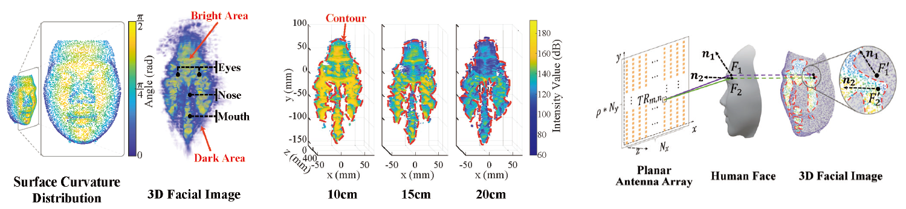</p>
    </div>
    
- **整体方案：** 主要包含两个阶段
    - <b>1. 注册阶段</b>为了避免现场注册，提出了一种VRS生成方法。（1）构造一个与身份验证场景一致的虚拟注册场景。（2）基于虚拟配准场景，建立了毫米波信号传播的理论模型，将图像转换为毫米波信号。

    - <b>2. 认证阶段</b> 用户只需要将他们的脸放在毫米波雷达前几秒钟。（1）在这个过程中，通过移动毫米波雷达沿特定轨迹来收集从面部反射的电磁波信号。mmFace从采集到的毫米波信号中提取生物特征进行活体检测。（2）为了抑制距离变化的影响，mmFace基于重构的人脸图像提取出抗距离的面部结构特征。（3）mmFace试图通过计算提取的面部结构特征与数据库中存储的每个模板之间的距离来在数据库中找到匹配。
        <div style="text-align:center">
            <p>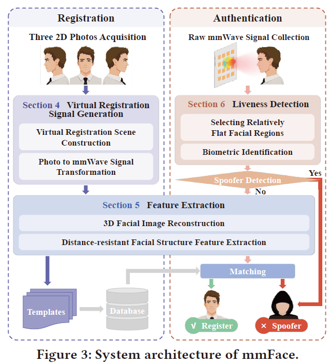</p>
        </div>

- **读后感：** 

- **Cite：**
```
    @inproceedings{10.1145/3495243.3560515,
    author = {Xu, Weiye and Song, Wenfan and Liu, Jianwei and Liu, Yajie and Cui, Xin and Zheng, Yuanqing and Han, Jinsong and Wang, Xinhuai and Ren, Kui},
    title = {Mask Does Not Matter: Anti-Spoofing Face Authentication Using MmWave without on-Site Registration},
    year = {2022},
    isbn = {9781450391818},
    publisher = {Association for Computing Machinery},
    address = {New York, NY, USA},
    url = {https://doi.org/10.1145/3495243.3560515},
    doi = {10.1145/3495243.3560515},
    abstract = {Face authentication (FA) schemes are universally adopted. However, current FA systems are mainly camera-based and hence susceptible to face occlusion (e.g., facial masks) and vulnerable to spoofing attacks (e.g., 3D-printed masks). This paper exploits the penetrability, material sensitivity, and fine-grained sensing capability of millimeter wave (mmWave) to build an anti-spoofing FA system, named mmFace. It scans the human face by moving a commodity off-the-shelf (COTS) mmWave radar along a specific trajectory. The mmWave signals bounced off the human face carry the facial biometric features and structure features, which allows mmFace to achieve reliable liveness detection and FA. Due to the penetrability of mmWave, mmFace can still work well even if users wear masks. We explore a distance-resistant facial structure feature to suppress the impact of unstable face-to-device distance. To avoid inconvenient on-site registration, we also propose a novel virtual registration approach based on the core idea of cross-modal transformation from photos to mmWave signals. We implement mmFace with various antenna configurations and prototype two typical modes of mmFace. Extensive experiments show that mmFace can realize accurate FA as well as reliable liveness detection.},
    booktitle = {Proceedings of the 28th Annual International Conference on Mobile Computing And Networking},
    pages = {310–323},
    numpages = {14},
    keywords = {face authentication, biometrics, millimeter wave},
    location = {Sydney, NSW, Australia},
    series = {MobiCom '22}
    }
```


## 25.[mmEve: Eavesdropping on Smartphone’s Earpiece via COTS mmWave Device](https://cse.buffalo.edu/~wenyaoxu/papers/conference/xu-mobicom2022.pdf)

- **阅读时间：** 2022-12-13
- **出处：** MobiCom2022
- **关键词：** 智能手机语音隐私泄露
- **摘要：** 智能手机的耳机模式通常用于机密通信。在本文中，我们提出了一种针对智能手机耳机的远程(&gt;2m)和运动弹性攻击。我们开发了一种基于商用毫米波传感器的端到端窃听系统mmEve，以恢复智能手机耳机发出的语音。攻击的基本原理是基于我们的观察，智能手机耳机发出的声波与智能手机后部反射的毫米波有很强的相关性。然而，我们发现恢复的语音受到传感器自噪声和智能手机用户运动的影响，攻击距离限制在2米以内，在现实世界中威胁有限。我们模拟了毫米波传感下的运动干扰，并通过优化I/Q平面的拟合函数，提出了一种运动弹性解决方案。为了在攻击距离合理的情况下实现实际攻击，我们开发了一种基于gan的去噪方案来消除传感器的噪声模式，将攻击距离提高到6-8m。我们通过大量实验对mmEve进行了评估，发现三星、华为等公司生产的23种不同型号的智能手机都可能受到该攻击的影响。
- **应用场景：** </br>
    <div style="text-align:center">
        <p>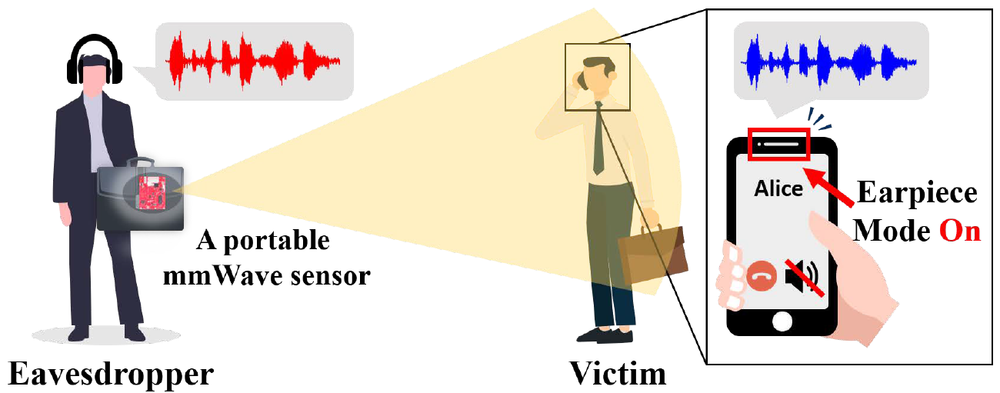</p>
    </div>

- **攻击模型：** </br>
    - 攻击场景：
        - 1. 手机用户使用听筒模式进行语音交流
        - 2. 攻击者尝试利用便携式攻击设备远距离恢复用户听筒语音内容
        - 3. 攻击者与被攻击者之间保持一定的社交距离（>2m）
    - 攻击假设：
        - 1. 攻击者和手机用户之间无遮挡
        - 2. 攻击者无需在用户手机上安装恶意软件
    - 攻击原理：
        - 该攻击利用手机听筒发声时与手机外壳之间产生的振动耦合，通过毫米波传感器感知机身轻微的振动来恢复听筒语音内容。
        <div style="text-align:center">
            <p>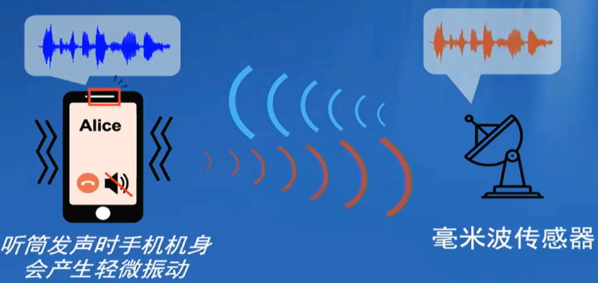</p>
        </div>
    
- **挑战：**
    - <b>1. 手持场景</b> 用户手持手机时的肢体的晃动会对解调的毫米波相位产生干扰，进而使所恢复的音频产生失真。
    - <b>2. 远距离攻击</b> 我们通过调整毫米波雷达到手机的间距来探究攻击距离对于所恢复的语音信号的影响，所恢复音频的信噪比会随着感知距离的增加急剧恶化，给远距离隐蔽窃听带来了挑战。

- **贡献：**
    - <b>1. </b> 我们的工作揭示了智能手机耳机上的远程(>2m)和运动弹性窃听，即远程对手可以通过COTS毫米波设备恢复可理解的语音。这种攻击不需要在目标智能手机上安装任何恶意软件。
    - <b>2. </b> 我们解决了几个技术难题，提出了一个端到端系统，实现了语音恢复的实际攻击，包括消除人体运动干扰的动态杂波抑制方法，以及将攻击距离提高到6-8m的基于gan的去噪方案。
    - <b>3. </b> 我们进行了大量的实验来评估针对三星、华为、苹果等不同型号智能手机的攻击。我们发现，23种不同型号的智能手机可以被提议的语音恢复攻击所破坏。
    
- **整体方案：**
    <div style="text-align:center">
        <p>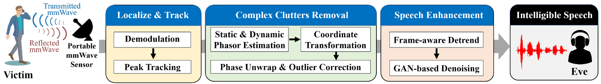</p>
    </div>
    - <b>1. 目标定位：</b> 利用常规雷达感知技术初步定位目标（Range-FFT，Doppler-FFT，Angle-FFT）
    - <b>2. 抑制杂波：</b> 消除环境中静态杂波以及用户运动带来的干扰，具体方法对IF信号分段拟合并根据估计的圆心进行转换，对转换后的信号进行离群点检测和纠正。
    - <b>3. 语音增强：</b> 提升远距离感知情况下所恢复音频的质量，构建基于GAN的降噪网络用于提升语音的信噪比，训练数据由公开语音数据和毫米波噪声合成得到。将恢复的低信噪比语音输入去噪声网络，得到增强后的音频。

- **思维导图：**


- **读后感：** 

- **Cite:**
```
@inproceedings{10.1145/3495243.3560543,
author = {Wang, Chao and Lin, Feng and Liu, Tiantian and Zheng, Kaidi and Wang, Zhibo and Li, Zhengxiong and Huang, Ming-Chun and Xu, Wenyao and Ren, Kui},
title = {MmEve: Eavesdropping on Smartphone's Earpiece via COTS MmWave Device},
year = {2022},
isbn = {9781450391818},
publisher = {Association for Computing Machinery},
address = {New York, NY, USA},
url = {https://doi.org/10.1145/3495243.3560543},
doi = {10.1145/3495243.3560543},
abstract = {Earpiece mode of smartphones is often used for confidential communication. In this paper, we proposed a remote(&gt;2m) and motion-resilient attack on smartphone earpiece. We developed an end-to-end eavesdropping system mmEve based on a commercial mmWave sensor to recover speech emitted from smartphone earpiece. The rationale of the attack is based on our observation that, soundwaves emitted from the smartphone's earpiece have a strong correlation with reflected mmWaves from the smartphone's rear. However, we find the recovered speech suffers from the sensor's self-noise and smartphone user's motion which limit attack distance to less than 2m, causing limited threats in real world. We modeled the motion interference under mmWave sensing and proposed a motion-resilient solution by optimizing the fitting function on I/Q plane. To achieve a practical attack with reasonable attack distance, we developed a GAN-based denoising scheme to eliminate the noise pattern of the sensor, which boosted the attack range to 6--8m. We evaluated mmEve with extensive experiments and find 23 different models of smartphones manufactured by Samsung, Huawei, etc. can be compromised by the proposed attack.},
booktitle = {Proceedings of the 28th Annual International Conference on Mobile Computing And Networking},
pages = {338–351},
numpages = {14},
keywords = {eavesdropping, earpiece, smartphone, mmWave sensing},
location = {Sydney, NSW, Australia},
series = {MobiCom '22}
}
```


## 24.[mmPhone: Acoustic Eavesdropping on Loudspeakers via mmWave-characterized Piezoelectric Effect](https://ieeexplore.ieee.org/document/9796806)

- **阅读时间：** 2022-12-16
- **出处：** INFOCOM2022
- **关键词：** 毫米波感知声音
- **摘要：** 由于方便，越来越多的人转向使用配备扬声器的设备进行在线语音通信。 为防止话音外泄，常采用隔音室。 本文介绍了 mmPhone，这是一种新颖的声学窃听系统，可以恢复受隔音环境保护的扬声器语音。 关键思想是由于压电效应，毫米波波段压电薄膜的特性会随着声压的变化而变化。 如果对手获得属性变化（即用毫米波表征压电效应），则可能会发生语音泄漏。 更重要的是，压电薄膜可以在没有电源的情况下工作。 基于此，我们提出了一种使用毫米波感知电影并解码来自毫米波的语音的方法，将电影变成一个被动的“麦克风”。 为了恢复可理解的语音，我们进一步开发了一种基于去噪神经网络、多通道增强和语音合成的增强方案，以补偿毫米波的传播和穿透损失。 我们进行了大量实验来评估 mmPhone 并进行数字识别，准确率超过 93%。 结果表明，mmPhone 可以从 5 米以上的距离恢复高质量和可理解的语音，并且对声波的入射角（55 度以内）和不同类型的扬声器具有弹性。

- **应用场景：** </br>
    <div style="text-align:center">
        <p>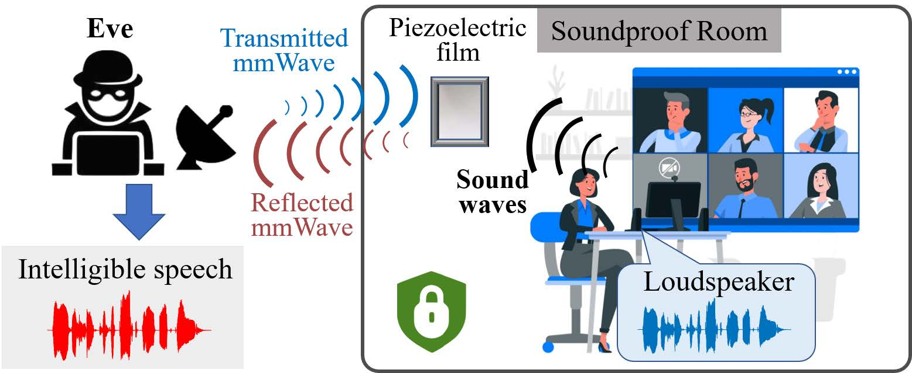</p>
    </div>
    
- **挑战：**
    - <b>1. </b> 正常对话中传播声波的声压级 (SPL) 是有限的 (60 - 70dB)。 建立基于声敏材料的遥感方法来恢复低能声波对于窃听至关重要。
    - <b>2. </b> 毫米波信号会随着感应距离的增加而衰减，导致信噪比 (SNR) 降低，尤其是在穿透障碍物（例如隔音墙）时。
    - <b>3. </b> 考虑到人类语音的频谱复杂性，声波的较高频率分量在传播过程中受到更大的衰减，更容易被噪声淹没，导致语音清晰度较差。

- **贡献：**
    - <b>1. </b> 我们建立了一种直接利用压电效应和毫米波信号来感测声波的方法。 我们从理论上对声音-毫米波转换进行建模，并揭示了一种可以窃听受隔音障碍物保护的语音的新型攻击。
    - <b>2. </b> 我们提出了一种基于 COTS 毫米波探头的窃听系统 mmPhone。 为了提高语音质量，我们设计了一个包含去噪神经网络和基于相位对齐的多通道增强的增强方案。 为了提高语音清晰度，我们开发了一种基于语音合成的免训练方法，该方法利用了从四种语言中恢复的音频用于精确语音重建的接收天线。
    - <b>3. </b> 我们通过大量实验评估 mmPhone。 结果表明，mmPhone 可以远程（5m）恢复高质量和可理解的语音，数字识别准确率超过 93%。 我们定量评估了 mmPhone 的鲁棒性，它显示了对声波入射角（< 55°）和不同扬声器的弹性。

- **整体方案：**
    <div style="text-align:center">
        <p></p>
    </div>


## 23.[Hearing Heartbeat from Voice: Towards Next Generation Voice-User Interfaces with Cardiac Sensing Functions](https)
- **阅读时间：** 2022-12-2
- **出处：** SenSys’22
- **关键词：** 通过提取说话人语音信息来感知说话人心跳信号，并且利用深度学习网络将特征转换为心跳活动
- **摘要：** 语音用户界面(vui)已广泛应用于日常生活中的许多物联网和移动设备中。vui通过较低成本的硬件(例如，麦克风)和较高的吞吐量(与键盘和触摸屏相比)提供了良好的用户体验。目前，身份认证和接收命令是通过vui进行的两种最常见的交互，这使得语音中的生理信息无法被利用。认识到这一尚未开发的潜力，我们建议VocalHR将vui扩展到语音命令以外的心脏活动感知，而无需额外的硬件。VocalHR建立在声心调制效应的基础上，声心调制效应植根于心脏活动对发声器官在发声过程中的行为的影响。VocalHR在多个语音器官中捕获心脏活动的语音特征，并提出了一种深度学习管道，将特征转化为心脏活动。由于这是第一项探索基于语音的心脏活动感知的研究，我们对43个人口统计学上不同的受试者进行了广泛的实验，以验证语音和心脏活动之间的内在联系。平均而言，VocalHR对心脏事件计时的规范化感知误差小于11.1%。我们进一步的评估表明，VocalHR对不同的麦克风规格和不同的语音速率具有鲁棒性。

    在这项工作中，我们提出了VocalHR，这是第一个利用声音-心脏调制效应将VUIs扩展到心脏活动感知的系统框架。我们首先对声音音量进行归一化，以补偿音量对信号能量的影响。然后，通过去除与心脏活动无关的嘴唇辐射的影响来增强声音。之后，我们分析了心脏活动对声音产生影响的物理模型。根据分析模型，提取出与心脏活动对肺、喉影响密切相关的代表性语音特征。分析还发现，声心调制模型与语音系统特性相结合。因此，我们提出了一种基于深度学习解调器的心脏活动重建模型。具体来说，我们利用一个基于长短期记忆的过滤器来提取心脏信息，然后将其下转换为心脏活动。为了配置语音-心脏解调模型，设计了一种基于小波分解的监督判别器。为了评估我们的系统，我们招募了43名受试者，结果显示在低心率和高心率状态下心脏事件(心室去极化)的归一化误差分别为11.02%和11.08%。


- **应用场景：** </br> VocalHR将VUIs扩展到心脏活动传感。该系统建立在心脏活动影响与声音产生有关的多个器官的效果之上。在首次使用之前，VocalHR需要一次性注册用户，以配置用户的发声器官特征。在注册过程中，用户同时记录他们的口头阅读声音和心脏活动。这些记录用于建立声心解调器。登记设置是直观和快速的，因此它可以由家庭医生在例行访问中完成，或作为类似于血压测试的药房服务提供。基于已建立的模型，VocalHR可以无缝集成到现有的VUIs中，在用户正常与智能手机和扬声器等设备交互时，感知心脏活动。我们将在第10节中进一步讨论VocalHR在医疗保健场景中的几个潜在应用。
    <div style="text-align:center">
        <p>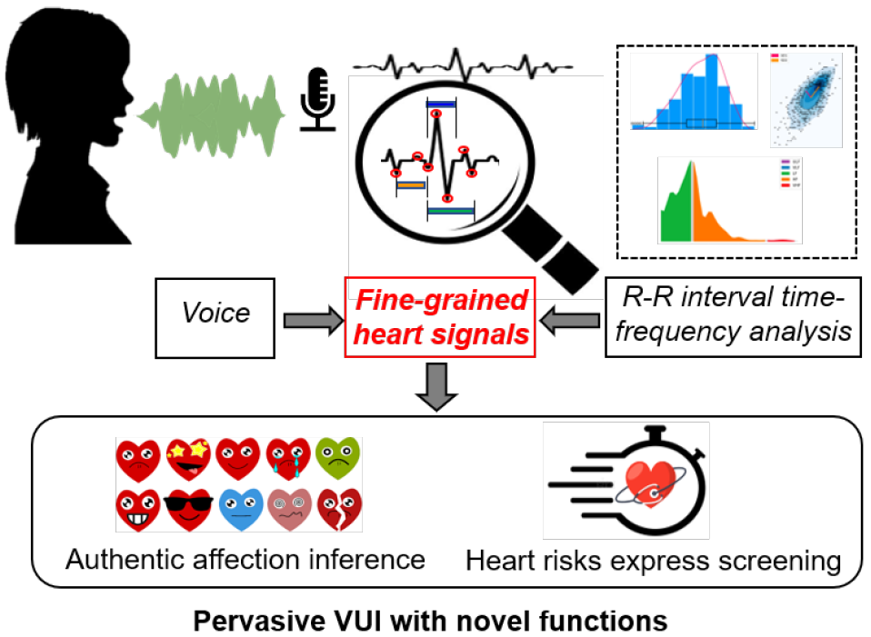</p>
    </div>
    
- **动机：** 是否有可能通过探究语音中的心脏信息来赋予VUI应用新的功能?

- **挑战：**
    - <b>1. </b> 声音是为了交流而产生的。如何从充满语义信息的语音中发现和提取心脏活动信息?
    - <b>2. </b> 每个人都有独特的发声系统。从声音中提取的心脏活动信息将与用户的声音系统特征相结合。如何用最小的用户努力建立心脏活动重建模型?
    - <b>3. </b> 如何定量评估各种下游应用的重建心脏活动?

- **贡献：**
    - <b>1. </b> 我们探索了一种新的基于语音的心脏活动传感方法。我们发现，由于心脏对发声器官的影响，声音携带着丰富的心脏活动信息。
    - <b>2. </b> 我们开发了VocalHR，这是一种无处不在的心脏活动传感系统，可以与vui无缝集成，无需额外的硬件。生理语音特征是由心音调节效应衍生出来的，用以表征心脏活动信息。提出了一种基于深度学习的心脏活动语音特征解调模型。
    - <b>3. </b> 我们使用多种心脏活动指标对43名受试者进行VocalHR广泛评估。平均而言，感知到的心脏活动R峰的归一化计时误差为11.1%，心脏周期持续时间的归一化误差为15.7%。
    
- **整体方案：** VocalHR由语音处理模块和心脏活动重建模块组成,VUI捕获用户语音后，通过预处理对其音量进行归一化处理。然后，通过去除语音中不相关的唇形影响来增强声心调制效果。然后提取语音的肺、喉、咽成分，在此基础上通过相应的调制特征描述心脏活动对这些成分的影响。一旦特征得到，数据驱动解调器将从调制特征过滤心脏信息。这些信息最终被转化为心脏活动。在一次性用户注册时，用户的声音输入到VocalHR的前端，心脏活动输入到末端。声心解调器通过这种数据驱动的监督配置来配置用户的声音器官特征。
    <div style="text-align:center">
        <p>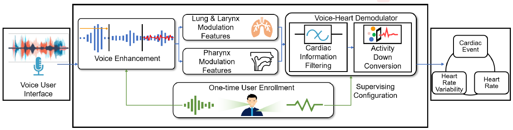</p>
    </div>

    - <b>1. Pre-processing </b> 采用相对于全音阶的响度单位(LUFS)作为归一化的度量，而不是加权分贝或dB声压级，因为使用LUFS的归一化更好地与人的音域相关

    - <b>2. Enhancing Voice-heart Modulation Effect </b> 预加重来增强语音信号: ``` 𝑠′ (𝑡 ) = 𝑠 (𝑡 ) − 𝛼𝑠 (𝑡 − 1) 𝛼=0.97 (𝛼的取值范围0.9-1）``` 语音经发声者的口唇辐射发出，空气作为语音信号传播的介质，在传播声音信号能量的同时也消耗能量，语音信号的频率越高，介质对声音能量的损耗越严重，预加重能在一定程度上弥补高频部分的损耗，保护声道的信息。
    
    - <b>3. Lung-Larynx Demodulation </b> 
    
    - <b>4. Pharynx Demodulation </b> 
    
    - <b>5. Cardilac Reconstruction vir Voice-heart Demodulation </b> 之前的理论分析说明心脏活动信号被调制到声音信息中，现在如果已知声音信号，然后获取心脏活动信息。
        - 5.1 Design Considerations.
            - Consideration 1: 解调整体架构, 考虑使用历史信息来更好的处理时序数据，考虑IoT设备计算和存储资源的限制。
            - Consideration 2：解调器的配置， 在用户enrollment阶段通过最小化近似差分方法来配置解调器参数，损失函数L的设计。
        - 5.2 Voice-Heart Demodulation. To address these issues, the voice-heart demodulator builds upon the long-short term memory (LSTM), which is considered to be a learnable non-linear IIR filter.
            - Two-stage Demodulation. 采用encoder-decoder的方式实现基本框架，每个编码器均由LSTM组成，编码器的上述等式表明心脏信息和LSTM状态被传递到下一个时间步，从而利用历史信息进行更好的过滤。

            - Adaptive Weighting of Filtering. 

            <div style="text-align:center">
                    <p>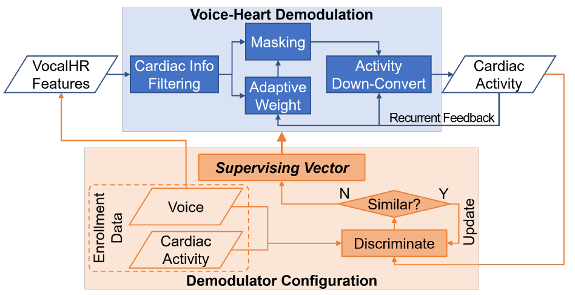</p>
                </div>
        - 5.3 Demodulator Configuration. 设计Discriminator来区分reconstructed and original cardiac activities.

- **实验评估：**
    - 6. Evaluation Setup
        - 1. 48k采样率的USB麦克风采集语音数据，512Hz的ECG采集心跳信号，43名志愿者参与收集数据，
        - 2. 评估指标：Cardiac Cycle and Event Timing，Heart Rate Variability，

    - 7. Overall Performance
        - 1. 
    - 8. Cardinality Study
        - 1. How Much Does Each Demodulation Feature Contribute?
        - 2. Understanding Cardiac Activity Reconstruction in Voice Data

    - 9. Usability and Robustness study
        - 1. The Impact of Speech Rate
        - 2. The Impact of User Distance & Direction
        - 3. The Impact of Voice Sampling Rate
        - 4. The Impact of Microhpone Frequency Response
        - 5. The Impact of Noise
        - 6. Impact of Real-world Environment
        - 7. Longitudinal Study
    - 10. Implications and Future Work

- **读后感：** 


## 22.[Wavesdropper: Through-wall Word Detection of Human Speech via Commercial mmWave Devices](https://cse.buffalo.edu/~wenyaoxu/papers/journal/xu-imwut2022b.pdf)

- **阅读时间：** 2022-11-14

- **出处：** Ubicomp'22

- **关键词：** 商用毫米波雷达实现穿墙语音单词检测

- **摘要：** 大多数现有的窃听攻击利用传播声波进行语音检索。然而，隔音材料广泛应用于语音敏感的场景（例如会议室）。在本文中，我们揭示了受隔离房间保护的人类语音可能会受到便携式和商用现成毫米波设备的影响。为了实现这一目标，我们开发了 Wavesdropper，这是一个单词检测系统，它利用毫米波探头来感知目标说话者的喉咙振动并在阻塞条件下恢复语音内容。我们提出了一种基于 CEEMD 的方法来抑制动态杂波（例如，人类运动) 和基于小波的处理方法从混合信号中提取精细的声音振动信息。为了从与声音振动相关的毫米波信号中恢复语音内容，我们设计了一个神经网络来推断语音内容。此外，我们使用多个（两个）探测器探索了对话中的单词检测，并发现攻击者可以仅使用一个毫米波设备同时检测多个人的单词。我们进行了广泛的实验来评估超过 60,000 个发音的系统性能。实验结果表明，Wavesdropper 对 23 名志愿者的 57 个单词识别可以达到 91.3% 的准确率。

- **应用场景：** </br> 攻击者可以利用COTS mmWave探头对在隔音场景中保护的人类语音进行穿墙字检测。
    <div style="text-align:center">
        <p>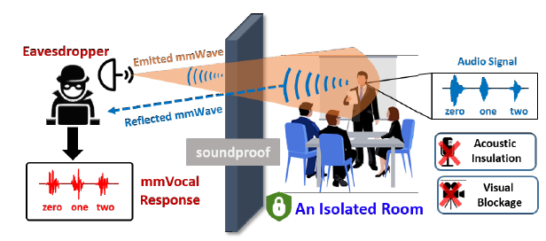</p>
    </div>
    
- **动机：** 当声波受到隔音材料的约束时，利用传播声波和声波诱导振动的攻击可能失败。隔音障碍虽然可以防止传播的声波泄漏，但不能保证声源(如本文中的人扬声器)直接泄漏。在本文中，我们试图研究用隔音措施保护的人类语音是否会被装备了COTS mmWave设备的外部攻击者破坏。具体来说，如上图所示，攻击者在房间外使用便携式和COTS mmWave探头，通过墙壁捕捉受害者喉咙附近的皮肤振动，以恢复语音内容，这是抗隔音措施。

- **挑战：** 要实现这样的穿墙攻击有多重挑战
    - <b>1. 定位被窃听对象。 </b> 由于墙的堵塞，攻击者对环境设置一无所知。重要的是要使攻击对环境变化有弹性，并找到说话人。

    - <b>2. 消除干扰信号。 </b> 扬声器周围的物体（包括静态和移动物体）会产生杂波，因此消除干扰并从混合反射信号中提取与语音相关的毫米波分量非常重要。 此外，作为一种常见情况，说话者在讲话过程中可能会出现运动伪影（例如，身体摆动和手势），这可能会导致与语音无关的毫米波回声，并使细微的声音振动的提取更具挑战性。
    
    - <b>3. 感知到的毫米波信息转化为语音信息。</b> 假设攻击者成功获取包含语音信息的毫米波组件，则需要一个转换模型将毫米波信号转换为语音内容。

    - 为此，作者提出了 Wavesdropper，这是一种穿墙词检测系统，基于便携式 COTS 毫米波探头（即 TI IWR1642Boost）语音窃听。所提出的Wavesdropper 可以将目标扬声器定位在墙后并发射毫米波感知他/她的喉咙振动。通过应用时空分析，Wavesdropper 可以将说话者与背景区分开来，并消除背景回声的影响。之后，应用基于 CEEMD 的杂波抑制来消除房间中的动态干扰（例如，移动物体）。高通滤波和基于小波的分析进一步用于过滤说话者运动伪影（例如身体摆动和手势）的影响，并提取包含语音信息的干净声音振动，即 mmVocal 响应。最终，Wavesdropper 自动将 mmVocal 响应分割成单个单词，并将它们输入基于 ResNet 的神经网络（即 WavesdropNet）以恢复可理解的语音内容。
    

- **贡献：**
    - <b>1. </b> 恶意对手可以将广泛使用的 COTS 毫米波传感器变成窃听者，从而对受隔音材料保护的人类语言造成威胁。 我们研究了使用 COTS mmWave 设备在穿墙场景中窃听人工语音的可行性。

    - <b>2. </b> 我们开发了一个端到端系统Wavesdropper，用于穿墙词检测。 基于我们提出的基于 CEEMD 的杂波抑制和基于小波的信号处理方案，Wavesdropper 可以消除杂波干扰并从反射的混合毫米波信号中提取语音信息。 通过精心设计的检索模型，可以高精度地恢复语音内容。
    
    - <b>3. </b> 我们进行了实验来评估该系统，该系统对 23 名志愿者的 57 字识别准确率达到 91.3%。 我们还测试了系统在不同条件下的鲁棒性并给出了对策。
    
    
- **整体方案：**
    <div style="text-align:center">
        <p>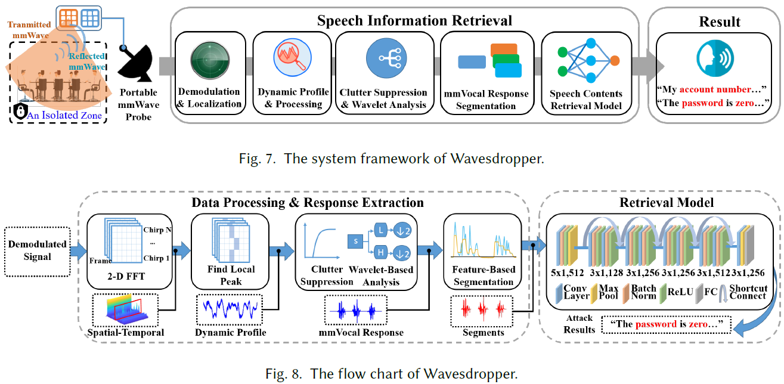</p>
    </div>


- **思维导图：**
    <div style="text-align:center">
        <p>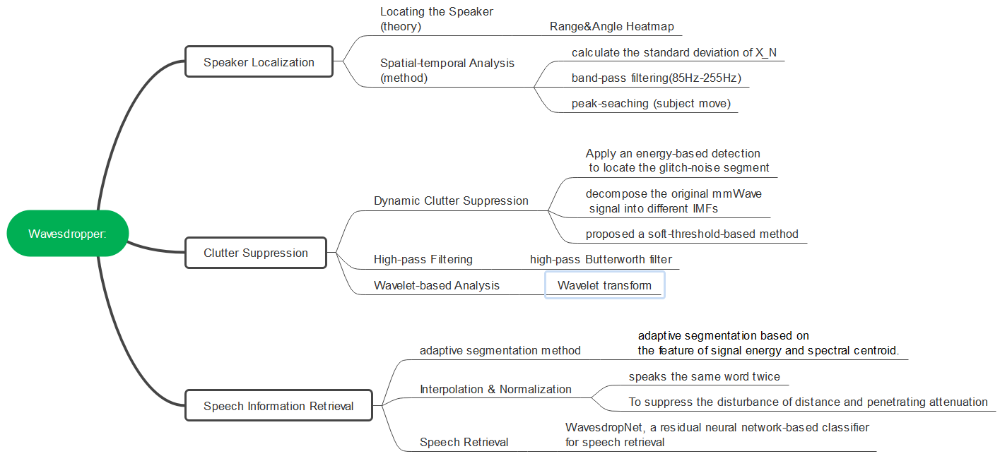</p>
    </div>

- **实验设置以及测试场景：**
    <div style="text-align:center">
        <p>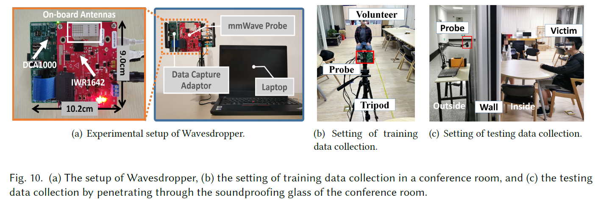</p>
    </div>

- **读后感：** 
    - (1) CEEMD-based Dynamic Clutter Suppression，但是不知算法实际效果如何？


## 21. [Towards Robust Gesture Recognition by Characterizing the Sensing Quality of WiFi Signals](https://www.researchgate.net/publication/359586964_Towards_Robust_Gesture_Recognition_by_Characterizing_the_Sensing_Quality_of_WiFi_Signals?enrichId=rgreq-a64f3d9dacbdd8ae708952605978d465-XXX&enrichSource=Y292ZXJQYWdlOzM1OTU4Njk2NDtBUzoxMTQ3MjQ4OTE4NDI5Njk2QDE2NTA1MzY4NjU3ODM%3D&el=1_x_3&_esc=publicationCoverPdf)

- **阅读时间：** 2022-12-11
- **出处：** Ubicomp2022
- **关键词：** Wifi 感知手势信号
- **摘要：** 基于wifi的手势识别是近年来兴起的，受到了研究者的广泛关注。通过WiFi信号识别手势是可行的，因为人类的手势会给接收到的原始信号带来时间序列的变化。构建无处不在的手势识别系统的主要挑战是，每个手势和一系列信号变化之间的映射不是唯一的，完全相同的手势，但在不同的位置或对收发器的不同方向执行，会产生完全不同的手势信号(变化)。为了消除位置依赖，先前的工作建议使用手势级别的位置独立特征来表征手势，而不是直接匹配信号变化模式。我们观察到，手势级别的特征不能完全消除位置依赖，因为每个手势内部的信号质量是不同的，也取决于位置。因此，我们将每个手势的信号时间序列根据其质量进行细分，并提出定制化的信号处理技术分别进行处理。为了实现这一目标，我们通过建立一个将手势信号与环境噪声联系起来的数学模型来表征信号的感知质量，并由此进一步推导出一个唯一的度量，即动态相位指数误差(EDP-index)，定量描述每个手势信号段的感知质量。然后，我们提出了一个面向质量的信号处理框架，最大限度地提高高质量信号段的贡献，最小化低质量信号段的影响，以提高手势识别应用的性能。我们开发了COTS WiFi设备的原型。大量的实验结果表明，我们的系统可以识别手势，平均准确率超过94%，与现有技术相比有显著提高。

- **应用场景：** </br> 基于wifi的手势识别技术是近年来兴起的，由于它是用户与数字设备进行交互的一种自然和非侵入性的方式，因此受到了广泛的关注。每个手势在相对于Wi-Fi收发器的不同位置执行时，都会导致不同的信号变化。
    <div style="text-align:center">
        <p>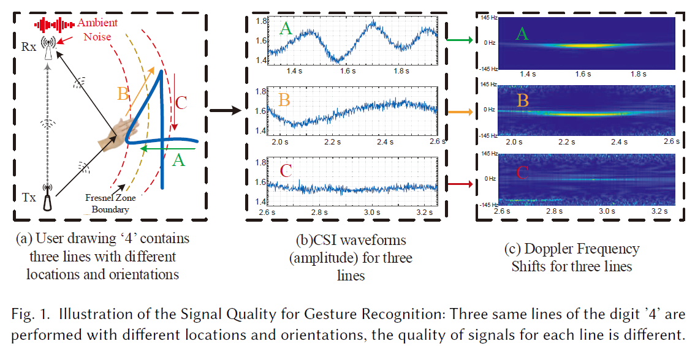</p>
    </div>
    
- **动机：** 非接触式交互应用

- **挑战：**
    - <b>1. </b> 
    - <b>2. </b>
    - <b>3. </b>
    - <b>4. </b>

- **贡献：**
    - <b>1. </b> 我们观察到手势内部的异构传感质量现象，这对传感鲁棒性有显著影响。我们建立了一个理论模型来解释这一现象，并描述了原始WiFi信号中手势信号和环境噪声之间的关系。在理论分析的基础上，我们进一步提出了一种新的动态相位误差(Error of Dynamic Phase, EDP)度量来精确量化传感质量。

    - <b>2. </b>在此基础上，我们提出了一种新的传感框架-DPSense，该框架利用EDP度量根据信号的传感质量有效地将信号分类为片段，并对其进行不同的处理。DPSense提高了感知质量，避免了低质量信号的失真，保证了手势识别的鲁棒性。

    - <b>3. </b>为了演示DPSense的有效性，我们将该框架应用于两个不同的最新应用程序以识别实际环境中的各种手势。我们的实验结果表明DPSense极大地提高了其他系统的性能。
    - <b>4. </b>

- **模型：** Understanding the sensing quality of gesture recognition
    - 1. Intuition Analysis of Signal’s Sensing Quality

    - 2. Theoretical Model of Gesture Sensing on Wi-Fi Signals

    - 3. Investigation of Sensing Quality from the Gesture Sensing Model. 
        - 定义信号感知质量：噪声干扰比目标动态干扰
        
- **整体方案：**
    <div style="text-align:center">
        <p>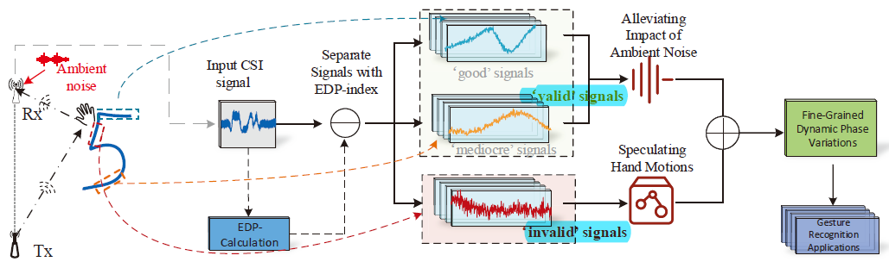</p>
    </div>

- **思维导图：**
    <div style="text-align:center">
        <p></p>
    </div>


## 20. [Pointillism: Accurate 3D Bounding Box Estimation with Multi-Radars](https://wcsng.ucsd.edu/files/Pointillism_paper.pdf)

- **阅读时间：**  2022-11-13

- **出处：** SenSys'20

- **关键词：** 多毫米波雷达点云感知3D目标框, 毫米波，雷达感知，深度学习，不利天气，自动驾驶，物体检测

- **摘要：** 自主感知需要以动态对象的 3D 边界框的形式进行高质量的环境感知。汽车系统中使用的主要传感器是基于光的摄像头和激光雷达。然而，众所周知，它们在恶劣的天气条件下会失效。雷达可以潜在地解决这个问题，因为它们几乎不受恶劣天气条件的影响。然而，无线信号的镜面反射会导致雷达点云的性能不佳。我们介绍了**点画法**，这是一种将来自多个空间分离雷达的数据与最佳分离相结合的系统，以缓解这些问题。我们引入了交叉势点云的新概念，它利用多个雷达引起的空间多样性，解决了雷达点云中的噪声和稀疏问题。此外，我们提出了 RP-net 的设计，这是一种新颖的深度学习架构，专为雷达的稀疏数据分布而设计，以实现准确的 3D 边界框估计。本文设计和提出的空间技术是雷达点云分布的基础，将有利于其他雷达传感应用。

- **应用场景：** </br> 主要原因是，汽车雷达发射毫米波信号，与光信号向各个方向散射不同，毫米波信号反射表面，只允许一小部分入射波返回到雷达接收器，如图所示。
    <div style="text-align:center">
        <p>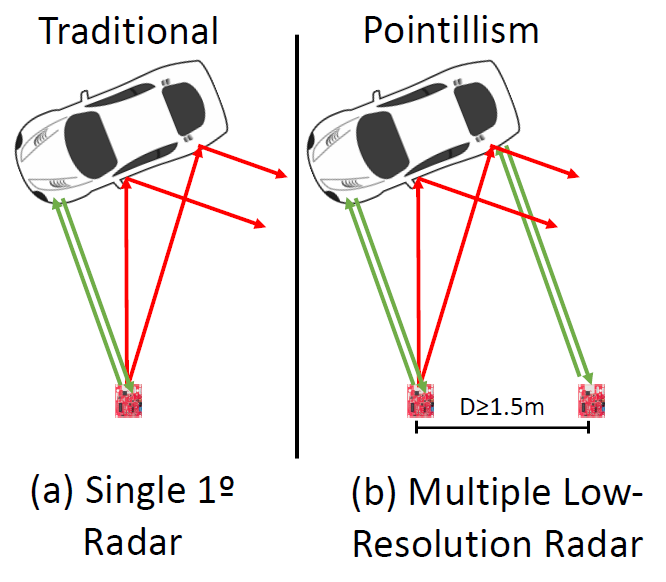</p>
    </div>
    
- **动机：** 自动驾驶汽车需要高质量的几何感知他们航行的场景，即使在不利的天气条件下。大多数已经存在视觉算法和数据驱动算法都是基于高分辨率、多通道的LiDARs来重建3D的BBOX。然而，激光雷达无法穿透雾和灰尘。相比之下，毫米波雷达是一种强大的传感解决方案，它发射毫米波(mmwave)，受不利天气条件的影响较小。毫米波的波长使它们可以轻易地穿过雾、灰尘和其他微观粒子。

- **挑战：**
    - <b>1. </b> 毫米波雷达由于镜面反射引起的点云稀疏性
    - <b>2. </b> 好的位置摆设可以增加空间多样性，但是噪声任然是一个主要挑战。因为以简单的方式直接叠加噪声也随之相应叠加。

- **贡献：**
    - <b>1. </b> 提出了一种新的雷达感知框架，利用多雷达引起的空间分异和优化它们的分离，以应对毫米波雷达镜面反射的基本挑战。
    - <b>2. </b> 利用多台雷达点云的时空相干性，提出了交叉势点云（Cross Potential Point Clouds）的概念，以降低雷达点云中的噪声，从而提高信号质量。
    - <b>3. </b> 我们设计了RP-net，一种新的深度学习框架，旨在利用雷达点云的非均匀分布，在交叉势点云上估计精确的三维边界盒。
    - <b>4. </b> 我们从多个视野重叠的雷达建立了第一个真实世界的标记雷达点云数据集，其中包含54K雷达帧和相应的激光雷达点云和良好/恶劣天气条件下的RGB图像。我们相信这个数据集将使各种传感器融合方法的创新成为可能。
    
- **整体方案：**
    <div style="text-align:center">
        <p></p>
    </div>
    - <b>1. Space coherence with Radar point potential</b> 如何叠加多个雷达数据来降低点云噪声？利用空间相干性到点云几何信息中，基于这样一个insight“如果一个3D空间区域在多个雷达中产生响应，它很可能是由一个物体而不是噪声产生的”。利用点云聚类的不同雷达的点云数据，
    - <b>2.Time coherence with multiple frames </b> 单帧中的点数量较少，利用多帧的时间相干性。我们跟踪连续帧中点的运动，并用它来估计航向。对自运动补偿帧进行跟踪，以消除源车辆运动的影响。采用基于卡尔曼滤波的校正方法来处理传感器的不确定性和噪声。
    - <b>3. MULTI-OBJECT 3D BOUNDING BOXES --> RP-net </b> 使用多个雷达融合来创建交叉势点云，我们可以解决噪声，并潜在地消除检测动态对象数量的不准确性。深度网络可以建立关于点云和精确物体位置之间关系的经验，并使用该经验来估计精确的3D-BBoxs。
        <div style="text-align:center">
        <p>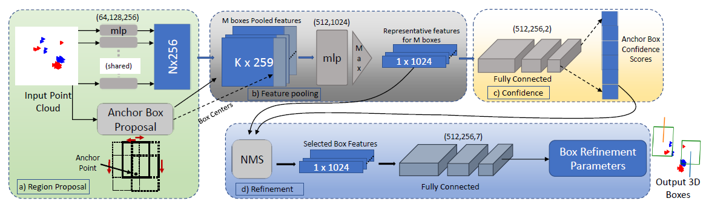</p>
        </div>

    - <b>4. Network Architecture Design </b> RP-net的工作是给定一个场景点云，输出场景中出现的物体的三维边界框集合。它以CPPC为输入，CPPC有6个通道，分别对应于每个点的x、y、z坐标、速度、峰值强度和交叉电位值。RP-net包括以下区块:
        - (a) 处理多目标：对于有多个车辆的给定场景，区域建议通过在场景中放置多个锚框来定义。我们基于车辆几何形状和时空相干性的雷达响应，提出了一种新的基于点的区域提议(锚盒)生成方案。

        - (b) 基于特征提取和池化的分割方法: PR-Net使用两阶段网络，

        - (c) BBox的置信度：

        - (d) BBox参数Refinement：

        - (e) Loss Function: The first stage of the network is a binary classification problem that uses a **cross-entropy loss**, given by. Refinement of the bounding boxes is a regression problem and we use **Smooth-L1** loss for this purpose.
    
    - <b>5. 雷达参数配置 </b>:
        |Parameter| Value| Parameter| Value |
        |-|-|-|-|
        |Start Frequency| 77 GHz| Frame rate |30 fps|
        |Bandwidth |2240 MHz |Range Res.|0.067m
        |ADC rate |7500 ksps| Velocity Res.| 2.59 m/s|
        |Chirp Duration |40 𝜇s |Max velocity |20.74 m/s|
        |-|-|-|-|

- **读后感：** 
    - (1) 3D框估计边界准确度，以及边界限定的机理？


## 19. [milliEye: A Lightweight mmWave Radar and Camera Fusion System for Robust Object Detection](https://dl.acm.org/doi/abs/10.1145/3450268.3453532)
- **[Github](https://github.com/sxontheway/milliEye)**
- **阅读时间：** 2022-10-21
- **出处：** ACM IOTDI'21
- **关键词：** 毫米波（点云）与摄像头实现融合检测目标，并且设备在边缘移动端部署
- **摘要：** 近年来，许多先进的深度学习算法被提出用于图像分类和目标检测。然而，这些方法的有效性在许多能见度或光照较差的现实场景中会受到显著限制。与RGB相机相比，毫米波(mmWave)雷达不受上述环境变化的影响，可以在不利条件下辅助相机。为此，我们提出了milliEye，一种轻量级的毫米波雷达和相机融合系统，用于边缘平台上的鲁棒目标检测。与现有的传感器融合方法相比，milliEye有几个关键优势。首先，虽然milliEye以基于学习的方式融合了两种传感模式，但它只需要少量新场景的标记图像/雷达数据，因为它可以充分利用大型公共图像数据集进行广泛的训练。这一显著特性使milliEye能够适应高度复杂的现实环境。其次，基于一种新颖的架构，将基于图像的对象检测器与其他模块解耦，milliEye可以兼容不同的现有基于图像的对象检测器。因此，它可以利用快速发展的目标检测算法。此外，得益于高度计算效率的融合方法，milliEye是轻量级的，因此适合基于边缘的实时应用。为了评估milliEye的性能，我们收集了一个新的雷达和相机融合数据集用于目标检测，其中包含普通光和低光照明条件。 结果表明，与最先进的基于图像的对象检测器(包括Tiny YOLOv3和SSD)相比，milliEye可以提供显著的性能提升，特别是在光线较弱的场景中，同时在边缘平台上产生较低的计算开销。近年来，许多先进的深度学习算法被提出用于图像分类和目标检测。然而，这些方法的有效性在许多能见度或光照较差的现实场景中会受到显著限制。H与RGB相机相比，毫米波(mmWave)雷达不受上述环境变化的影响，可以在不利条件下辅助相机。为此，我们提出了milliEye，一种轻量级的毫米波雷达和相机融合系统，用于边缘平台上的鲁棒目标检测。与现有的传感器融合方法相比，milliEye有几个关键优势。首先，虽然milliEye以基于学习的方式融合了两种传感模式，但它只需要少量新场景的标记图像/雷达数据，因为它可以充分利用大型公共图像数据集进行广泛的训练。这一显著特性使milliEye能够适应高度复杂的现实环境。其次，基于一种新颖的架构，将基于图像的对象检测器与其他模块解耦，milliEye可以兼容不同的现有基于图像的对象检测器。因此，它可以利用快速发展的目标检测算法。此外，得益于高度计算效率的融合方法，milliEye是轻量级的，因此适合基于边缘的实时应用。为了评估milliEye的性能，我们收集了一个新的雷达和相机融合数据集用于目标检测，其中包含普通光和低光照明条件。结果表明，与最先进的基于图像的对象检测器(包括Tiny YOLOv3和SSD)相比，milliEye可以提供显著的性能提升，特别是在光线较弱的场景中，同时在边缘平台上产生较低的计算开销。

- **应用场景：** </br> 
    <div style="text-align:center">
        <p>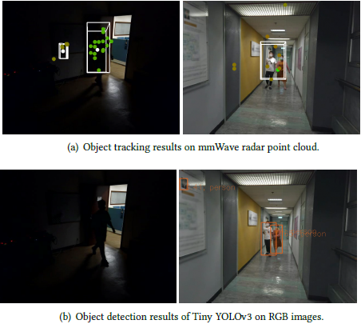</p>
    </div>
    
- **动机：** 在光照条件不好的情况下摄像头检测目标不准，但是毫米波能很好的感知目标，在多人情况下毫米波不能很好的区分目标，但是摄像头可以，因此考虑融合两模态特征，利用模态之间的互补性来提高目标检测准确率。

- **挑战：**
    - <b>1. 数据集</b> 同时带有mmWave和Camera标注的大数据集难以获取
    - <b>2. 不同场景目标检测难易程度</b>

- **贡献：**
    - <b>1. </b> 我们提出了milliEye，一个毫米波和相机融合系统实时鲁棒的目标检测。我们新颖的融合优化设计可以显著提高现有的基于图像的对象检测器在具有挑战性的环境中的性能。
    - <b>2. </b> 我们收集了一个用于雷达和相机融合的多模态数据集，并在此基础上研究了现有的基于图像的目标检测器和基于融合的检测器在不同光照条件下的性能。我们的实现向社区提供
    - <b>3. </b> 我们从适应性、计算开销和兼容性三个方面对milliEye的设计进行了大量的实验验证。在具有挑战性的场景中，milliEye实现了74.1%的mAP(与Tiny YOLOv3的63.0%相比)，而Jetson TX2只增加了每帧16.8毫秒的平均延迟。据我们所知，这是第一个能够实现上述多个系统级目标的对象检测框架。

    
- **整体方案：** 后融合方法（决策端） milliEye的系统架构。它包括两个阶段:框建议聚合和框优化。图中的蓝色锁表示这些组件的权重在多模态数据集的训练过程中被冻结
    <div style="text-align:center">
        <p>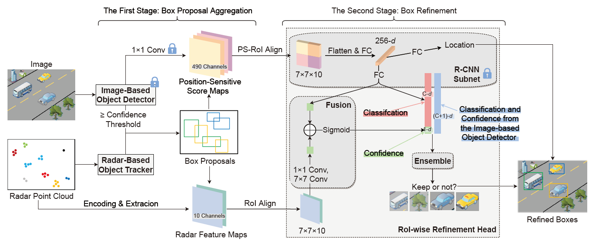</p>
    </div>
    
    milliEye有以下三个系统级优势:
    - <b>1. Adaptability </b>
    - <b>2. Compatibility </b>
    - <b>3. Lightweight </b>

- **思维导图：**
    <div style="text-align:center">
        <p>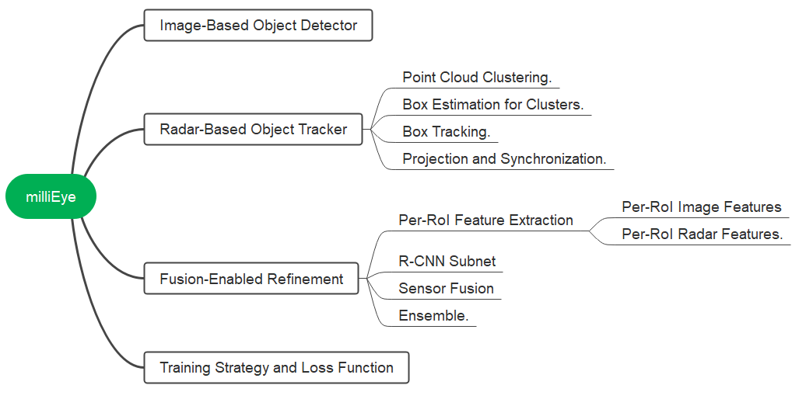</p>
    </div>

- **读后感：** 在coco,ExDarks数据集上训练图像检测器，然后再到self-collected数据集中进行联合训练，采用5倍交叉验证。


## 18. [mmECG: Monitoring Human Cardiac Cycle in Driving Environments Leveraging Millimeter Wave](https://ieeexplore.ieee.org/document/9796912)
- **阅读时间：** 2022-10-11
- **出处：** Infocom2022
- **关键词：** 在自动驾驶场景中 毫米波感知心跳信号
- **摘要：** 近年来，人们花在汽车旅行上的时间不断增加，这使人们越来越关注道路上司机的身心健康。心跳是驾驶员重要的生命体征之一，是驾驶员健康状况的重要指标。 大多数现有的心跳监测研究要么需要传感器连接，要么只能提供粗略的心率。此外，大多数测量方法都要求被测者保持静止或安静的测量环境，难以应用于动态驾驶环境。在这篇论文中，我们提出了一个非接触式心脏周期监测系统，mmECG，利用商业现成的毫米波雷达来估计移动车辆中驾驶员的细粒度心脏运动。通过探索基于毫米波信号的传感原理，我们首先在静态环境中进行研究，发现基于fmcw的毫米波雷达可以捕捉到以心房和心室为代表的重复心脏周期中的细粒度心脏运动，作为信号的相位变化。而在驾驶环境中，这种相位变化不仅受到驾驶员心跳的影响，还受到驾驶操作和车辆动力学的影响。为了进一步提取驾驶员的微小心脏运动并消除相位变化中的其他影响，我们构建了一个运动混合模型来表示不同运动引起的相位变化，进一步设计了一种层次变分模态分解(VMD)方法来提取和估计mmWave信号中的基本心脏运动。 最后，基于提取的相位变化，mmECG利用基于模板的优化方法，通过估计心房和心室的细粒度运动，重构心脏周期。对25名驾驶员在真实驾驶场景下的实验结果表明，mmECG不仅能准确估计驾驶员在真实驾驶环境下的心率，而且能准确估计驾驶员的心跳周期。

- **应用场景：** 汽车驾驶舱场景感知心跳信号
    <div style="text-align:center">
        <p>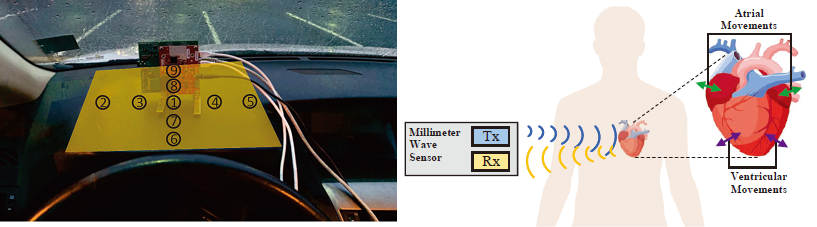</p>
    </div>

- **动机：** 目前大多数心跳信号感知方法要求受试者保持禁止或者在一个相对安静的环境中，这很难应用到动态驾驶场景中。


- **挑战：**
    - <b>1. </b> mmWave信号应该设计成能够捕捉到人类心脏的微小运动。The mmWave signal should be designed to be able to capture minute heart movements of human.
    - <b>2. </b> mmWave信号应消除驾驶环境中的干扰，包括驾驶操作和车辆动力学。The interferences in driving environments, including driving operations and vehicle dynamics, should be eliminated from mmWave signals.
    - <b>3. </b> 精细的心脏运动，即每个心动周期中心房和心室的阶段，需要从mmWave信号重建。The fine-grained heart movements, i.e., stages of the atria and ventricles in each cardiac cycle, need to be reconstructed from mmWave signals.

- **贡献：**
    - <b>1. </b> 我们设计了一个非接触式心脏周期监测系统，mmECG，它利用COTS毫米波雷达来估计在驾驶环境下的细粒度心脏运动。We design a non-contact cardiac cycle monitoring system, mmECG, which leverages COTS mmWave radars to estimate fine-grained heart movements in driving environments.
    - <b>2. </b> 我们在mmWave信号中建模由心跳和驾驶环境引起的不同运动，并设计了一个层次VMD来估计嵌入底层mmWave信号的基本心脏运动。We model diverse movements induced by heartbeats and driving environments in mmWave signals and design a hierarchy VMD to estimate the basic heart movement embedded underlying mmWave signals.
    - <b>3. </b> 在实际驾驶环境中进行了实验，结果表明，mmECG对心率估计的平均误差为0.37bpm，对心率变化估计的平均误差为11.2ms，对心循环估计的平均误差为6.8ms。We conduct experiments in real driving environments and the results show that mmECG achieves an average error of 0.37bpm for heart rate estimation, 11.2ms for heart rate variation estimation, and 6.8ms for cardiac cycle estimation.

- **背景知识：** 
    - 一个心动周期包含心脏的5个基本阶段，从心房收缩开始，发展到等容收缩、心室射血、等容舒张，最后心室充盈。a cardiac cycle contains 5 basic heart stages, which begins with the atria contraction, and progresses to the isovolumic contraction, ventricular ejection, isovolumic relaxation, and finally the ventricular filling. P波表示心房去极化，QRS波表示心室去极化，T波表示心室复极化。P wave representing the depolarization of atria, QRS complex indicating the depolarization of ventricles, and T wave exhibiting the repolarization of ventricles.
    - <div style="text-align:center">
        <p>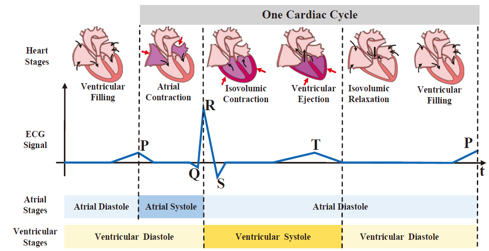</p>
      </div>
    
- **整体方案：** 整个系统由三个步骤组成:毫米波信号预处理、基本心率估计和心循环重建。
    - <div style="text-align:center">
        <p>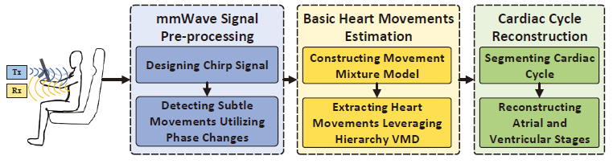</p>
     </div>

- **思维导图：**
    - <div style="text-align:center">
        <p>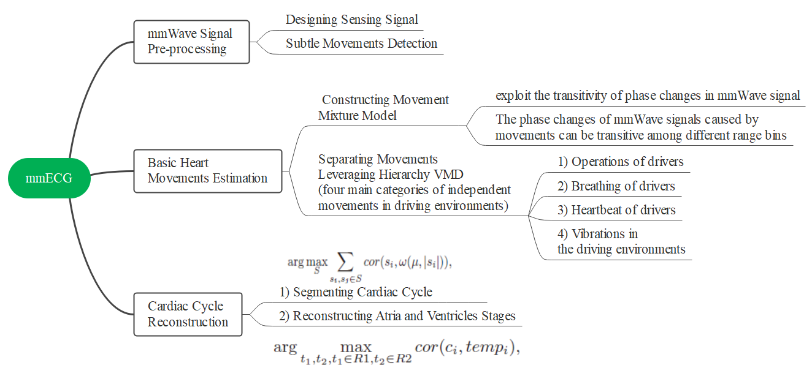</p>
     </div>

- **读后感：** 毫米波感知心跳振动位移，利用互相关和模板匹配。

- **Cite:**
```
@INPROCEEDINGS{9796912,
  author={Xu, Xiangyu and Yu, Jiadi and Ma, Chengguang and Ren, Yanzhi and Liu, Hongbo and Zhu, Yanmin and Chen, Yi-Chao and Tang, Feilong},
  booktitle={IEEE INFOCOM 2022 - IEEE Conference on Computer Communications}, 
  title={mmECG: Monitoring Human Cardiac Cycle in Driving Environments Leveraging Millimeter Wave}, 
  year={2022},
  volume={},
  number={},
  pages={90-99},
  doi={10.1109/INFOCOM48880.2022.9796912}}

```


## 17. [mmMesh:Towards 3D Real-Time Dynamic Human Mesh Construction Using Millimeter-Wave](https://dl.acm.org/doi/pdf/10.1145/3458864.3467679)
- **阅读时间：** 2022-10-7
- **出处：** MobiSys 2021
- **关键词：**  毫米波3D人体Mesh估计
- **摘要：** 在这篇论文中，我们提出mmMesh，第一个实时三维人体网格估计系统使用商业便携式毫米波设备。mmMesh是建立在一个新颖的深度学习框架之上的，它可以动态定位移动的主体，并通过分析从人体反射回来的themwave信号生成的3D点云来捕捉他/她的身体形状和姿势。提出的深度学习框架解决了一系列挑战。首先，它编码了一个3D人体模型，这使mmMesh能够从稀疏的点云中估计出复杂的和看起来真实的3D人体网格。其次，在不受环境点、射频信号易出错特性和多径效应影响的情况下，能够准确地将三维点与相应的体段对齐。第三，该模型可以根据之前的帧信息推断出缺失的身体部位。在商用mmWave传感测试台上的测试结果表明，mmMesh系统能准确定位人体网格上的顶点，平均误差为2.47 cm。良好的实验结果证明了我们提出的人体网格构建系统的有效性。
- **整体框架：** </br>
    <div style="text-align:center">
        <p>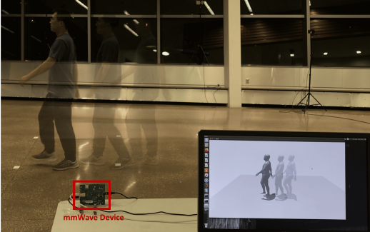</p>
    </div>
    
- **动机：**  最近，研究人员在构建智能无线传感系统方面投入了大量精力，旨在利用无处不在的无线信号来感知和理解人类活动。到目前为止，这项努力中最显著的成就是通过人体反射的信号构建了人类骨骼。有了这些骨骼表示，一个后续的问题出现了:射频信号中包含的信息是否足够丰富，可以进一步重建人体的形状，从而不仅可以判断被监测对象的身高，还可以判断其体型、体重甚至性别?

- **挑战：**
    - <b>1. </b> 由于商用波雷达天线数量有限，每帧生成的点云过于稀疏，无法准确估计如此复杂的3D人体网格。每一帧只有几百个点，其中与人体相关的只有几十个点。从这样一个稀疏的点云中直接估计数千个人体网格顶点的位置在技术上是不可能的。解决方法是利用SMPL模型作为额外约束。利用解剖学的先验知识
    - <b>2. </b> 如何将点云中的每个3D点与对应的体段正确关联也是非常具有挑战性的。由于来自环境的点可能被错误地视为来自被摄体的点，由于射频信号的易出错特性和多径效应，得到的点位置可能不准确。
    - <b>3. </b> 在某些帧中，由于射频信号反射的镜面，与特定体段相关的点可能会缺失。


- **贡献：** 为了解决上述问题，我们提出了一种名为mmMesh的深度学习框架，利用mmWave信号构建动态的三维人体网格。
    - <b>1. </b> mmMesh编码一个3D人体模型，这允许我们只用86个参数来表示一个完整的人体网格。这种人体模型的合并使得使用几十个点来推断一个复杂的人体网格成为可能。
    - <b>2. </b> 提出的mmMesh模型可以动态定位移动的Subject，并聚焦于Subject附近的点，而不是来自周围物体的点。此外，尽管每个单点的信息可能不准确，mmMesh能够捕获3D点之间的空间关系，并将它们与相应的身体片段对齐。此外，我们的模型能够对数据点进行区别对待，并自动将更大的权重分配给具有更高质量信息的点。
    - <b>3. </b> 提出的mmMesh模型使用循环神经网络从之前的帧信息中推断出缺失的身体部位。
    - <b>4. </b> 为了评估所提出的mmMesh框架，我们使用COTS毫米波设备实现了mmMesh系统的原型。评价结果表明，mmMesh系统能准确定位人体网格上的顶点，平均误差为2.47 cm。
    
- **整体方案：** 在本文中，我们考虑了一个真实的场景，在这个场景中，人体被测对象由一个装有毫米波雷达的手机监控，雷达信号从人体和周围物体反射回来。本文提出的mmMesh系统旨在以反射的mmWave信号为输入，实时重构人体的动态网格。图2显示了我们提出的mmMesh系统的概述，它包含三个主要组件:数据收集、数据预处理和网格构造。
    <div style="text-align:center">
        <p>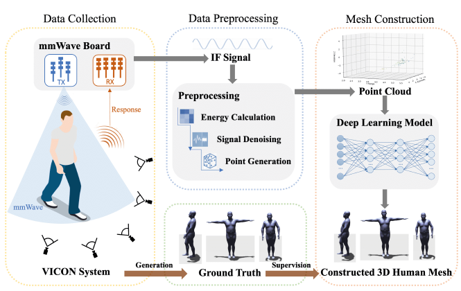</p>
    </div>
    
    mmMesh模型整体结构：
    <div style="text-align:center">
        <p>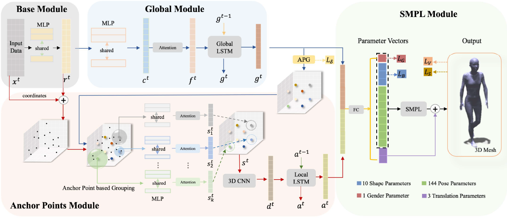</p>
    </div>
    - <b>1. Data Collection: </b> 
    - <b>2. Data Preprocessing: </b>
    - <b>3. Mesh Construction: </b>
    - <b>4. </b>

- **思维导图：**
    <div style="text-align:center">
        <p></p>
    </div>

- **读后感：** 


## 16. [Point-BERT: Pre-training 3D Point Cloud Transformers with Masked Point Modeling](https://arxiv.org/abs/2111.14819)
- **阅读时间：** 2022-9-28
- **出处：**  CVPR2022
- **关键词：** 利用BERT思想对点云数据做训练，Transformer网络结构
- **摘要：** 我们提出了 Point-BERT，这是一种学习 Transformers 的新范式，可以将 BERT 的概念推广到 3D 点云。受 BERT 的启发，我们设计了一个掩蔽点建模 (MPM) 任务来预训练点云 Transformers。具体来说，我们首先将一个点云划分为几个局部点块，并设计一个带有离散变分自动编码器（dVAE）的点云标记器来生成包含有意义的局部信息的离散点标记。然后，我们随机屏蔽一些输入点云，并将它们输入到主干 Transformer 中。预训练目标是在 Tokenizer 获得的点令牌的监督下，在掩蔽位置恢复原始点令牌。大量实验表明，所提出的 BERT 式预训练策略显着提高了标准点云 Transformer 的性能。配备我们的预训练策略后，我们表明纯 Transformer 架构在 ModelNet40 上的准确率达到 93.8%，在最难的 ScanObjectNN 设置上达到 83.1% 的准确率，超过了精心设计的点云模型，而手工设计的数量要少得多。我们还证明了 Point-BERT 学习的表示可以很好地转移到新的任务和领域，我们的模型在很大程度上推进了最先进的小样本点云分类任务。
- **整体框架：** </br> 下图展示了论文的主要思想。Point-BERT 专为标准点云 Transformer 的预训练而设计。 通过点云重建训练 dVAE，我们可以将点云转换为一系列离散点标记。 然后，我们可以通过预测掩码标记来使用掩码点建模 (MPM) 任务对 Transformer 进行预训练。
    <div style="text-align:center">
            <p>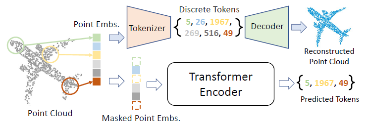</p>
    </div>
    
- **动机：**  利用网络来增强点云数量,对点云数据进行mask，然后利用BERT学习

- **整体方案：** 

    我们首先将输入点云划分为几个点块（子云）。 然后使用 mini-PointNet 获得一系列点嵌入。 在预训练之前，通过基于 dVAE 的点云重建来学习一个 Tokenizer，其中一个点云可以转换为一系列离散的点令牌； 在预训练期间，我们掩盖了点嵌入的某些部分并用掩码标记替换它们。 然后将掩码点嵌入输入到 Transformer 中。 在 Tokenizer 获得的点令牌的监督下，训练该模型以恢复原始点令牌。 我们还添加了一个辅助对比学习任务，以帮助 Transformer 捕获高级语义知识。
    
    <div>
        <p>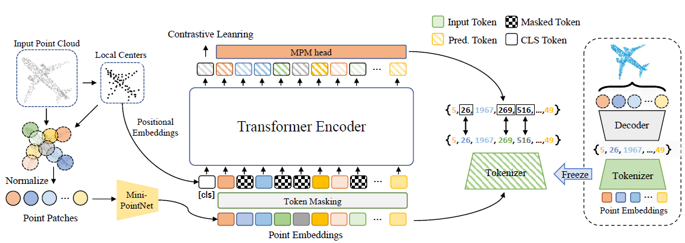</p>
    </div>

    这项工作的总体目标是将 BERTstyle 预训练策略扩展到点云 Transformers。 为了实现这个目标，我们首先学习一个 Tokenizer 来获取每个输入点云的离散点标记。


- **思维导图：**
    <div style="text-align:center">
        <p>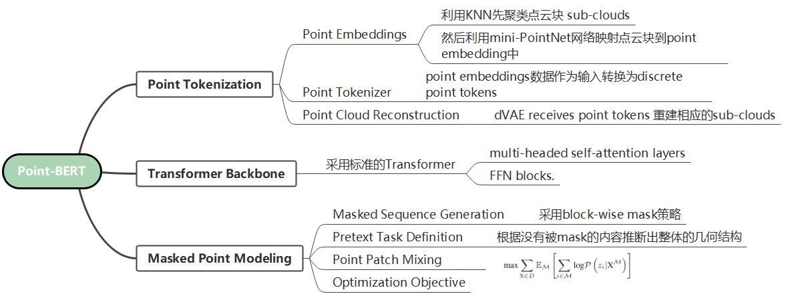</p>
    </div>


- **读后感：**


## 15. [A Unified Query-based Paradigm for Point Cloud Understanding](https://arxiv.org/abs/2203.01252)

- <a href="https://github.com/dvlab-research/DeepVision3D"> Code </a>

- **阅读时间：** 2022-9-28
- **出处：** CVPR2022
- **关键词：** 3D点云理解， Embedding-Querying范式，

- **摘要：** 3D 点云理解是自动驾驶和机器人技术的重要组成部分。在本文中，我们提出了一种新颖的嵌入查询范式（EQ-范式），用于 3D 理解任务，包括检测、分割和分类。 EQ-Paradigm 是一个统一的范式，可以将任何现有的 3D 主干架构与不同的任务头结合起来。在 EQ-Paradigm 下，输入首先在嵌入阶段以任意特征提取架构进行编码，该架构独立于任务和头。然后，查询阶段使编码的特征适用于不同的任务头。这是通过在查询阶段引入中间表示（即 Q 表示）作为嵌入阶段和任务头之间的桥梁来实现的。我们设计了一个新颖的 Q-Net 作为查询阶段网络。在各种 3D 任务（包括对象检测、语义分割和形状分类）上的广泛实验结果表明，EQ-Paradigm 与 Q-Net 结合是一种通用且有效的管道，它可以实现骨干和头部的灵活协作，进一步提升最先进方法的性能。

- **整体框架：** </br>
    <div style="text-align:center">
        <p align="center">
            <p>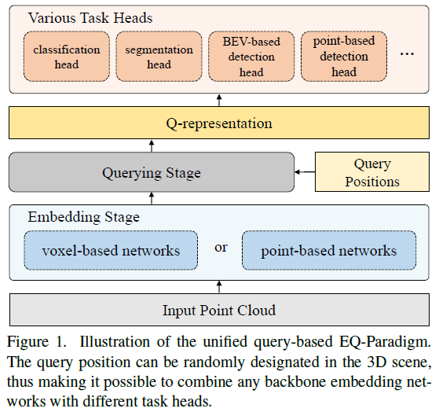</p>
        </p>
    </div>
    
- **动机：** 3D点云理解在自动驾驶领域应用广泛

- **贡献：**
    - 1. 我们提出了一种用于 3D 点云理解的嵌入查询范式。 它是一个统一的基于查询的范例，可以将任意基于点或体素的网络与不同的任务头结合起来。
    - 2. 我们提出了一种新颖的查询阶段网络Q-Net，以提取中间Q-representation(即查询特征)用于人工指定的查询位置。
    - 3. 我们将我们的 EQ-Paradigm 和 Q-Net 集成到用于不同任务的多个最先进的 3D 网络中，并通过大量实验观察到一致的性能改进。
    
- **整体方案：**
    <div style="text-align:center">
        <p align="center">
            <p>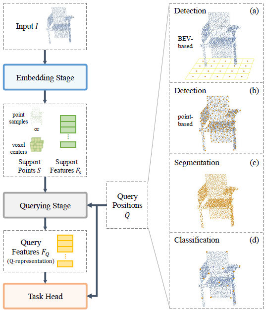</p>
        </p>
    </div>
    - 1. Embedding stage: 从输入的3D点云中提取特征Fs，作为支持特征为后续的查询阶段使用。
    - 2. Querying stage
    - 3. Task head stage： 基于查询位置Q个特征FQ来生成预测结果

- **细节：**
    <div style="text-align:center">
        <p>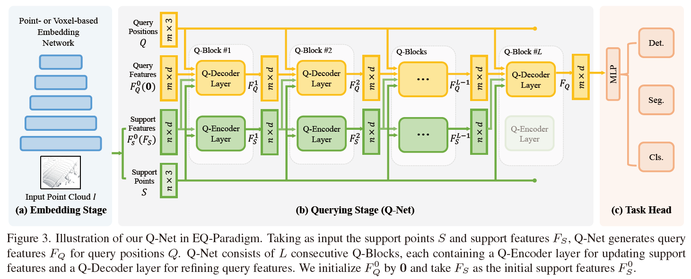</p>
    </div>
- **读后感：**

## 14. [CrossPoint: Self-Supervised Cross-Modal Contrastive Learning for 3D Point Cloud Understanding](https://arxiv.org/abs/2203.00680)
- **阅读时间：** 2022-9-27
- **出处：** CVPR2022
- **关键词：** 3D点云数据和2D图像对比学习，跨模态对比学习方法
- **摘要：** 由于点云的不规则结构，用于各种任务（例如 3D 对象分类、分割和检测）的大规模点云数据集的手动注释通常很费力。无需任何人工标记的自我监督学习是解决此问题的一种很有前途的方法。我们在现实世界中观察到，人类能够映射从 2D 图像中学习到的视觉概念来理解 3D 世界。受到这种见解的鼓舞，我们提出了 CrossPoint，这是一种简单的跨模态对比学习方法，用于学习可迁移的 3D 点云表示。它通过最大化点云和不变空间中相应渲染的 2D 图像之间的一致性来实现对象的 3D-2D 对应，同时鼓励点云模态中的变换不变性。我们的联合训练目标结合了模态内部和跨模态的特征对应关系，从而以自我监督的方式集成了来自 3D 点云和 2D 图像模态的丰富学习信号。实验结果表明，我们的方法在包括 3D 对象分类和分割在内的各种下游任务上优于以前的无监督学习方法。此外，消融研究验证了我们的方法在更好地理解点云方面的效力。
- **整体框架：** </br>
    给定对象的 3D 点云及其从随机摄像机视点渲染的 2D 图像，CrossPoint 强制执行 3D-2D 对应，同时通过自监督对比学习保持模型对仿射和空间变换的不变性。 这有助于可概括的点云表示，然后可用于 3D 对象分类和分割。 请注意，右侧显示的 2D 图像是直接从可用的 3D 点云渲染的
    <div style="text-align:center">
        <p align="center">
            <p>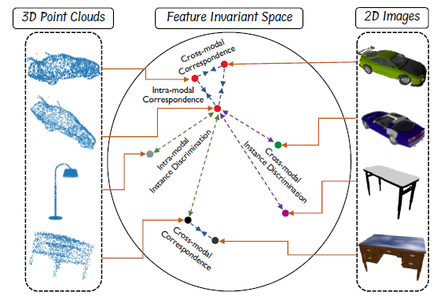</p>
        </p>
    </div>
    
- **动机：** 手动标注的3D点云数据难以获取，学习模型需要大量的3D点云数据，自监督学习是解决这一问题的主要方法之一，并被证明在二维领域是有效的。

- **贡献：**
    - 1. 我们表明，使用自我监督对比学习在特征空间中对象的简单 3D-2D 对应有助于有效地理解 3D 点云。

    - 2. 我们提出了一种新颖的端到端自监督学习目标，其中包含模态内和跨模态损失函数。 它鼓励将 2D 图像特征嵌入到相应的 3D 点云原型附近，从而避免偏向于特定的增强。

    - 3. 我们在三个下游任务中广泛评估我们提出的方法，即：对象分类、小样本学习和对各种合成和现实世界数据集的部分分割，其中 CrossPoint 优于以前的无监督学习方法。

    - 4. 此外，我们在 CIFAR-FS 数据集上执行小样本图像分类，以证明微调来自 CrossPoint 的预训练图像骨干网优于标准基线。
    
- **整体方案：** 
    
    所提出方法的整体架构（CrossPoint）。 它包括两个分支，即：点云分支，通过对点云增强施加不变性来建立模态内对应关系；图像分支，通过在渲染的 2D 图像特征和点云之间引入对比损失来简单地制定跨模态对应关系 原型特征。 CrossPoint 结合两个分支的学习目标联合训练模型。 我们丢弃图像分支，仅使用点云特征提取器作为下游任务的主干。
    <div style="text-align:center">
        <p align="center">
            <p>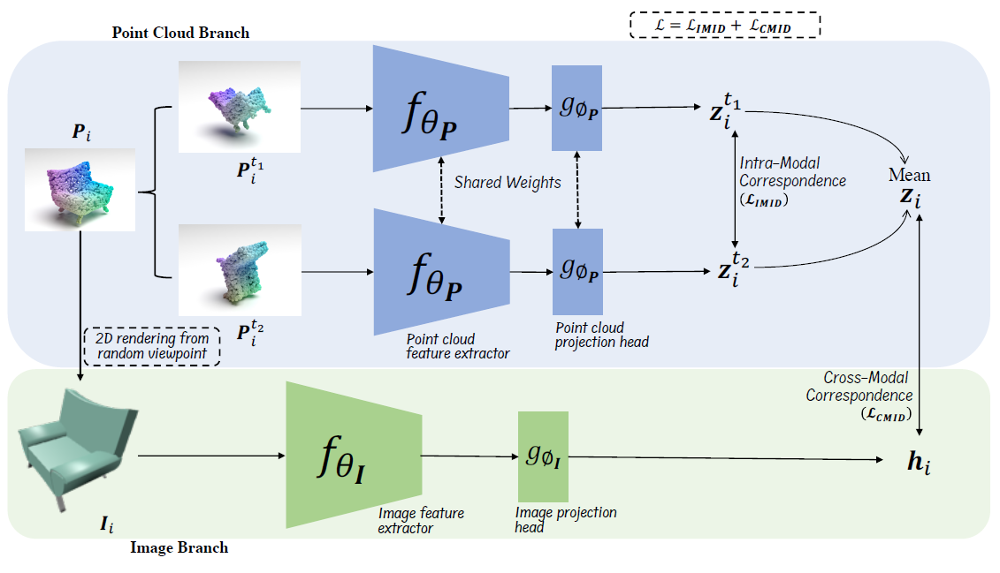</p>
        </p>
    </div>


## 13. [PointCLIP: Point Cloud Understanding by CLIP](https://arxiv.org/abs/2112.02413)
- **阅读时间：** 2022-9-27
- **出处：** CVPR2022
- **关键词：** CLIP（Contrastive Vision-Language Pre-training）， 对比学习， PointCLIP, which transfers 2D pre-trained knowledge into 3D.
- **摘要：** 最近，通过对比视觉语言预训练 (CLIP) 进行的零样本和少样本学习在 2D 视觉识别方面表现出了鼓舞人心的表现，它学习在开放词汇设置中将图像与其对应的文本进行匹配。然而，由 2D 中的大规模图像-文本对预训练的 CLIP 是否可以推广到 3D 识别仍有待探索。在本文中，我们通过提出 PointCLIP 来确定这种设置是可行的，它在 CLIP 编码的点云和 3D 类别文本之间进行对齐。具体来说，我们通过将点云投影到多视图深度图而不进行渲染来对点云进行编码，并聚合视图方面的零镜头预测以实现从 2D 到 3D 的知识转移。最重要的是，我们设计了一个视图间适配器，以更好地提取全局特征，并将从 3D 中学到的少量知识自适应地融合到在 2D 中预训练的 CLIP 中。只需在几次设置中微调轻量级适配器，PointCLIP 的性能就可以大大提高。此外，我们观察到 PointCLIP 和经典 3D 监督网络之间的互补特性。通过简单的集成，PointCLIP 提高了基线的性能，甚至超越了最先进的模型。因此，PointCLIP 是在低资源成本和数据机制下通过 CLIP 进行有效 3D 点云理解的有前途的替代方案。我们对广泛采用的 ModelNet10、ModelNet40 和具有挑战性的 ScanObjectNN 进行了彻底的实验，以证明 PointCLIP 的有效性。

- **整体框架：** </br>
    <div style="text-align:center">
        <p align="center">
            <p>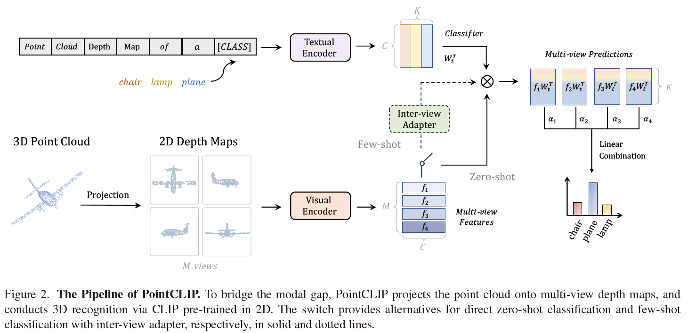</p>
        </p>
    </div>
    
- **动机：** 解决3D点云数据足问题，考虑使用多个维度的2D图像和文本做对比学习实现3D模型学习

- **贡献：**
    - 1. 我们提出 PointCLIP 扩展 CLIP 以处理 3D 点云数据，通过将 2D 预训练知识转换为 3D 实现跨模态零样本识别.
    - 2. PointCLIP通过多视图间的特征交互引入了视图间适配器，提高了few-shot微调的性能。
    - 3. PointCLIP 可用作多知识集成模块，以增强现有经过全面训练的 3D 网络的性能，超越最先进的性能。
    - 4. 对广泛适用的 ModelNet10、ModelNet40 和具有挑战性的 ScanObjectNN 进行了综合实验，这表明 PointCLIP 在 3D 理解方面的潜力。

    
- **整体方案：**
    <div style="text-align:center">
        <p align="center">
            <p>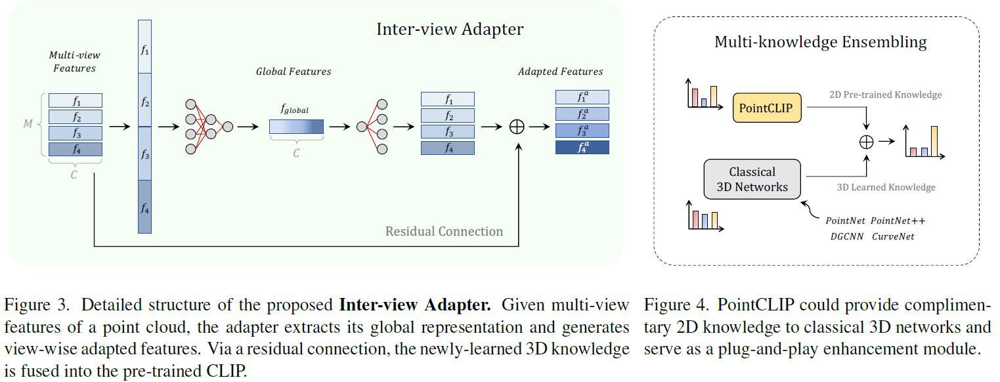</p>
        </p>
    </div>

- **读后感：**  多视角编码


## 12. [Fast Point Transformer](https://arxiv.org/abs/2112.04702)
- **阅读时间：** 2022-9-26
- **出处：** CVPR2022
- **关键词：** 处理3D点云的挑战性问题，轻量级点云处理， Transformer
- **摘要：** 神经网络最近的成功可以更好地解释 3D 点云，但处理大规模 3D 场景仍然是一个具有挑战性的问题。当前大多数方法将大规模场景划分为小区域并将局部预测组合在一起。但是，该方案不可避免地涉及用于预处理和后处理的额外阶段，并且由于从局部角度进行预测，还可能会降低最终输出。本文介绍了由新的轻量级自注意力层组成的 Fast Point Transformer。我们的方法编码连续的 3D 坐标，基于体素散列的架构提高了计算效率。所提出的方法通过 3D 语义分割和 3D 检测进行了演示。我们的方法的准确性可与基于体素的最佳方法相媲美，并且我们的网络的推理时间比最先进的 Point Transformer 快 129 倍，并且在 S3DIS 上的 3D 语义分割中具有合理的准确性权衡数据集。
- **整体框架：** </br>
    <div style="text-align:center">
        <p align="center">
            <p>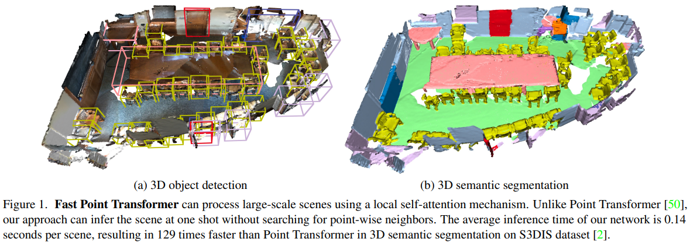</p>
        </p>
    </div>
    
- **动机：** 3D点云计算复杂度高，为了降低复杂度设计Fast Point Transformer.

- **贡献：**
    - 1. 我们提出了一种新颖的基于局部自注意力的网络，称为 Fast Point Transformer，可以快速处理大规模 3D 场景。

    - 2. 我们引入了一个轻量级的局部自注意力模块，可以有效地学习 3D 点云的连续位置信息，同时降低空间复杂度。
    
    - 3. 我们表明，我们的模型比以前使用提出的评估指标的基于体素的方法产生了更加连贯的预测。
    
    - 4. 我们展示了我们基于体素散列的架构的快速推理； 我们的网络执行比 Point Transformer 快 129 倍的推理，在 S3DIS 数据集 [2] 上的 3D 语义分割中获得了合理的准确性权衡。
        
- **整体方案：**
    
    我们说明了所提出的 Fast Point Transformer 的整体架构。 红色点是输入点及其特征，紫色点是输出点及其特征。 彩色方块是体素化产生的非空体素。 蓝色和绿色点是具有特征的非空体素的质心。
    <div style="text-align:center">
        <p align="center">
            <p>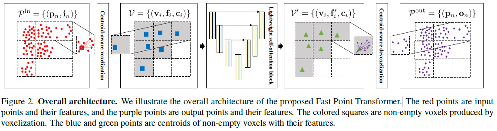</p>
        </p>
    </div>
    
    - 1. 质心感知体素化
    - 2. 轻量self-attention
    - 3. 质心感知逆体素化


- **细节：**
    - Centroid-aware Voxel & Devoxelization （质心感知体素化和逆体素化）
    利用位置编码以质心为参考点建立关系，利用位置编码降低空间关系
    <div style="text-align:center">
        <p align="center">
            <p>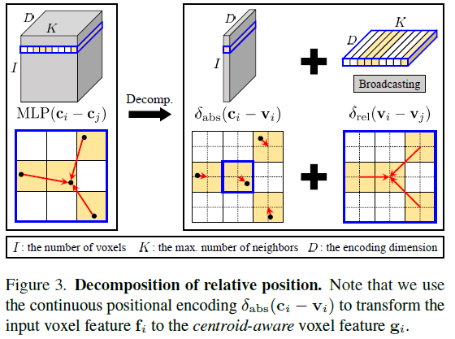</p>
        </p>
    </div>

    - Lightweight Self-Attention（轻量网络设计）
        - a. 中心点上的局部自注意力机制
        - b. 降低空间复杂度
        - c. 轻量级的self-attention层：余弦相似度（cosine similarity），余弦相似度可以有效地处理输入体素 V 的稀疏性问题，而不是使用 softmax(.)。
            <div style="text-align:center">
                <p align="center">
                    <p>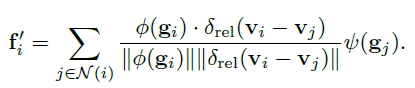</p>
                </p>
            </div>

- **读后感：** 实验评估非常详细全面：3D目标检测，3D目标分割，一致性测试


## 11. [Exploiting Temporal Relations on Radar Perception for Autonomous Driving](https://arxiv.org/abs/2204.01184)
- **阅读时间：** 2022-9-25
- **出处：** CVPR2022
- **关键词：** 自动驾驶， 雷达信号处理，目标检测

- **摘要：**我们使用汽车雷达传感器考虑自动驾驶中的物体识别问题。 与激光雷达传感器相比，雷达在自动驾驶感知的全天候条件下具有成本效益和鲁棒性。 然而，雷达信号在识别周围物体时存在低角度分辨率和精度问题。 为了提高汽车雷达的能力，在这项工作中，我们利用来自连续以自我为中心的鸟瞰雷达图像帧的时间信息进行雷达目标识别。 我们利用对象存在和属性（大小、方向等）的一致性，并提出一个时间关系层来显式地建模连续雷达图像中对象之间的关系。 在目标检测和多目标跟踪中，我们展示了我们的方法与几种基线方法相比的优越性。

- **整体框架：** </br>
    <div style="text-align:center">
        <p align="center">
            <p>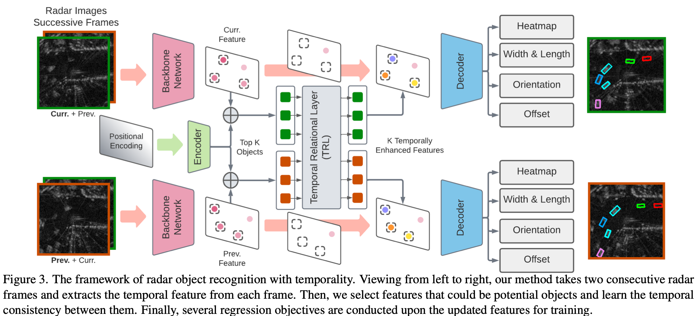</p>
        </p>
    </div>
    
- **动机：** 相机提供语义丰富的交通场景视觉特征，而激光雷达提供高分辨率点云，可以捕捉物体的反射。

- **贡献：**
    - 1. 我们通过额外的时间信息促进雷达感知，以补偿雷达传感器引起的模糊和低角分辨率。
    - 2. 我们设计了一个定制的时间关系层，其中插入的网络具有归纳偏差，即连续帧中的同一对象应该共享一致的外观和属性。
    - 3. 我们在Radiate数据集上评估我们的目标检测和多目标跟踪方法。 通过与基线方法的全面比较，我们展示了我们的方法带来的一致改进。
    

## 10. [Catch Your Breath: Simultaneous RF Tracking and Respiration Monitoring with Radar Pairs](https://www.researchgate.net/publication/362516117_Catch_Your_Breath_Simultaneous_RF_Tracking_and_Respiration_Monitoring_with_Radar_Pairs)
- **阅读时间：** 2022-9-23
- **出处：** TMC'2022
- **关键词：** 多人连续呼吸波形监测，多人跟踪定位,UWB射频信号
- **摘要：** 连续呼吸监测对于现实生活中的医疗保健应用非常重要，但要实现这一点非常困难，因为可穿戴传感器很笨重，而且非接触式传感器在很大程度上无法容忍用户的移动。同时，在室内跟踪用户大多需要用户手持设备，而无设备本地化几乎无法分辨它跟踪的对象和对象。幸运的是，由于非接触式呼吸监测和免设备定位都可能依赖于射频 (RF) 传感，因此将它们融合在一起创建了一个新系统，能够在恢复用户细粒度呼吸波形的同时持续跟踪用户。为此，我们提出 BreathCatcher 作为室内应用的连续人体呼吸跟踪系统。为了构建这个系统，我们采用商业级紧凑型雷达对来捕获包含呼吸信号的射频反射。然后，我们提出了一种混合人体呼吸和位置跟踪算法来定位和识别来自复杂射频反射混合物的呼吸信号。最后，我们设计了一个由变分推理驱动的编码器解码器深度神经网络，以恢复细粒度的呼吸波形。从本质上讲，BreathCatcher 不仅可以获取多个步行用户的呼吸波形，还可以根据呼吸信号的潜在属性识别每个用户。我们通过涉及 12 名受试者和 80 个工时数据的实验证明了跟踪和呼吸监测的准确性。
- **整体框架：** </br>
    <div style="text-align:center">
        <p align="center">
            <p>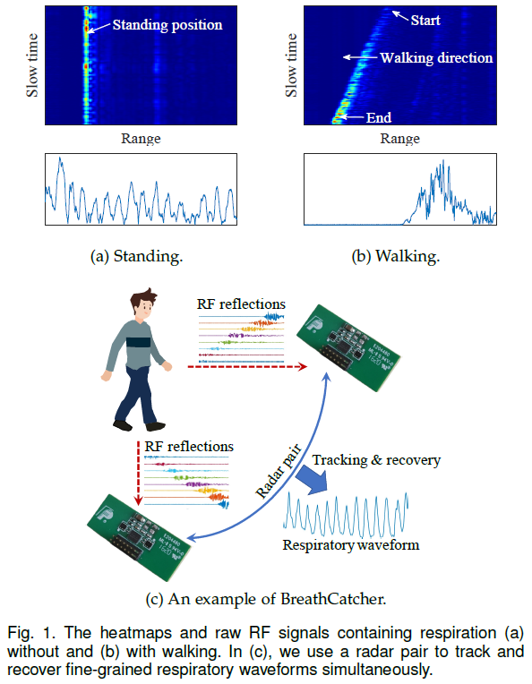</p>
        </p>
    </div>
    
- **动机：** 无接触人体心跳信号持续检测，并且恢复波形，主要解决两个问题：1. 多人定位跟踪（卡尔曼滤波算法）。 2. 利用射频感知心跳信号并且恢复波形（IQ对比学习，Encoder-Decoder网络模型）

- **贡献：** 
    1. 我们提出了一种用于同时进行人体跟踪和呼吸恢复的新算法。 据我们所知，BreathCatcher 是第一个连续跟踪人体位置和呼吸的系统。
    2. 我们设计了一种由自适应卡尔曼滤波器和信号融合驱动的算法，以实现多目标多雷达跟踪。 该算法有助于定位对象，同时识别对象特定的信号，从而促进呼吸恢复。
    3. 我们提出 IQ-VED 以运动稳健的方式从非线性混合物中恢复和细化呼吸波形。 恢复的特征丰富的波形可以进一步帮助识别每个人体对象，从而提高跟踪功能。
    4. 我们使用 80 工时的数据集对 BreathCatcher 进行了广泛的评估； 结果有力地证实了 BreathCatcher 在跟踪、识别人体对象和恢复其细粒度呼吸波形方面的出色能力。
    
- **整体方案：**
    <div style="text-align:center">
        <p align="center">
            <p>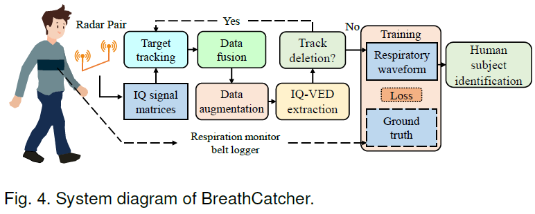</p>
        </p>
    </div>

    - 变分自编码 呼吸波形恢复，A novel IQ Variational Encoder-Decoder (IQ-VED) neural network。
    <div style="text-align:center">
        <p align="center">
            <p>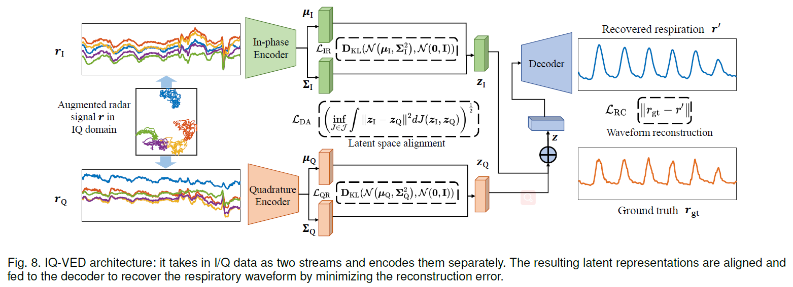</p>
        </p>
    </div>

- **读后感：** 卡尔曼滤波适用于根据现有的状态信息来预测当前值，变分编码器用法？


## 9. [Synchronize Inertial Readings From Multiple Mobile Devices in Spatial Dimension](https://cs.nju.edu.cn/lxie/publication/TON2018Xie2.pdf)
- **阅读时间：** 2022-9-21--2022-9-22
- **出处：** TON2018
- **关键词：** 多个IMU空间同步
- **摘要：** 在本文中，我们研究空间同步问题，即在空间维度上同步来自多个移动设备的惯性读数，换句话说，多个移动设备是空间同步的，具有相同的 3-D 坐标，除了每个设备是其对应坐标的原点。我们为具有两个传感器的设备提出了一种称为移动空间同步 (MOSS) 的方案：加速度计和陀螺仪，大多数移动设备都可以使用它们。当人类对象向前移动（例如步行和跑步）时，来自多个移动设备的加速度计读数用于实现空间同步。当人体停止向前移动时，来自多个移动设备的陀螺仪读数用于保持空间同步，这意味着我们无法再获得身体向前移动引起的一致加速度。实验结果表明，我们的MOSS方案可以实现9.8%的平均角度偏差和97%的平均测量相似度。
- **整体框架：** </br>
    <div style="text-align:center">
        <p align="center">
            <p>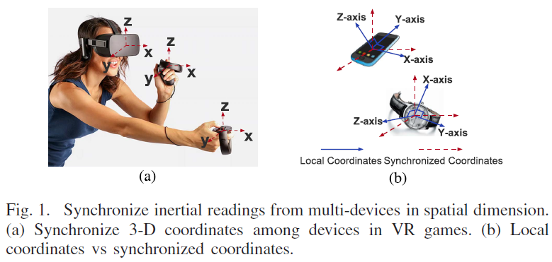</p>
        </p>
    </div>
    
- **动机：** 多个移动设备相互协作与人交互时需要时空同步

- **挑战：** 
    1. 第一个挑战是提取人体主体向前移动时身体运动的一致加速度。
    2. 第二个挑战是解决当人停止前进时保持空间同步的累积误差。
    
- **整体方案：**
    - 1. 身体运动模型，坐标映射
    - 2. 空间同步模型
    - 3. 系统框架
    <div style="text-align:center">
        <p align="center">
            <p>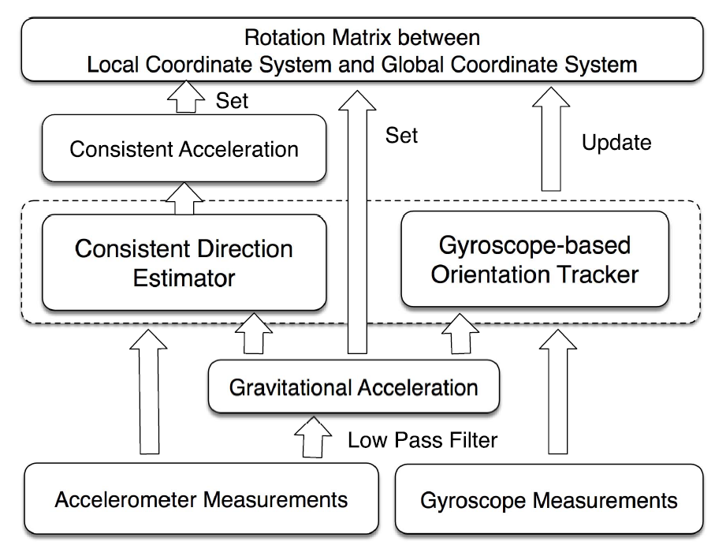</p>
        </p>
    </div>

- **读后感：** 多个IMU坐标同步，映射到一个固定的坐标系中。


## 8. [Sound of Motion: Real-time Wrist Tracking with A Smart Watch-Phone Pair](https://www.researchgate.net/publication/357098007_Sound_of_Motion_Real-time_Wrist_Tracking_with_A_Smart_Watch-Phone_Pair)
- **论文链接：** [IEEE](https://ieeexplore.ieee.org/stamp/stamp.jsp?tp=&arnumber=9796731)
- **阅读时间：** 2022-9-19
- **出处：** INFOCOM'22
- **关键词：** 智能手表IMU与手机超声波实现手势轨迹跟踪
- **摘要：** 智能环境的激增需要通过手/手臂运动进行实时和无处不在的人机交互。尽管最近的一些尝试尝试使用 COTS 设备实时跟踪手/手臂的运动，但它们要么获得相当低的准确度，要么必须依赖精心设计的基础设施和一些繁重的信号处理。为此，我们提出了 SoM（运动声音）作为手腕跟踪的轻量级系统。 SoM 只需要一对智能手表-手机，需要非常轻量级的计算，可以在资源受限的智能手表中运行。 SoM 使用嵌入式 IMU 传感器在智能手表中进行基本的运动跟踪，它依赖于固定的智能手机充当“声锚”：手机发送的有规律的信标由于手表运动而以不规则的方式接收，诸如此类方差为调整 IMU 跟踪的漂移提供了有用的提示。通过对我们的 SoM 原型进行大量实验，我们证明了精心设计的系统实现了令人满意的手腕跟踪精度，并在复杂性和性能之间取得了良好的平衡。

- **整体框架：** </br> 
    - Sound-driven wrist tracking with a smart watch-phone pair.
    - 通过运动引起的到达时间差 (MTDoA) 进行差分测距。 固定的智能手机会传输音序（中间），因此腕戴式智能手表远离（或朝向）手机移动时会观察到扩张（或压缩）的间隔，如顶部（或底部）音序所示。
    <div style="text-align:center">
        <p align="center">
            <p>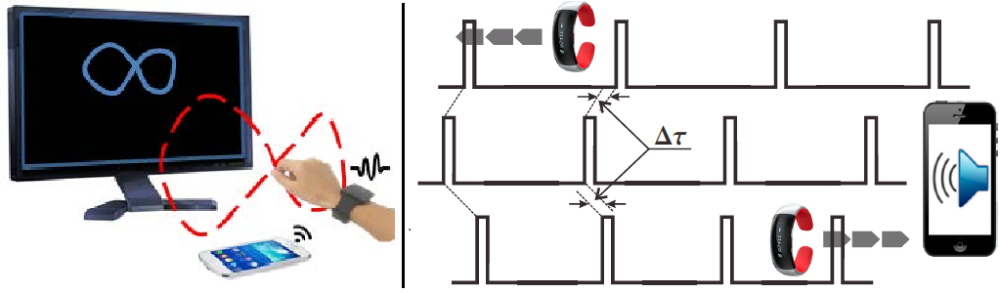</p>
        </p>
    </div>

## 7. [Towards Domain-Independent and Real-Time Gesture Recognition Using mmWave Signal](https://)
- **阅读时间：** 2022-9-15
- **出处：** arXiv
- **关键词：** 毫米波感知手势识别
- **摘要：** 使用毫米波 (mmWave) 信号的人体手势识别提供了有吸引力的应用，包括智能家居和车载界面。虽然现有工作在受控环境下取得了可喜的性能，但由于需要密集的数据收集、适应新领域时的额外培训工作以及实时识别性能不佳，实际应用仍然受到限制。在本文中，我们提出了 DI-Gesture，一种独立于域的实时毫米波手势识别系统。具体来说，我们首先通过时空处理推导出与人类手势相对应的信号变化。为了增强系统的鲁棒性并减少数据收集工作，我们基于信号模式和手势变化之间的相关性为毫米波信号设计了一个数据增强框架。此外，采用时空手势分割算法进行实时识别。大量实验结果表明，DI-Gesture 对新用户、新环境和新位置的平均准确率分别为 97.92%、99.18% 和 98.76%。我们还在具有挑战性的场景中评估 DI-Gesture，例如实时识别和极端角度的传感，所有这些都证明了我们系统的卓越鲁棒性和有效性。

- **整体框架：** DI-Gesutre 将接收到的信号转换为 DRAI 序列，并通过提出的数据增强框架生成合成数据。 对于实时识别，DI-Gesutre 从连续的 DRAI 流中检测手势边界。 最后，将分割后的样本输入神经网络进行分类。</br>
    <div style="text-align:center">
        <p align="center">
            <p>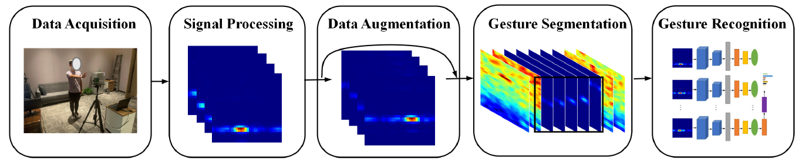</p>
        </p>
    </div>

- **贡献：**
    - (1) 据我们所知，我们是第一个解决毫米波雷达手势识别在各个领域（即环境、用户、距离和角度）中的领域依赖性问题的人。
    - (2) 我们设计了一个基于信号表示和手势变化之间的相关性的毫米波信号数据增强框架，以减轻数据收集的痛苦，提高分类器的鲁棒性并增强极端角度的感知能力。
    - (3) 我们在商品毫米波雷达上实施 DI-Gesture 并进行广泛的评估。 实验结果证明了 DI-Gesture 在跨域设置和实时场景下的出色性能。
    - (4) 我们收集并标记了第一个全面的跨域 mmWave 手势数据集1，该数据集由来自 25 个志愿者、5 个位置和 6 个环境的 24050 个样本组成，已向研究界公开。 我们相信这个数据集将有助于毫米波手势识别的未来研究。


## 6. [MilliMirror: 3D Printed Reflecting Surface for Millimeter-Wave Coverage Expansion  (含PPT)](http://xyzhang.ucsd.edu/papers/Kun.Qian_MobiCom22_MilliMirror.pdf)
- **阅读时间：** 2022.9.8
- **出处：** MobiCom'22
- **关键词：** 智能反射表面，毫米波网络，5G，相位矩阵信号处理
- **摘要：** 下一代无线网络因其高容量而采用毫米波技术。 然而，由于高方向性和传播伪影，毫米波无线电具有基本的覆盖限制。 在本文中，我们探索了一种基于 3D 打印技术的经济范式，用于扩展毫米波覆盖范围。 我们提出了 MilliMirror，这是一种完全无源的超表面，它可以重塑毫米波光束并将其重新引导到异常方向，以照亮覆盖盲点。 我们开发了一个封闭形式的模型，以有效地将 MilliMirror 设计与数千个单元元素和宽频带相结合。 我们进一步开发了一种基于 3D 打印和金属沉积的经济工艺来制造 MilliMirror。 我们的现场测试结果表明，MilliMirror 可以有效地填补覆盖漏洞，并按照标准毫米波光束管理协议透明地运行。
- **整体框架：** </br>
    <div style="text-align:center">
        <p align="center">
            <p>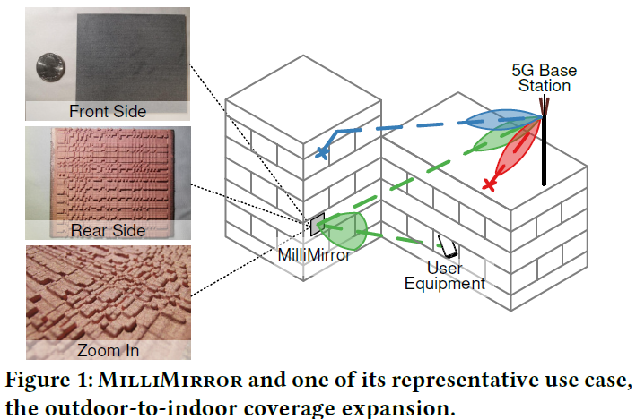</p>
        </p>
    </div>
    
- **动机：** 利用3D打印无源MillMirror，来对mmWave信号做beam到特定的方向

- **机理：** 不同材料的介电常数不同，对射频信号的反射相位影响不同
    
- **整体方案：**
    - 1. 找到介电材料入射信号和出射信号的相位变化与材料的关系。
    - 2. 建模找到反射MilliMirror的增益关系，参考论文公式（4）；求解期望的MilliMirror模式。
    - 3. 考虑波束倾斜效应，不同频率对MilliMirror反射效应

- **读后感：** 考虑毫米波对不同介电常数的介电材料反射信号不同，是否能利用此来识别材料类别或者对毫米波检测的目标做特定分类着色。


## 5. [RF-URL: Unsupervised Representation Learning for RF Sensing](https://)
- **阅读时间：** 2022-9-15
- **出处：** MobiCom'22
- **关键词：** 射频传感、无监督表示学习、对比学习、预训练模型
- **摘要：** 基于学习的射频传感的主要障碍是获得高质量的大规模注释数据集。然而，与易于人工注释的视觉数据集不同，RF信号不直观且不可解释，这导致RF信号的注释既费时又费力。为了解决注释数据的贪婪需求，我们提出了一种用于射频传感的新型无监督表示学习 (URL) 框架 RF-URL，以在可以轻松收集的大规模未注释射频数据集上学习预训练模型。 RF-URL 利用对比框架来关注基于信号处理的射频传感和基于学习的射频传感之间的差距。 RF-URL 通过不同的信号处理表示构造正负对，将现有的射频信号处理算法无缝集成到基于学习的网络中。此外，RF-URL 经过精心设计，考虑了不同 RF 信号处理表示的不对称特性。我们通过基于两种通用射频设备（WiFi 和雷达）在三个典型射频传感任务（人体手势识别、3D 姿势估计和轮廓生成）中评估射频 URL，表明射频 URL 对各种射频传感任务是通用的。所有实验结果都有力地表明，RF-URL 向大规模射频传感应用的基于学习的解决方案迈出了重要一步。

- **整体框架：** </br>
    <div style="text-align:center">
        <p align="center">
            <p>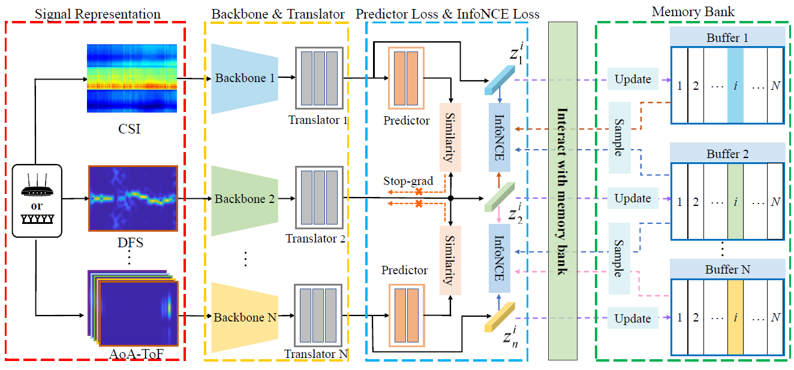</p>
        </p>
    </div>
    
- **动机：** 利用对比学习互相打标签解决无线信号数据标注问题， 将不同信号处理方法获取的特征作为对比特征，来代替传统的数据增强方式。

- **贡献:**
    - 1. 本文介绍了一种用于射频传感的新型 URL 框架 RF-URL。 据我们所知，这是第一项利用对比框架来关注基于信号处理的射频传感和基于学习的射频传感之间的差距的工作。 通过从不同的信号表示中学习各种传感任务的一般语义信息，所提出的 RF-URL 可以以无监督的方式提高传感性能。
    - 2. 本文提出了一种无监督射频传感架构，该架构利用多分支设计、转换器、存储库和预测器以及停止梯度操作来实现简单性、可扩展性和性能之间的平衡。
    - 3. 该论文通过在具有两种射频信号（WiFi 和雷达）的三个基本任务上对其进行评估，表明 RF-URL 是各种射频传感任务的通用框架，包括（1）单标签预测任务：人体手势识别与 WiFi信号； (2) 结构化预测任务：利用毫米波雷达信号进行3D姿态估计； (3) 密集预测：利用毫米波雷达信号生成人体轮廓。

- **读后感：** 利用对比虚心对多种模态之间互相打标记


## 4. [RFMask: A Simple Baseline for Human Silhouette (轮廓) Segmentation with Radio Signals](https://arxiv.org/abs/2201.10175)
- **阅读时间：** 2022-9-14
- **出处：** TMM'22（IEEE Trans. Multimedia, CCF-B） 
- **关键词：** 基于无线信号(毫米波雷达信号)的人体轮廓提取任务
- **摘要：** 最初在计算机视觉中定义的人体轮廓分割在理解人类活动方面取得了可喜的成果。（动机：然而，物理限制使得基于光学相机的现有系统在低照度、烟雾和/或不透明障碍物条件下遭受严重的性能下降。）为了克服这些限制，在本文中，我们建议利用可以穿越障碍物且不受光照条件影响的无线电信号来实现轮廓分割。提出的 RFMask 框架由三个模块组成。它首先将毫米波雷达在两个平面上捕获的射频信号转换为空间域，并抑制对信号处理模块的干扰。然后，它在射频帧上定位人体反射，并使用人体检测模块从周围信号中提取特征。最后，从 RF 帧中提取的特征与基于注意力的掩码生成模块进行聚合。为了验证我们提出的框架，我们收集了一个数据集，其中包含 804,760 个无线电帧和 402,380 个摄像机帧，其中包含各种场景下的人类活动。实验结果表明，即使在传统基于光学相机的方法失败的具有挑战性的场景（例如低光和遮挡场景）下，所提出的框架也可以实现令人印象深刻的人体轮廓分割。据我们所知，这是对基于毫米波信号分割人体轮廓的首次研究。我们希望我们的工作可以作为基准，并激发进一步的研究，用无线电信号执行视觉任务。数据集和代码将公开发布。

- **系统框图：** RFMask 的架构。 它由三个部分组成：信号处理、人体检测和掩码生成。 整个模型以端到端的方式进行训练。
    <div style="text-align:center">
        <p align="center">
            <p>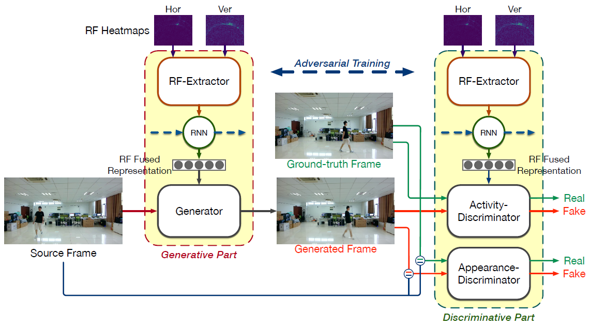</p>
        </p>
    </div>

- **挑战：**
- （1）低分辨率：与光学相机相比，射频信号的空间分辨率要低得多，这使得区分来自不同人体部位的信号极其困难。
- （2）镜面反射：射频信号在人体上会遇到镜面反射，使得接收到的信号只包含全身的部分信息。
- （3）视图转换：相机成像平面垂直于射频信号平面，如果没有精心设计，很难从射频信号生成视觉效果。

- **贡献：**
- （1）提出的 RFMask 框架是第一次尝试从毫米波无线电信号生成人体轮廓结果。
- （2）提出了一个由信号处理模块、人体检测模块和掩码生成模块组成的系统框架，用于从射频信号中实现人体轮廓分割。
- （3）创建了一个多模式数据集，其中包含数千个无线电帧和相应的人类活动光学相机图像。 同时，我们的数据集提供了各种形式的ground-truth，包括2D/3D人体骨骼和人体轮廓结果等。


## 3. [RFGAN: RF-Based Human Synthesis](https://arxiv.org/abs/2112.03727)
- **阅读时间：** 2022.9.14
- **出处：** TMM'22（IEEE Trans. Multimedia, CCF-B） 
- **关键词：** 毫米波合成细粒度的人体光学图像
- **摘要：** 本文演示了基于射频 (RF) 信号的人体合成，它利用射频信号可以记录人体运动以及人体反射的信号这一事实。与现有的只能粗略感知人类的射频传感工作不同，本文旨在通过引入一种新颖的跨模态 RFGAN 模型来生成细粒度的光学人体图像。具体来说，我们首先构建了一个配备水平和垂直天线阵列来收发射频信号的无线电系统。由于反射的射频信号被处理为水平和垂直平面上的模糊信号投影热图，我们在 RFGAN 中设计了一个带有 RNN 的射频提取器，用于射频热图编码和组合以获得人类活动信息。然后，我们使用提出的基于 RF 的自适应归一化将 RF-Extractor 和 RNN 提取的信息作为条件注入 GAN。最后，我们以端到端的方式训练整个模型。为了评估我们提出的模型，我们创建了两个跨模式数据集（RF-Walk 和 RF-Activity），其中包含数千个光学人类活动帧和相应的 RF 信号。实验结果表明，RFGAN 可以使用射频信号生成目标人体活动帧。据我们所知，这是第一个基于射频信号生成光学图像的工作。

- **挑战：**
- （a）需要在没有监督标签的情况下训练射频调节编码网络，以获得理想的人类活动信息； 
- （b）需要融合来自水平和垂直射频热图的信息来表征整体人类活动；
- （c）需要将融合的信息正确地注入到 GAN 模型中。

- **系统框图1:** 用于生成连续人类活动帧的 RFGAN 模型的架构。
    <div style="text-align:center">
        <p align="center">
            <p>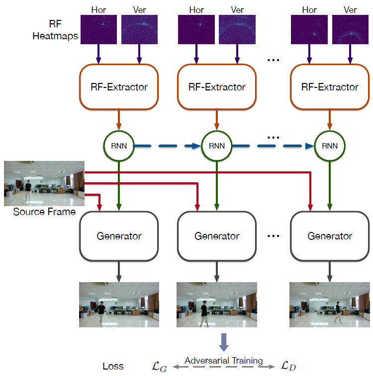</p>
        </p>
    </div>

- **系统框图2: ** RFGAN 一时的训练框架。 它由生成部分和判别部分组成。 整个模型以端到端的方式通过对抗学习进行训练。
    <div style="text-align:center">
        <p align="center">
            <p></p>
        </p>
    </div>

- **贡献：**
- （a）提出了一种新颖的 RFGAN 模型来实现基于 RF 的人体合成。 据我们所知，这是第一项从毫米波雷达信号生成人体图像的工作。 从这项任务中可以衍生出许多潜在的应用，例如，智能家居中的细粒度人类感知和全天监控系统。

- （b）从技术上讲，对于新的条件数据，即 RF 信号，我们建议通过对抗性学习来训练 RF 条件编码网络，即 RF-Extractor 和 RNN。 然后我们设计了一种新的融合操作来融合水平和垂直射频信息，这是从二维射频热图进行整体人类活动感知的有效方法。 由于空间结构的差异，我们建议使用基于 RF 的自适应归一化将融合信息注入 GAN 模型。

- （c）创建了两个跨模态数据集，即 RF-Walk 和 RF-Activity，其中包含数千个光学人类活动帧和相应的 RF 信号。 数据集在以下网址向公众发布：https://github.com/congyucn/Dataset-RFVision。


## 2. [Cross Vision-RF Gait Re-identification with Low-cost RGB-D Cameras and mmWave Radars](https://arxiv.org/abs/2207.07896)
- **阅读时间：** 2022.9.14
- **出处：** UbiComp'22

- **摘要：** 人体识别是日常生活中许多应用的关键要求，例如个性化服务、自动监控、持续身份验证和大流行期间的接触者追踪等。这项工作研究了跨模式人体重新识别 (ReID) 问题，在对部署有异构传感器的摄像头允许区域（例如街道）和摄像头限制区域（例如办公室）的常规人类运动做出响应。通过利用新兴的低成本 RGB-D 相机和毫米波雷达，我们提出了首个用于跨模态多人 ReID 的视觉 RF 系统。首先，为了解决基本的模态间差异，我们提出了一种基于观察到的人体镜面反射模型的新型签名合成算法。其次，引入了一种有效的跨模态深度度量学习模型来处理雷达和摄像头之间的不同步数据造成的干扰。通过在室内和室外环境中的广泛实验，我们证明了我们提出的系统能够在 56 名志愿者中达到约 92.5% 的 top-1 准确度和约 97.5% 的 top-5 准确度。我们还表明，即使传感器的视野中存在多个对象，我们提出的系统也能够可靠地重新识别对象。

- RGB-D相机+毫米波雷达实现跨模态行人识别

- **挑战1**：（两种模态数据的差异性）视觉和雷达的传感数据固有地遭受严重的模态间差异。
- 解决方法：设计了一种新颖的算法来从深度图像中合成特征点，同时解决原始 RGB-D 数据的缺陷和两个传感器的视角差异

- **挑战2**：（两个传感器采集数据的同步问题）由于摄像头和雷达安装在不同的地方，它们的数据不是同时收集的，因此通常不会在细粒度上同步。
-   解决方法：为相似度估计设计了一个端到端的深度度量学习管道。 该模型从合成特征和雷达点云中提取步态特征的高级表示，并估计它们在高维潜在空间中的相似性，从而解决时间错位、步行速度的微小变化，等。


- **系统框图:**
    <div style="text-align:center">
        <p align="center">
            <p>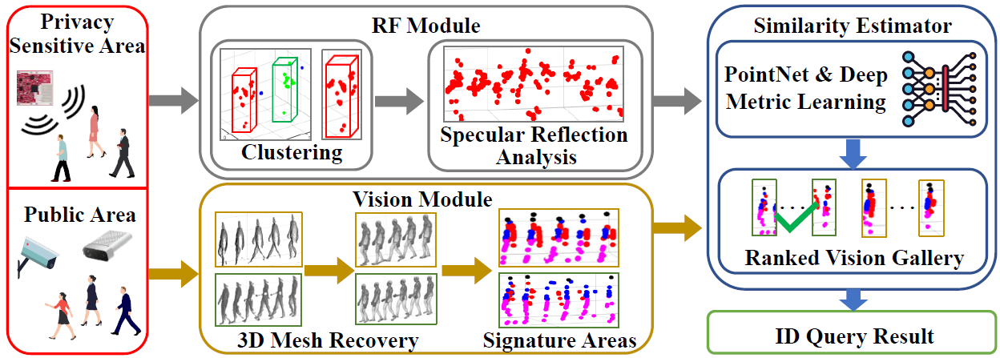</p>
        </p>
    </div>


## 1. [Contactless Electrocardiogram Monitoring with Millimeter Wave Radar](https://arxiv.org/abs/2112.06639)

- **阅读时间：** 2022.9.14

- **摘要：** 心电图（ECG）一直是诊断心血管疾病的重要生物医学检查。目前的心电图监测方法是基于身体附着的电极，导致用户体验不舒服。因此，非接触式心电监护引起了极大的关注，但仍未解决。事实上，心脏机电活动以良好协调的模式耦合。在本文中，我们通过打破心脏机械和电活动之间的界限来实现非接触式心电图监测。具体来说，我们开发了一种毫米波雷达系统，以非接触式测量心脏机械活动并在没有任何接触的情况下重建心电图。为了全面测量心脏机械活动，我们提出了一系列信号处理算法来从射频（RF）中提取 4D 心脏运动。 ) 信号。此外，我们设计了一个深度神经网络来解决与心脏相关的域变换问题，并实现从射频输入到心电图输出的端到端重建映射。实验结果表明，与真实心电图相比，我们的非接触式心电图测量实现了心脏电事件的计时精度，中值误差低于 14 毫秒，形态学精度中值 Pearson 相关性为 90%，中值均方根误差为 0.081mv。这些结果表明，该系统能够实现非接触式、连续和准确的心电图监测。

- **关键词：** 毫米波利用非接触式感知心电信号

- **系统框图:**
    <div style="text-align:center">
        <p align="center">
            <p>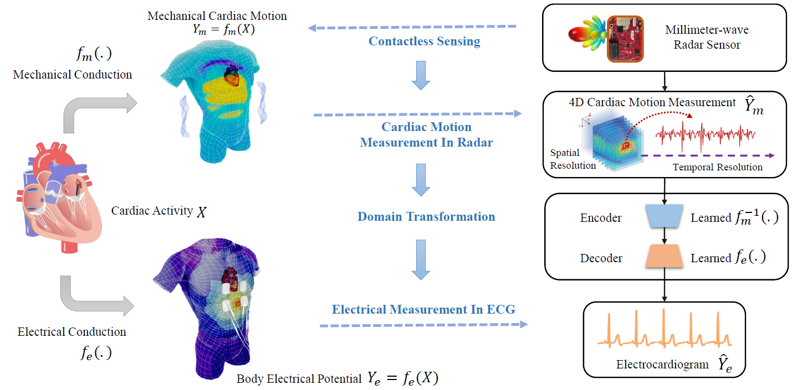</p>
        </p>
    </div>
